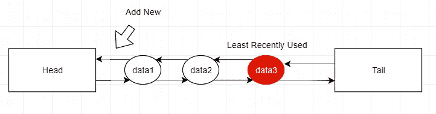
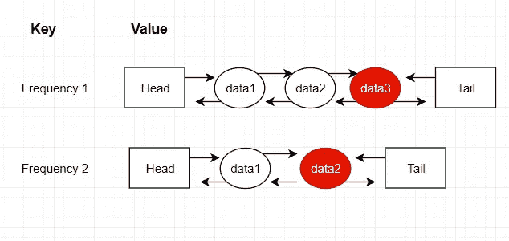

# 用 C#中最近最少使用和最少使用的策略设计和实现缓存系统

> 原文：<https://medium.com/swlh/design-and-implement-cache-systems-with-least-recently-used-and-least-frequently-used-policies-in-1bedc4c7f328>

缓存系统是一个非常重要的工具，通过允许更快地访问保存在缓存中的数据来提高应用程序的性能。它比包括主存储器和硬盘在内的其他类型的存储器每字更贵。因此，缓存系统的容量非常有限，当达到其容量时，需要智能替换策略来管理缓存中的数据。并且高速缓存替换策略应该能够最小化高速缓存未命中的数量。在本教程中，我将分享如何用 C#分别设计具有最近最少使用策略和最少使用策略的简单缓存系统。

# 高速缓存系统的基本要求

缓存系统的主要目的是提供对存储在容量有限的缓存中的数据的更快访问。因此，我们可以将缓存系统的基本要求总结如下:

1.  固定和有限的容量
2.  给定一个键，访问存储在缓存中的数据的时间复杂度为常数(O(1))
3.  在缓存中添加数据项的恒定时间复杂度(O(1))

不管缓存替换策略如何，这三个基本要求可以应用于任何缓存系统。因此，我们可以根据上述要求创建一个接口 ICache。为了使本教程更简单，并把重点放在真正重要的事情上，我将使用 integer 作为键及其在缓存中的值的数据类型，但如果必要的话，数据类型肯定可以是通用的。

# 具有 LRU 策略的缓存系统

最近最少使用(LRU)策略是指选择最近最少访问的数据条目进行替换的算法。该策略假设，由于所选择的用于替换的数据条目不再被执行，因此它们的相关联的存储器可以被释放，而对应用性能的影响最小。

## LRU 的要求和设计

1.  为了实现对数据条目的快速(O(1))访问，包括缓存中的 Get 和 Add 方法，我们可以使用 C#中的字典来记录键及其数据条目。
2.  为了跟踪最少或最近使用的数据条目，我们需要设计一个数据结构。通过使用这种数据结构，每当数据条目被访问时，它将被放置在列表的顶部，利用这种属性，列表底部的数据条目将是最近最少使用的。为了符合高速缓存系统的基本要求，在该列表中添加或移除数据条目的时间复杂度也应该是 O(1)。显然，这可以用双向链表来实现。

Double-Linked List for LRU

## RLU 的实施

我们可以使用 LRUNode 类来表示一个数据条目，它包含键、值以及它的前一个和下一个 LRUNode 的链接的属性。

有了 LRUNode 类，现在我们可以实现 LRU 策略的双向链表，它有两个伪节点头和尾，以及三个时间复杂度为 O(1)的方法:

1.  AddToTop(LRUNode node):这个方法是在双向链表的顶部添加一个新的节点。
2.  RemoveNode(LRUNode node):这个方法是从双向链表中移除一个节点。
3.  RemoveLRUNode():这个方法从双向链表中删除最近最少使用的节点。

现在我们准备实现 LRU 缓存类。

现在我们完成了 LRU 缓存系统的实现。

# 具有 LFU 策略的缓存系统

LFU 策略指的是一种选择最不常用的数据项进行替换的算法。此外，如果存在平局，这意味着有一个以上的键具有最低频率，那么具有最低频率的最近最少使用的数据条目将被选择用于替换。

## LFU 缓存的需求与设计

1.  对于缓存中的每个数据条目，我们需要能够跟踪它的频率。为了解决这个问题，我们可以为每个数据条目添加一个额外的频率属性。
2.  所有数据条目都应该按频率管理，我们需要能够跟踪所有数据条目的最低频率。为了解决这个问题，我们可以使用以频率为关键字的字典。
3.  对于具有相同频率的数据条目，我们应该能够得到最不频繁使用的数据条目。这个问题可以通过再次使用双向链表来解决。
4.  所有运算的时间复杂度应为 O(1)。

基于以上需求，我们现在可以对 LFU 缓存的设计有一个基本的想法。我们需要一个字典来记录所有的数据条目，另一个字典根据频率来管理所有的数据条目，如下所示。

Dictionary with frequency as Key and Double-Linked List as Value

正如我们在上图中看到的，对于具有相同频率的数据条目，我们将使用一个双向链表作为容器来存储这些数据条目。并且双向链表将有助于通过最近最少使用来保持数据条目的顺序。

现在让我们实现 LFU 缓存。

## 实施 LFU 缓存

同样，我们将创建一个节点类来表示 LFU 缓存中的数据条目。

然后，我们需要执行 LFU 政策的双链表。这个双向链表非常类似于 LRU 的双向链表，除了我们需要添加一个额外的属性 Count。我实现如下:

现在，我们准备用 LFU 策略实现我们的缓存系统。在这个类中，除了基本的 Get 和 Add 方法之外，我们需要创建一个方法来将数据条目从较低频率的双向链表提升到较高频率的双向链表。并且每当有数据条目被访问时，将使用该方法。

我对这个 LFU 缓存实现如下:

感谢您的宝贵时间！

希望这有助于理解具有这两种不同替换策略的缓存系统。

参考:

1.  本教程的源代码可以在我的个人 github 中找到:[https://github.com/doctral/Medium-Cache-System-Design.git](https://github.com/doctral/Medium-Cache-System-Design.git)