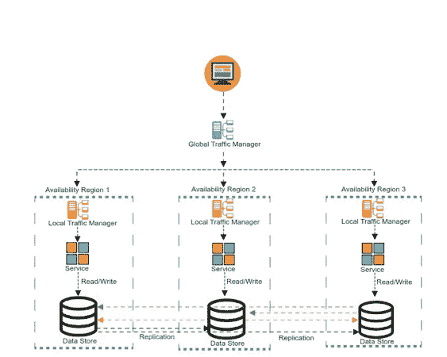

# 读本地写本地多主数据存储中的设计考虑

> 原文：<https://medium.com/swlh/design-considerations-in-a-read-local-write-local-multi-master-data-store-8ff16c9c120>

Example of a Read local/Write local Multi-master

读本地写本地多主数据存储模式是最难实现的数据模式之一。也称为主动-主动或多领导者，这种模式是跨行业高容量低延迟事务性应用程序可用性的圣杯。