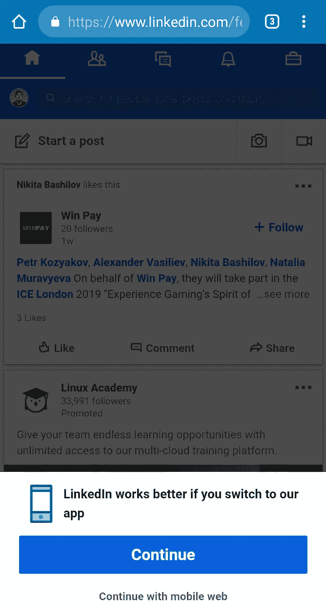
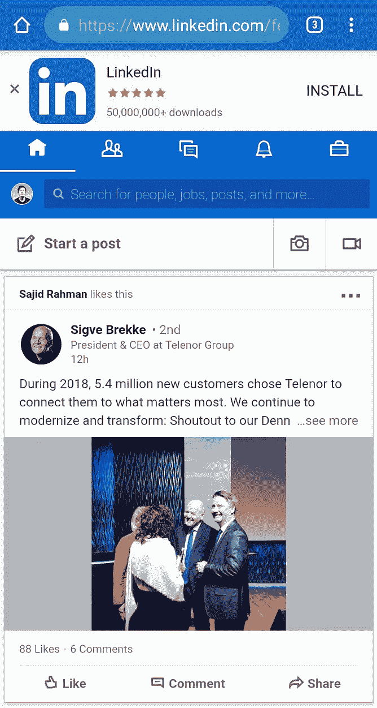
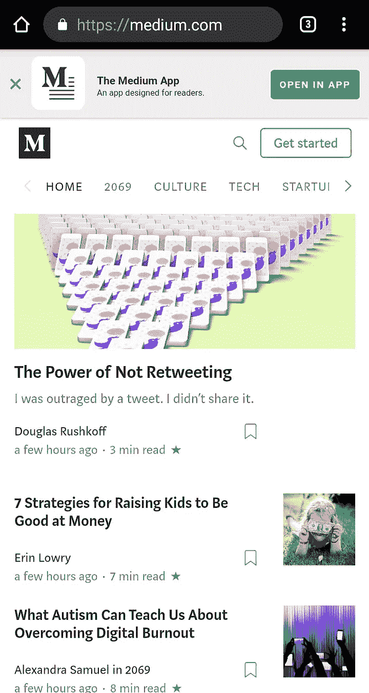
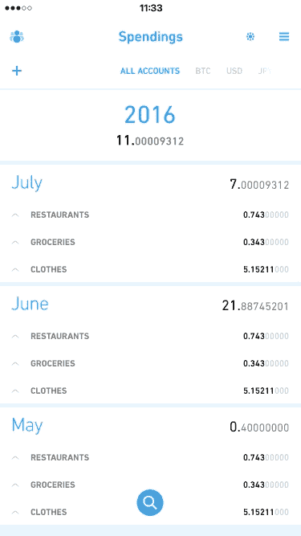
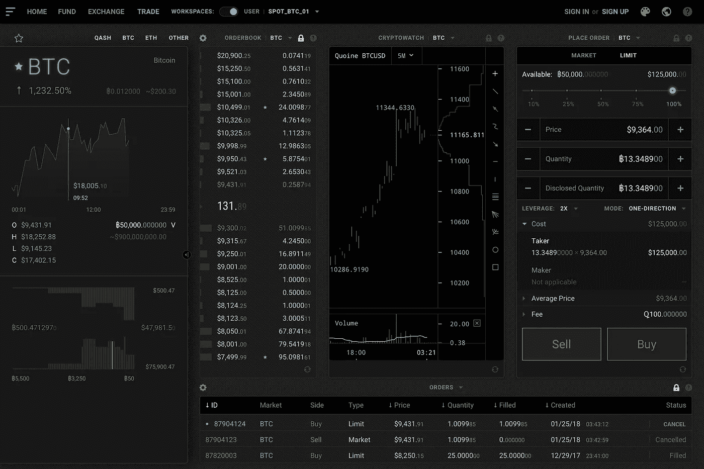
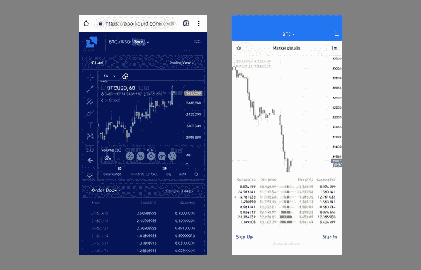

# 为客户参与而设计

> 原文：<https://medium.com/swlh/design-for-customer-engagement-331f7c7dc535>

## **7 次你认为你在做好事，但你没有**

# 关于作者

帕维尔·佩卡诺夫是一名经验丰富的创意总监、艺术总监和设计师*(也是一名开发人员，但 tss-s 没有告诉任何人)。*他于 2004 年开始创作生涯，随后于 2008 年成立了自己的创作公司。2013 年在 Upwork(前 Elance)上被评为收入最高的自由职业者。创办了几个自己的公司。CSS 设计奖上的特写。QUOINE 的前创意总监。Pavel 在品牌、产品设计、用户界面/UX 和品牌体验方面帮助初创公司、创始人和运营良好的企业超过 14 年。

个人网站:【pekanov.com】T4

# **1。要求安装移动应用程序。**

我明白了。转换，为移动体验优化的平台，或者有一个移动开发部门的简单借口。但是，说真的，从什么时候开始它变得如此荒谬的侵扰？像这样:

Intrusive and leaves less space for the actual content.

**领英**

首先，它告诉我 LinkedIn 在手机上运行得更好。老实说，这不是真的。与网络相比，这款应用不仅没有任何附加价值，而且有时运行速度比网络慢。具体怎么做更好？对移动应用程序有何不同有什么见解？不要费心去查了，他们没有任何概述。

那个蓝色的*“继续”*动作按钮简直让人摸不着头脑。它会引导你下载应用程序，而你会希望它能让你继续你的浏览体验。嗯，直到你读了那个按钮下面的内容，顺便说一下，那个按钮有时会离开屏幕。为什么？因为有时 LinkedIn 会显示他们的顶部*“下载应用程序”*提示，这会耗尽宝贵的像素，因此整个页面会下移。

> 具体怎么做更好？对移动应用程序有何不同有什么见解？

这是一个主要的节目停止器——除非你精准地点击另一个*“继续移动网络”*选项，否则你无法关闭它。单击其他任何地方都不会隐藏整个内容。

最后，每次在移动网络上打开 LinkedIn 时都会被问到这个问题。简直荒谬至极。

**中等(和许多其他网站都这样做)**

你认为告诉人们你有一个移动应用程序是个好主意。也许你为你的移动应用程序投资了很棒的 UI/UX 设计。也许你真的提供了超越网络的移动体验。也许吧。不过，即使你这样做了，在手机上安装你的移动应用程序仍然是一个*“选项”，*如果可以的话，这是一个善意的表示。

我是一个完人(算不算轻度强迫症？在评论里让我知道)。我倾向于让我的收件箱空着，关闭我不使用的应用程序，完成草稿，并在开始使用某样东西之前关闭所有我能关闭的东西，因为我不想分心。当我在网上使用媒体时会发生什么？我得关闭那个该死的*“在 app 中打开”。*每。单身。时间。

不知道你们有多少人有同感？

## **解决方案**

把移动应用选项放到别的地方。网站页眉的小图标，菜单或网站页脚的链接。不要打扰。顾客参与就是让顾客住得愉快。记住这一点，你会没事的。

# 2.启动客户支持提示。

啊，打开一个新网站却被一个客户支持聊天框攻击的刺激感。无价的。

你在网站上只花了几秒钟。到目前为止你没有问题，你甚至不知道那个产品是关于什么的，那个公司在做什么。你在探索，你在订婚。

然后……**砰！我能帮你做点什么吗？日安，有什么可以帮你的吗？先生，你有什么问题吗？他妈的，我没有！至少，现在不是。也许永远不会。*【网站关闭。]***

帮我什么？如果我有一个关于生命、宇宙和一切的问题，那算吗？看，你还没有提供任何支持的背景。

不要误解我的意思，我非常支持尽早提供客户支持，并将其作为产品体验的主要部分。然而，除非你的产品*是*(万能的)聊天框，否则不要这样做。先弄清楚上下文。

> 先生，你有什么问题吗？他妈的，我没有！至少，现在不是。也许永远不会。[网站关闭。]

> 对于那些想了解更多关于产品体验和公司体验，以及客户支持是其中一个不可或缺的部分的人，请阅读我以前的文章:[https://medium . com/p/ui-UX-and-the-Company-Experience-a-refined-know-it-all-guide-on-all-about-the-Product-82e 8662 FDA 00](/p/ui-ux-and-the-company-experience-a-refined-know-it-all-guide-on-all-about-the-product-82e8662fda00)

## 解决办法

默认情况下，保持聊天框关闭。有一个图标，需要的时候可以点击打开聊天框。换句话说，当有上下文时。

跟踪用户行为。当有不规则的鼠标移动，奇怪的不活动时间表明用户有点困惑时，启动支持。猜测语境，创造语境，提供支持。

# 3.使用默认设置。

我说的是加载指示器、进度条、按钮——小东西。他们很小，所以谁在乎，对不对？不对。

这些微小的 UI 元素通常被认为是理所当然的，由痴迷的 UI 完美主义者培育，被懒惰的开发人员和项目经理抛弃。花了这么多时间把它们做得尽善尽美，后来却像没事一样从代码中被删除了。可怜的东西。

事实是，细节让人兴奋，原因很简单——你的用户每时每刻都会遇到细节，每一秒的加载时间，每一秒等待更多内容的时间。让它有价值。让等待变得有趣。参与。

这是我过去项目中的几个例子。这些是用户向下滚动页面时显示的加载指示器(内容预加载):

Animated mascots for e-commerce website selling entertainment items (music, movies, books, games, etc.)

> …细节让人兴奋，原因很简单，您的用户每时每刻、每一秒钟都会遇到它们…

这是一个移动应用程序的自定义刷新动画:

Refreshing tables on mobile apps may be the most frequent action the user does. Why leave it boring default?

## 解决办法

表现出一点创意，表明你在乎。为参与做准备，不要只是等待它自己发生。

# 4.称他们为用户、客户或直呼其名。

这通常是一封电子邮件。它太蹩脚了，我把它放在这里，只是因为它非常愚蠢。

我说的是先生*【尊敬的客户】**【尊敬的用户】**【名字】。*也可以在您的本地垃圾邮件箱中看到，在一天结束时人口为零。

如果我还没有从你这里买过东西呢？如果我都不用你的产品呢？你为什么叫我的名字？我知道这是一封营销邮件，我知道这很可能是垃圾邮件，我们没有见过面或约会过(除非一个人可以见面或约会，比如说，一个网络商店)。

## 解决办法

我们在 Y 上有功能 X，帮助你做 z。我们商店有新产品，你可能会喜欢，等等。不要写在电子邮件里，从一些中性的东西开始，然后快速进入主题。

如果你绝对想给你的观众起个名字，而且你的产品名字听起来很酷，试着和 *-ers* 和 *-ists* 建立一种包容感。例如: *Mediumists (Mediumierites？)，*如果你是对你的媒介读者说话。

不过，请记住，这可能听起来很傻，完全取决于你的产品名称；更别说，还挺随意轻浮的。

我在上一份工作中做过兼职。它之所以有效，是因为它不费吹灰之力就能从你的舌头上说出来。可能不适合你的公司或产品。不过，这个领域是开放的即兴创作。

# 5.忽略已经存在的约定。

也主要是电子邮件。所以，当你知道你亲爱的尊贵的顾客在你这里花了不少钱时，你就应该直呼其名。一直都是。而你加上*“请”。*

## 解决办法

个性化的电子邮件和与忠实观众的交流。这就是忠诚度积分/等级/级别的用途。发现那些信誉良好的人，个性化他们的产品体验。

> …当你知道你亲爱的尊贵顾客在你这里花了不少钱时，你就应该直呼其名。一直都是。而你加上*“请”。*

感觉自己是首选客户有多好？巨大的。就是这样。他们几乎不会离开你。

# 6.拥有一个非常复杂的产品的移动网站。

这是一个随机的复杂产品样本:

liquid.com LIQUID CARBON (early concept)

想象一下这样的东西被装进手机屏幕:

Left: web app. Right: native mobile app. Same product.

不用说，left 看起来既不像用户友好的东西，也不像在移动设备上可用的东西。然而，这种权利看起来完全像是某种吸引人的东西，可以在手机上试用(或者在旅途中使用)。

## 解决办法

并不是所有的网络产品都需要手机友好。特别是，如果它们最初是为桌面设计的，并且打算在桌面上使用。

每当有人试图从移动设备访问您的产品时，检测平台并显示提示以获取移动应用程序以获得最佳体验。

> 并不是所有的网络产品都需要手机友好。特别是，如果它们最初是为桌面设计的，并且打算在桌面上使用。

一个更好的方法是显示一个专为移动设备设计的登陆页面，告诉访问者你的产品在移动设备上是不可用的，除非他们下载一个本地应用。这将是一个合适的时间和地点，积极提示您的移动应用程序的可用性。

# 7.在首次登录时提供教程、演练和明确的入职培训。或者更糟，在注册时。

这听起来像是一个好主意，向一个对你的产品不熟悉的人解释一切。

我看到过像创建一个新账户一样简单的讲解；机上屏幕敦促人们打开每一个功能，为了，对，解释一切有解释；感觉更像内容营销的教程，而不是实际的解释。

你知道吗？见鬼去吧！

这是一件事。有些事情可能只是有点不清楚，这是完全可以接受的。接受现实吧。你的产品中有一些不清楚的东西是可以的。你不必马上解释。让你的顾客获得第一印象和体验。

> 有些事情可能只是有点不清楚，这是完全可以接受的。接受现实吧。

## 解决办法

用你产品中的一点一滴的知识做一个游戏。登机手续办好了吗？给予奖励。教程已经完成？给予奖励。换句话说，激励。

为首次用户推出简化的用户界面。询问他们是否准备好接受更多。当他们准备好的时候，多给他们看看。换句话说，与你的客户接触。

研究让你的产品学习体验成为一个简单的游戏，到达终点还有奖品可以领取。首先要让它值得一试。

# 好文章

我的另一篇关于产品体验和公司体验的文章:[https://medium . com/p/ui-UX-and-the-Company-Experience-a-refined-know-it-guide-on-all-about-the-Product-82e 8662 FDA 00](/p/ui-ux-and-the-company-experience-a-refined-know-it-all-guide-on-all-about-the-product-82e8662fda00)

# 你在追求最好的公司体验吗？

如果你在追求你的客户所能拥有的最好的公司体验，或者如果你在追求终极的产品体验，我很想听听你的意见。给我发封邮件。

## 这篇文章发表在 [The Startup](https://medium.com/swlh) 上，这是 Medium 最大的创业刊物，拥有+418，678 名读者。

## 订阅接收[我们的头条](http://growthsupply.com/the-startup-newsletter/)。

