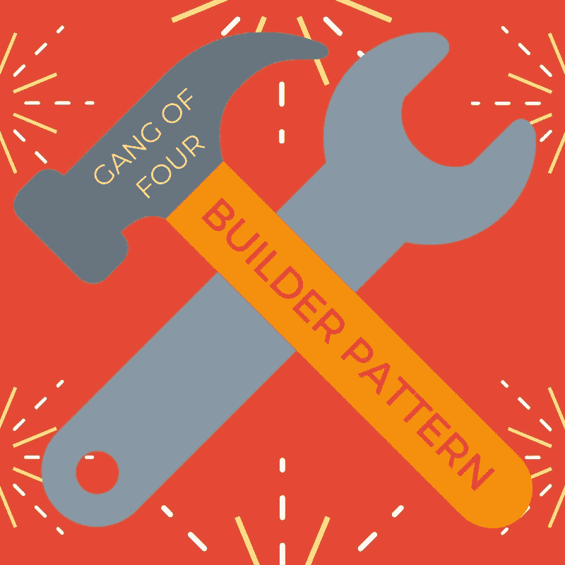

# 设计模式重构:实现复杂对象创建的构建器模式

> 原文：<https://medium.com/swlh/design-pattern-refactoring-implementing-the-builder-pattern-for-complex-object-creation-55e79d97ef25>

我最近一直在用 Java 构建一个 HTTP 服务器，我关注的一部分是使服务器可扩展，以便能够用任意数量的组件轻松地创建响应。

HTTP 服务器的基本流程是，它首先“监听”给定[套接字](/swlh/understanding-socket-connections-in-computer-networking-bac304812b5c)上的传入连接。当连接是…