# 如何设计获奖的凸版印刷书籍？

> 原文：<https://medium.com/swlh/design-process-production-of-an-awarded-letterpressed-book-733d4627966a>

## 使用模拟流程从头开始创作一本书，并将每个决定与概念绑定在一起。

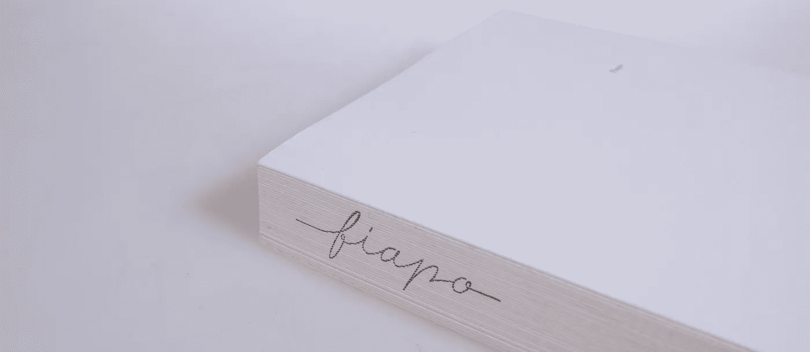

在收集活版印刷机、铅字和随身用品超过 10 年后，[鲁本·迪亚斯](http://rubenrdias.com) ( [鲁本·迪亚斯](https://medium.com/u/9b66a4fdb003?source=post_page-----733d4627966a--------------------------------))邀请我在 2015 年帮助[提波格拉菲亚·迪亚斯](http://tipografiadias.com)。从那时起，我们看到它发展到有史以来最活跃的时期，我们一直在印刷海报、卡片，举办研讨会，并努力为保护印刷材料和葡萄牙印刷历史做出贡献。

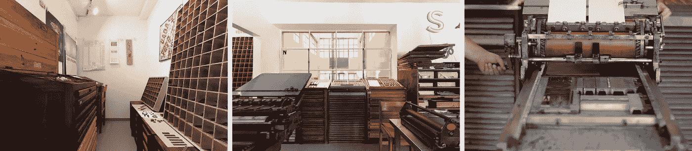

作为我们的编辑设计工作室 [Item Zero](http://www.itemzero.com) 的延伸，我们一直将工作室作为一个探索的地方，抓住排版构图的根源，沉浸在空白空间的平衡中，并与排版历史研究决斗。

> 我们从一开始就知道的一件事是，我们不想成为印刷商，而是印刷设计师。

作者 Hellington Vieira 向我们提出挑战，要求我们设计并制作一整本凸版印刷的书。这是一部漫画小说，讲述了一块绒布(Fiapo)脱离布料，独自开始冒险，探索爱情、孤独和自我照顾的故事。

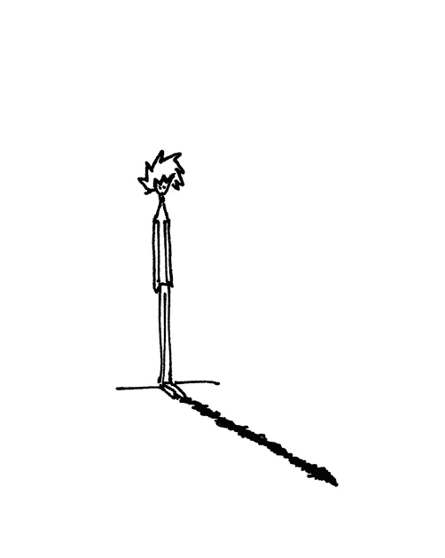

Fiapo character in one of the illustrations from the book.

整个故事和角色立刻给我们带来了一种轻松、微妙和天真的感觉。所以我们把这个概念作为主要的前提。

**——***名词* ***1。*** *没有多少重量的性质。* ***2。风格上温和或精致的品质。*****

**手头主要有两个任务要探索，我们创建了一个**布局**，它将涉及这个概念，同时帮助我们解决印刷速度和物流问题，并且还定义和应用了将相同概念传达给**对象**的生产方法。**

# **布局**

**我们沉浸在工作室中，翻遍了一个又一个的橱柜，并提供了文本字体的校样，最终我们意识到，我们比最初想象的还要受限制，因为大多数活字已经非常破旧，一些字体系列甚至没有每个字母的非常广泛的字符。我们最终把筹码押在了一种简单的衬线字体(Garamond 风格)上，这种字体有着非常清晰的印记，不会过时。**

**为了传达这种轻盈感，并赋予插图在书中的重要地位，我们设计了一种布局，不仅更易于组装和拆卸，而且当我们在印刷机上旋转纸张时，我们可以打印章节页面。**

**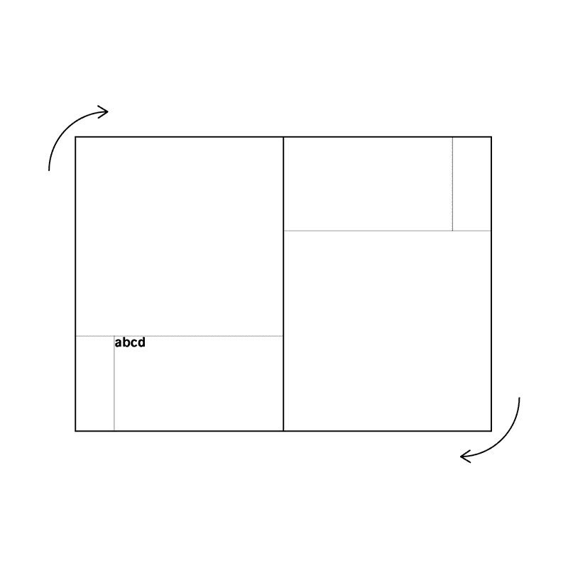**

**通过优化版面，我们可以打印各种类型的书籍版面、简介、章节、插图和文字，或者仅仅是插图，打印起来更加灵活，速度也更快。**

**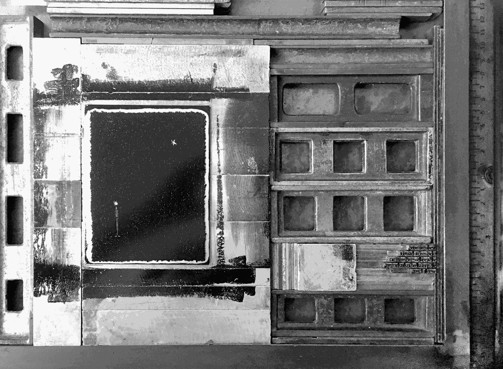**

**As in many other printing techniques, in letterpress, the printing cast or mold is mirrored to achieve the intended print.**

**所选择的类型有助于给人一个更清醒的历史印象，把它从儿童读物中分离出来，这不是本书的目的。制成锌版的插图设法在印刷过程中与铅字同时引入。在布局决策的同时，我们还必须把书当成一个对象，做出一些有趣的决定，使它成为一个整体。**

# **目标**

**遵循亮度和清晰度的概念，在为书的内页构思了这样一个干净和空白的构图后，我们必须决定一种也能传达这种亮度概念的纸张…**

> **它是 100%棉的，纸蓬松度很高！**

**选择高克重的纸，但也要有高的体积，我们可以有一本看起来很厚的大书，但抓住它，你可能会发现它比你最初想象的要轻。此外，高度纹理化的纸张有助于这种感官体验，因为它将更多的细节引入到已经充满了纹理的物体中，这些纹理是由墨水以及铅字和锌板对纸张本身的适度压力带来的。**

**绑定是另一个挑战；我们不仅有在两页之间展开更大插图的问题，这会给我们的拼版带来一些问题，并将不同的小册子放在一起，而且我们还希望给故事带来这种连续性和清晰度，而页面之间的折叠并没有带来这种效果。**

**选择一种不寻常的装订方法，如平装，背靠背粘合，我们可以实现这种连续性的概念，也可以得到一本书，它完全平装，没有中间跨页的中断。**

**但是接下来有一个问题要处理，按照这个解决方案，将跨页粘合在一起，我们最终得到的封面和封底实际上比内页薄。**

**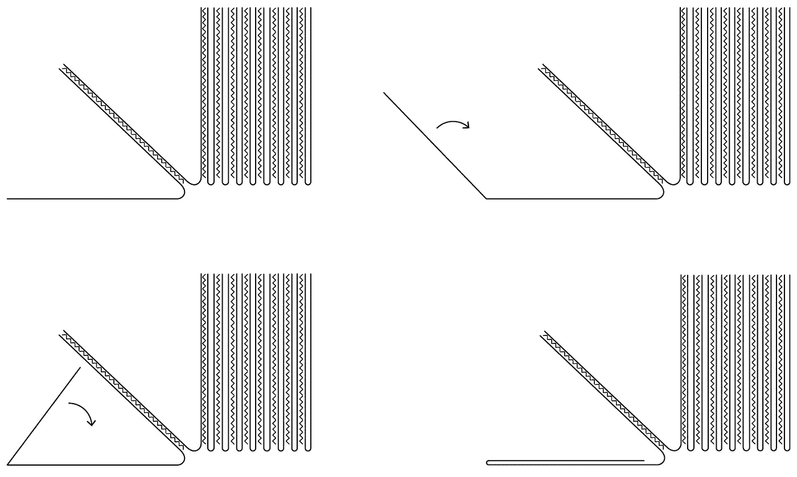**

**为了解决这个问题，我们引入了一个大的折页，这不仅可以增加书的封面、正面和背面的厚度，还可以给书一种开始和结束的感觉，因为折页铰链会超过书芯。**

**作为结束语，我们开发了一个签名，在使用一个模拟过程的同时，从概念中构思出所有这些天真。经过装订的过程，书脊变得很凹凸，很有性格。使用带有此签名的橡皮图章，我们可以对该对象进行最后的触摸，以便识别书架上的书，但也可以将更多的小细节归因于用户，这将为用户带来整体的极简主义和精致的体验。**

**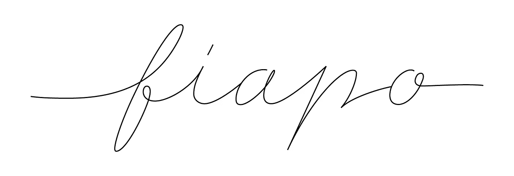**

**最后，我们得到了一个非常感性的物体，我们认为这一切努力的主要目标和概念是精致和轻盈，它简单但丰富，具有非常好的触觉。**

**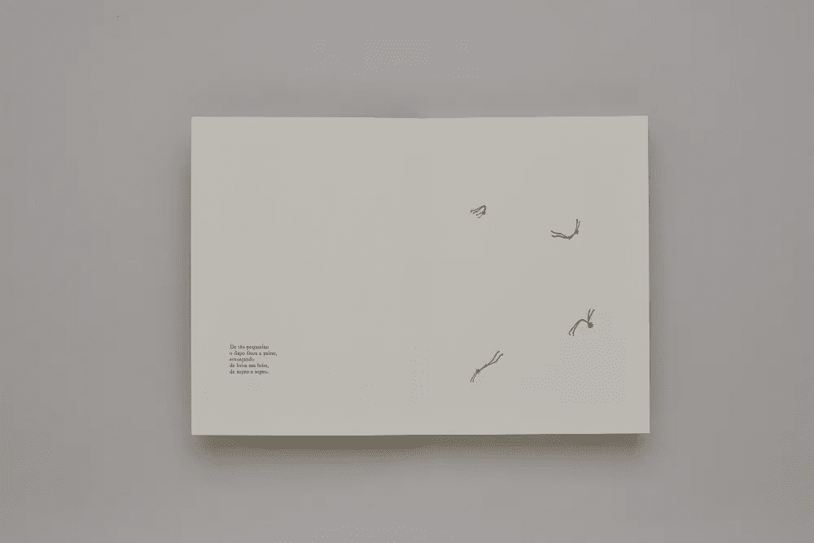****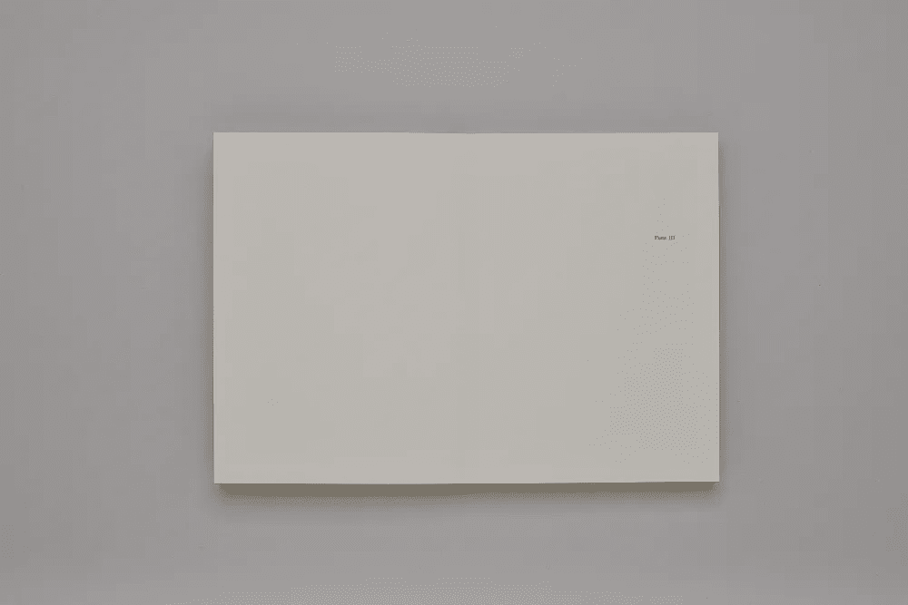****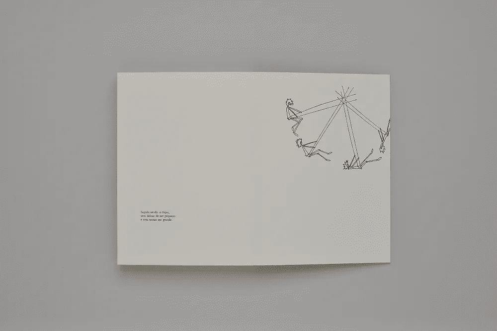****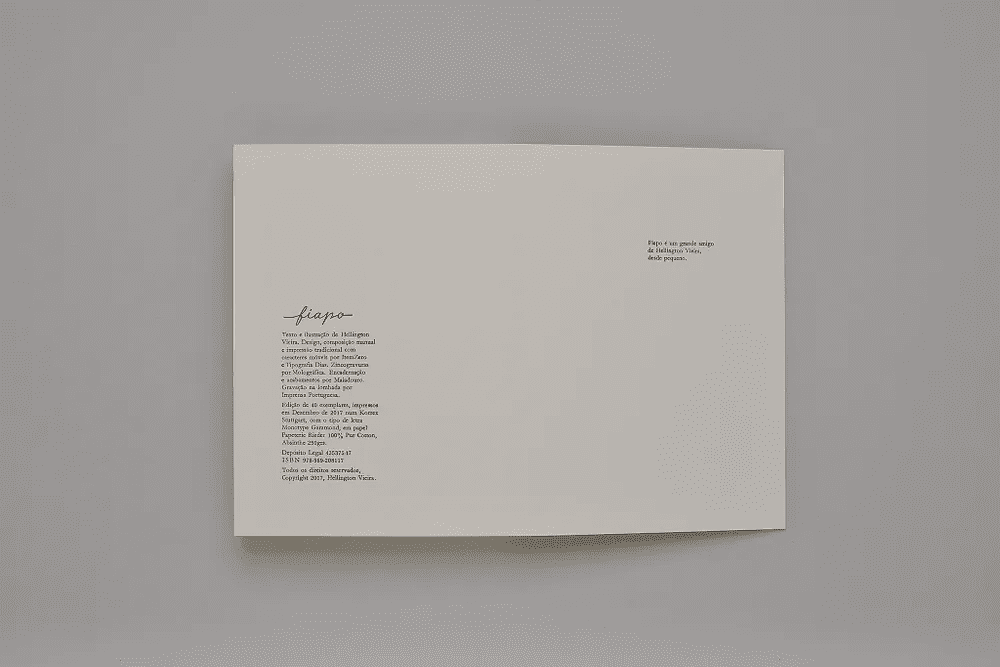**

**Photography by [Luís Espinheira](http://luisespinheira.com/pp/)**

**提交后，“Fiapo”最终在 DGLAB(图书、档案和图书馆的总方向)举办的 2018 年葡萄牙国家竞赛“Prémio Design do Livro”中获得了荣誉提名，并进入了 Stiftung Buchkunst 举办的 2019 年“世界各地最佳图书设计”竞赛的 50 本书入围名单，我们对此深表感谢。**

**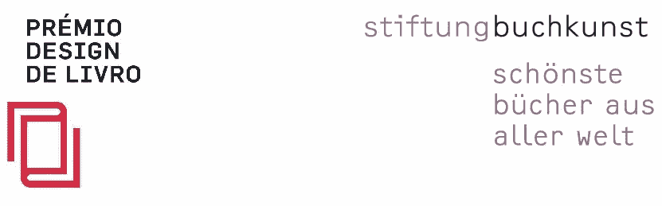**