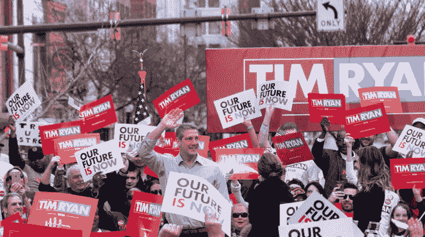

# 设计 2020，第一部分:你没听说过的候选人

> 原文：<https://medium.com/swlh/designing-2020-part-1-the-candidates-you-havent-heard-of-b514992baf8>

Tim Ryan (a guy you haven’t heard of) surrounded by his (pretty bad!) presidential campaign logo. (Ctsy: The Jambar)

如果 2016 年总统竞选由哪个候选人有最好的标志来决定，马丁·欧玛利将会是现在的总统。相反，你会想，“马丁·欧玛利是谁，为什么安东尼在谈论他？”(郑重声明，他就是这张照片中你不认识的那个人)。