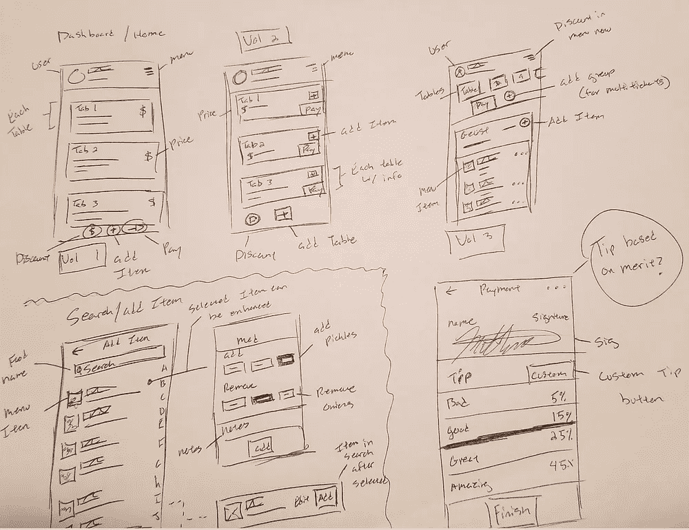

# 转向案例研究:IOS/Android 应用程序

> 原文：<https://medium.com/swlh/designing-a-restaurant-specific-point-of-sale-for-mobile-case-study-d9f6e9dccdde>

# 项目大纲

**角色**:产品设计师
**职责**:用户测试、UI 设计、UX 设计
**公司**:虚构 App

# 简短的

转向是一个移动销售点，专注于通过减少摩擦点、提高准确性和速度来简化服务器的工作。“转向”是我从与服务器的数十次对话和业务中创建的一个激情项目。一如既往，我使用以人为中心的设计来发现问题，采访用户，设计，测试和迭代。

# 问题是

目前的 POS 系统是固定的，需要服务员在餐桌上接受订单，然后输入系统。这降低了效率并增加了订单的不准确性。这些都在比 POS 机更繁忙的时段和更多的工作人员时被放大。

在对 10 个服务器进行即兴采访后，我发现了这些问题。9/10 的人非常不喜欢他们目前的职位。
10/10 认为 POS 过于复杂。(AVG 流利时间:6 小时 4 班以上)
10/10 的人在等待另一个服务员输入他们的订单时感到不安/焦虑。
8/10 的人认为，由于速度/准确性，POS 影响了他们的小费金额

# 竞争对手

**吐司**:可以随身携带的平板电脑。**狂欢**:静止位置。
**店主**:功能丰富的固定式 POS。
*注:您需要购买 POS 才能使用他们的应用程序*

# 我们的解决方案

创建一个易于使用和订购的高效移动应用程序，供服务器在接受订单时使用。

**表:** 一眼看去，服务器可以看到所有分配的表和就座的表。由于需要快速移动，我们将每个分配的表制作成一个选项卡，并连接订单。在任何时候，只需点击一次，即可对订单进行更改。

**搜索:**左
当前的 POS 系统很难理解并利用类别级别来定位菜单项。这个屏幕被创建来感受移动本地，允许任何用户通过键入或按字母顺序滚动来快速找到他们需要的内容。

**修改**:右
订单可能很复杂，需要即时更改。修改使添加或减少成分变得容易，如果需要，做一个准备笔记

**小费** :
订单效率和准确性是需要解决的两个根本问题。当正确地处理它们时，我们将最终得到服务器所期望的结果，更好的提示。创建这个屏幕是为了鼓励顾客给他们提供的服务适当的小费。
**注意**:百分比是任意的，需要测试以更好地计算双方都觉得公平的百分比利润。

# 成功的衡量标准

*   第一次使用“转向”的用户在当前 POS 上比有经验的用户更快地输入复杂的订单。
*   准确度提高 10%以上
*   平均小费增加 5%

# 结果呢

目前，还没有机会测试。进一步的测试将在不久的将来继续进行。

# 我学到了什么

这是我第一个使用“要做的工作”框架的项目，我真的很喜欢它。关注用户的结果，而不是问题或潜在的功能，更容易专注于目标。

我仍在学习如何测试原型，这是一个特别困难的问题。我将继续研究更好的实践和步骤来创建更好的原型并更好地测试它们。

**我目前正在使用的成长资源:**
[杰夫·高瑟夫的《学习 UX》](https://www.amazon.com/Jeff-Gothelf/e/B00DUH5RD0/ref=dp_byline_cont_book_1)
[杰克·纳普的《冲刺》](https://www.amazon.com/Sprint-Solve-Problems-Test-Ideas/dp/150112174X/ref=sr_1_1?keywords=Sprint+by+jake&qid=1560722265&s=books&sr=1-1)
[产品早餐俱乐部播客](https://www.productbreakfastclub.com/)

# 该过程

想法从何而来，与我交谈的人，以及我使用的基本原理。

# 短篇小说

早在 2010 年，一些名叫[杰克·多西](https://en.wikipedia.org/wiki/Jack_Dorsey)和[吉姆·麦克维](https://en.wikipedia.org/wiki/Jim_McKelvey)的超级聪明的家伙创建了一家名为 Square 的小公司。你可能听说过。他们制作了一个由智能手机驱动的便捷配件，并永远改变了商家服务游戏。唯一的事情是，它只改变了零售；餐饮业呢？

# 我的想法

让我们去掉所有不必要的东西:收银机、平板电脑、支架、箱子、打印机和电线(我希望 2019 年是摆脱电线的一年)。我想创建一个电话应用程序，它足够强大，可以被众多的餐馆采用，但又足够简单，可以让接受订单变得快速和轻松。在手机上插一个方块，你就可以开始了！

使用智能手机的原因是通过使用员工的智能手机来降低进入的财务障碍。其次，我相信熟悉的设备会增加服务器工作的流畅性，因为他们熟悉自己的设备。最后，不会有更多的队伍等待使用终端。在繁忙的时候，服务员通常会挤在一起，互相催促着把他们的订单放进去，这可能会导致订单不准确和团队成员之间的摩擦。

**项目可交付成果
-** 一系列可以测试和验证的假设
-几个展示用户界面和更好地传达想法的屏幕
-我的设计决策的强大理由
-平台:iOS & Android

# 了解项目

在我开始之前，让我们概述一些重要的信息。

**项目**
对于这个项目的范围，我将重点关注服务员和他们的接触点。我的解决方案应该以积极的方式影响他们的日常生活。我想解决过时产品造成的现实摩擦，并对服务器工作的每个方面表现出同理心。虽然我知道摩擦来自许多方面(其他员工、管理层和客户)，但我想从服务器需要完成的两个主要程序开始。接受订单和付款。

**我的环境**
为了让这个项目感觉更真实，我将把自己定位为一个虚构的小初创公司的独立产品设计师。它由两名开发人员、一名营销人员和一名业务领导组成。作为一家小型创业公司，跑道有限，要做的事情很多，所以我需要创造 ROI 积极的工作，不要淹没开发人员，并在测试中采取成本效益高的举措。

**让我们开始吧！**

# 有同感

**人际对话:** 在过去的几个月里，我与几十位餐厅服务员、主人和老板交谈过，询问他们对 POS 系统的个人感受。请注意，这是在我付钱的时候，而不是在高峰期。一切都感觉很冷，很自然。

**问题**:“那么你觉得你的销售点怎么样？”
**常见回答**:*长叹*……挺好的。

**跟进问题**:“听起来不像，跟我说说。”
**AVG 回答 1** :“它很笨重，很多功能我都不明白，直到有人给我看了，即使那样也还是很容易忘记。”
**AVG 回答 2** :“太慢了，我需要能跟上混乱的东西。”

**最后一个问题**:“你喜欢销售点的什么？”
**回答 1** :“它完成工作。”
**回答 2** :“它有很多功能，所以我从不担心它不能做我需要的事情。”

注意:回头看看这些问题，我本可以写得更好。我将继续学习更多关于用户访谈的知识，这样我就可以确保我得到的信息不是因为我领导了它。

综合我采访过的十几个人来看，没有几个人对自己的职位感到满意。事实上，感觉更像是他们变得自满了。几乎好像他们已经处理了这么多不同的系统，到目前为止，我不确定他们是否相信一个好的系统能够存在。(只是我得到的一种感觉。一些人对该系统的稳健性表示赞赏，但这往往是一个绊脚石。最后，没有人对速度感到满意。完成普通的任务需要十几个步骤，其中大多数步骤并不明显。在某些情况下，人们需要 1 到 2 天的培训来学习如何使用 POS。更糟糕的是，有时管理人员会添加/删除项目，这将导致一些新发现的混乱。

**优先需求** 1。一个简单明了的系统。(很少练习)
2。有足够深度解决常见问题的系统。
3。通过读卡器(Square、PayPal 等)接受付款，并为客户添加优质提示的能力。

# 思维能力

为了更好地理解我需要什么样的线框，我需要创建一个小需求列表(解决优先问题所需的较小部分)

**任务需求:**实现服务器结果所需的动作

-查看分配的表格
-添加请求的菜单
-快速找到请求的项目
-修改请求的项目以适应顾客的需求(添加/删除)
-添加或减少配菜
-接受付款(卡、现金、礼品卡)
-适当地分割支票
-增加折扣
-收取服务小费
-提供收据(电子邮件/文本)

**行动图** :
这些是完成订单需要采取的行动。

利用上面的信息，我开始用线框画出我的想法，直到一切开始运转。一旦我把我所有的想法都写在纸上，它们就会被分类成 MVP 或者膨胀。当 MVP 的想法被构思时，膨胀的想法被编目并保留。

← Wireframing **|||||||||||||||** Flow Mapping →

**更好的映射** 我有一个很好的想法，我相信这个应用程序将如何工作，但我想尽可能地细化和简化步骤。

← Old Flow**|||||||||||||||** New Flow→

> **旁注** 我知道要让这个应用程序充分发挥潜力，还需要一些其他的东西。我相信，在主人的手机上安装一个应用程序来安排座位、排队以及通知服务人员有人就座是非常有用的。我还担心一个应用程序对一个厨师来说会是什么样子。考虑到厨师工作的环境，他们真的不可能在看手机。这可能会在另一个时间解决——继续。

# 设计和原型

像素推进时间！这是我觉得大部分问题会在我的解决方案中真正表现出来的地方。你可以盯着草图上的画板看几个小时，感觉不错，但一旦你看到它被另一个人使用，你就会发现真正的缺陷。

V1 Set of Screens

**修改屏幕:** 该屏幕的目的是允许接受复杂的订单并适当收费。假设你的顾客点了熏肉芝士汉堡，但是想要额外的熏肉、蘑菇和鳄梨，但是不想要洋葱和芥末，半熟，旁边放有牧场调料。 目前，我已经用标签设计好了；但这将是一个巨大的痛苦。考虑到我需要留意障碍，我需要减少工作量。

# **可能的问题(设计之外)**

我的一个朋友指出，应用程序必须非常注意它使用的电池电量。服务员可以连续工作 10 个小时，那么当他们的手机没电时会发生什么呢？

另一个有趣的问题是，当客户签署收据时，他们是否会掉落/伤害/损坏服务器的手机？也许保险？谁知道…

# 感谢您的阅读！

作者:马修·瓦卡罗 [推特](https://twitter.com/EarHolesMcgee) | [链接](https://www.linkedin.com/in/matthew-vaccaro-409158119/) | [滴滴出行](https://dribbble.com/MatVaccaro)