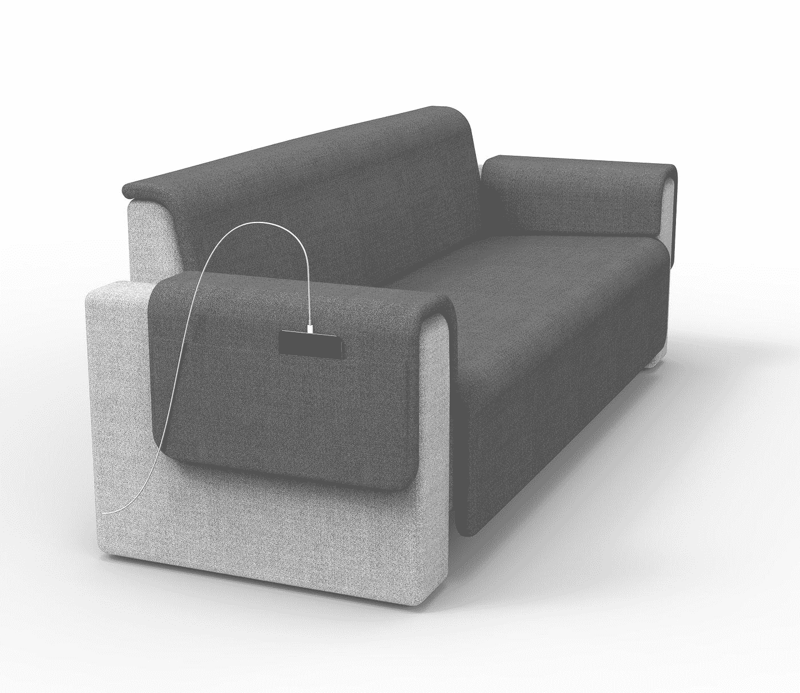

# 设计和制造新产品？从电影制作和大数定律中学习

> 原文：<https://medium.com/swlh/designing-and-making-a-new-product-learn-from-a-movie-production-and-the-law-of-large-numbers-746563d727c4>

《滚蛋》(Get Out)是一部预算为 450 万美元的电影，总票房为 1.5 亿美元，并获得了奥斯卡奖。该片的制片人遵循一个非常严格的理念:在开始拍摄电影之前，他们为每部电影设定了一个具体的预算，每部电影都分配了相同的预算。这是基于一个关键的事实:你无法确定哪部电影会成功。哲学的第二部分是，一旦电影制作人用完了预算，他们将停止制作，并在原地包装东西。任何额外预算的请求都被拒绝，因为电影制作人无法提前知道额外预算可以带来多大的改善。其他电影得到了同样的爱——也就是预算——它们成功了，所以增加额外的预算会落入沉没成本的陷阱:因为你已经投入了这么多时间，你错误地认为一些额外的时间不会是一个大的额外成本

这种哲学背后的原因是应用于电影制作的大数法则:保持每部电影的预算较小，这样你就可以制作更多的电影，增加制作大片的机会——因为你无法提前选择哪部电影会成功。当我们在可比制作沙发模型时，这一理念浮现在脑海中。

Moko’s Concept 1 Sofa

这个概念 1(这是一个 3D 图像)提出了许多设计挑战::薄床垫(深灰色的部分)是可拆卸的，很难装饰，因为它们的形状我们的装饰团队不习惯缝合，背部的舒适性很长一段时间都不太好，这些床垫在身体周围的形状不像我们希望的那样平滑——还有一次我在迭代的早期坐在上面，木头框架就裂开了:我猜命运试图告诉我们什么。与我们同时开发的其他概念相比，它花费了我们更多的空间和原型制作时间。因此，我想知道使用“退出”策略并在我们开始时设定的特定小时数后停止迭代是否有意义:每个沙发都会收到相同数量的爱，在此之后，我们将停止迭代。我不太确定这种方法在那种情况下是否可行，或者是否是正确的方法。但我的观点是，当我们开发新产品时，我会记住以下问题:

1.  相对于其他产品，我们如何证明在一个产品/系列上花费更多时间是合理的？为什么在概念 1 上多花两天时间比花在第二个概念上要好？
2.  我们如何(或者我们能不能)量化我们期望投入的额外时间能带来什么样的实际结果？例如，如果我们想要增加两天的迭代时间，那么在这段时间里我们能够产生什么样的结果呢？为了实现我们的目标，我们需要进行多少次测试(例如，调整后排的舒适度)，这两天够吗？
3.  如果没有“竞争”产品，我们可以分配额外的时间，是否有任何其他任务可以从该时间中受益，例如，我们是否应该将额外的 2 天集中在确保我们的沙发可以大规模生产上？

## 这篇文章发表在 [The Startup](https://medium.com/swlh) 上，这是 Medium 最大的创业刊物，拥有+417，678 名读者。

## 订阅接收[我们的头条](http://growthsupply.com/the-startup-newsletter/)。

