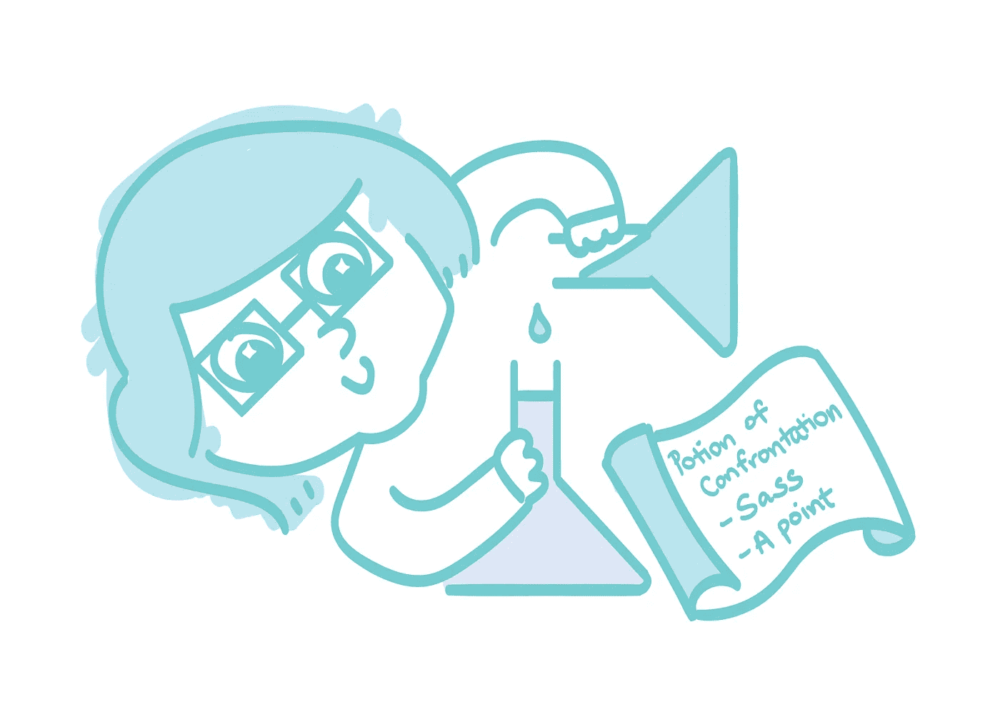
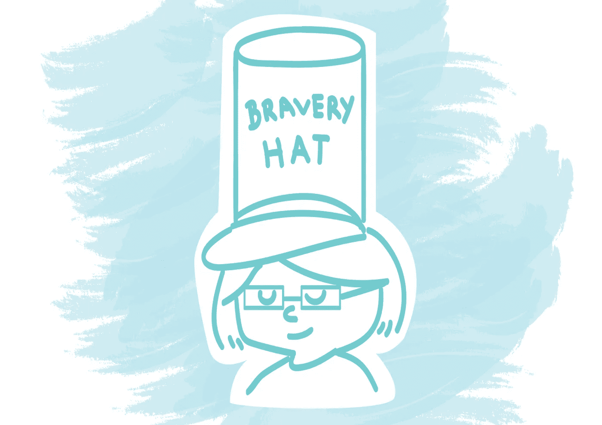
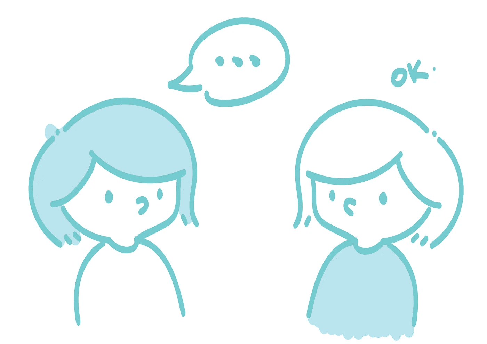
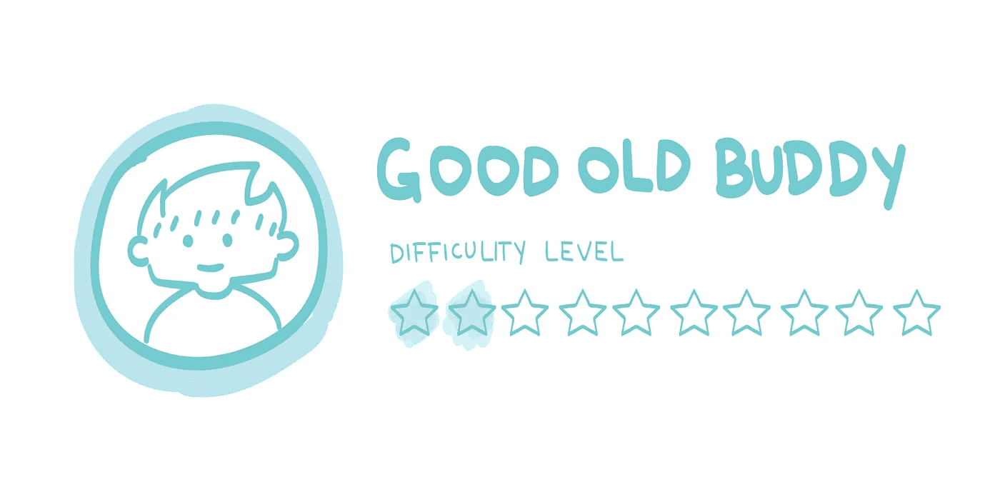
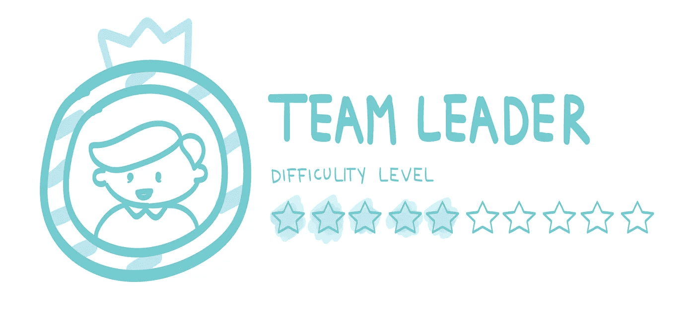
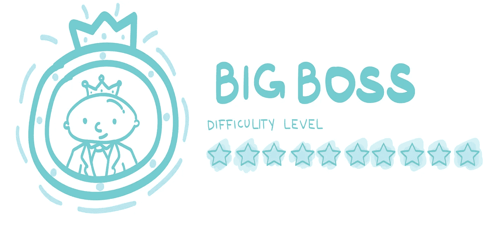
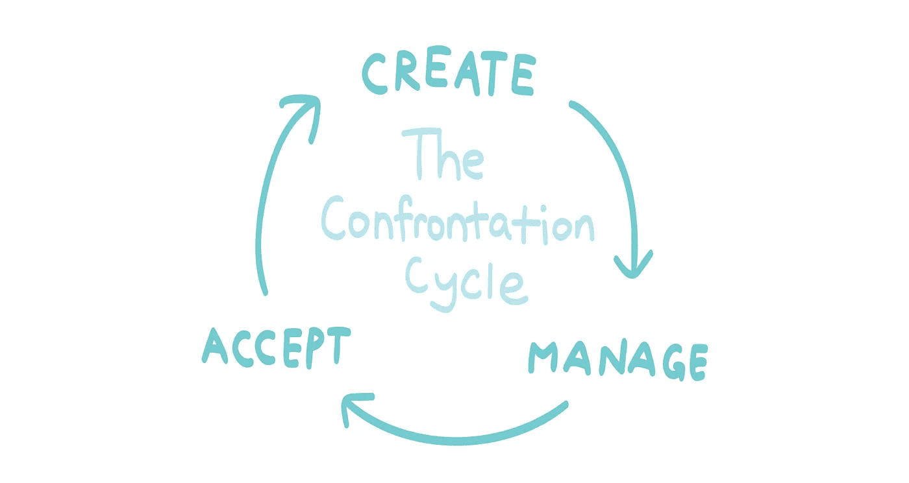

# 设计对抗

> 原文：<https://medium.com/swlh/designing-confrontation-c18a83c57e76>

## 因为哪里有对抗，哪里就有增长

My “I am not amused” face.

我讨厌我的工作。

对于我加入的每个新组织来说，这是一个持续的循环。当事情做得不对时，当事情做得太对时，当事情很正常时……我从来不会对事情的运作方式及其长期效果感到满意。

在我有机会给自己贴上精神病问题儿童的标签之前，我看到了大卫·阿金的文章，这篇文章讲述了对抗如何带来成功的创新。

*啊哈！我不是问题儿童，我其实很有创新精神？太好了，告诉我更多。*

“改变”是这个千年的流行语。我们已经习惯了 iPhone 不再有耳机插孔的事实，我们遵循新的工作流程和在办公室使用的工具，几乎像一种奖励一样，我们每个季度都可以从快餐连锁店消费新的菜单项。

这里有一个有趣的事实:我们有点接受改变。
这里有一个不那么有趣的事实:我们通常不会推动变革。

如果你把这两者放在一起，你会意识到**我们更能接受变化，而不是能够推动它们**。我们大多数人都是被动的个体；我们知道需要改变，但我们不想在知道我们可能会烧毁森林的情况下放火。

这是一个罕见的时候，失败或停滞比发现和进步更受欢迎。这很糟糕。

# 制造对抗

One drop to confrontational destruction.

为了对抗，我们需要反思。自我反省的行为允许任何人筛选出过去行动的细节，并得出行动点来采取行动。

> 你今天做得好的是什么？你还能做得更好吗？
> 你怎样才能在接下来的一周中提高表现得更好？

**Asking questions**
In Mandarin, “学问” (xué wèn) basically means knowledge. There’s a very interesting story I heard on the radio that I will always remember.

A man has two sons who didn’t understand the meaning of the phrase “学问”. He then separated he word into two and gave one to each son.

> “学” — To learn
> 
> “问” — To ask

The son who got “学” studied really hard, day and night.

The son who got “问” went to ask questions to every person in the village.

最终，两个儿子都没有揭示获得知识的真正含义。

父亲然后把单词重新组合在一起，完成它的意思。两个儿子终于明白了。

故事的寓意:为了获得知识，一个人必须问才能学习。

“学问”；要学要问。

问自己一些问题，以便更深入地挖掘自己的优点和缺点。把你的倒影想象成一次发现之旅；如果你需要指导也没关系。

对于你问自己的每一个问题，试着不断挖掘答案，找出问题并找到解决方案。那些“尤里卡！”你意识到该做什么的时刻——把它们写下来；这些将会是你的行动点，在那里你尝试在你的生活方式中实施一些新的东西。

**见义勇为**

Dress your bravest, act it too.

他们说生活中你只需要三样东西就能快乐:

1.  爱的能力
2.  做(某事)的能力
3.  希望的能力

每个人的真爱都是一碗芝士通心粉，所以 **№1** 已经应验了。*(评论区打我)*

**№2** 基本上意味着你需要能够做你需要进步的事情。通往幸福的道路是一个循序渐进的过程，所以在你完成这一项之前，你不能进行清单上的第三项。

**是我们大多数人在**完成之前都会犯的错误。我们都希望改变，不是吗？****

> ****为什么我们要等待改变的发生，而不是自己去改变呢？****

****对于我们在创造改变方面的能力有一个巨大的误解。我们大多数人都有这样的思维定势，认为只有高层人才被允许影响和建立变革。那根本不是真的。****

> ****“我们所创造的世界是我们思考的过程。不改变我们的思维，就无法改变。”阿尔伯特·爱因斯坦****

****我们比自己想象的更强大。****

****这是反思过程的一个重要部分，我恳求你问自己这个问题:****

****“你为什么害怕改变？”****

****为了朝着不同的方向迈出第一步，你需要勇敢。****

****未知的结果是一块有待探索的土地。谁知道走一条稍微不同的路会发现什么呢？****

****领导者不仅仅是能够改变的人。我们需要停止把所有的权力交给那些我们认为处于顶端的人。****

# ****如何开始采取行动****

****在你做了适当的反思后，你会得到你的打火石和钢铁来创造你的第一个火花。****

********

****技巧 1:学会客观对话创造合适的火花需要技巧和练习。人们无时无刻不在交谈；对话的影响力和意义取决于你如何引导讨论。****

****进行有效的对话并不像看起来那么难；带着开放的心态，做好充分的准备，你就可以开始了。不要害怕与人交谈，找出更多更好的工作方式。****

****想到了一种可能对工作场所更有效的新工作流程？向你的团队大声说出来，并说服他们试用几周。****

****不太确定如何在工作中提升自己？与每一个和你一起工作过的人交谈，收集建设性的反馈。****

****你认为一个同事在过去的几周里没有表现吗？
*让他/她知道并讨论你们双方如何促进改进。*****

****在一天结束的时候，确保你的谈话以一个行动点或结论结束。****

****提示 2:记录你的进步
人类是视觉动物，我们大多数人都需要能够想象一些事情，以便进行下一步行动。我们也是健忘的存在；我和你打赌，你不记得上周末吃了什么。****

> ****没有记录=无法想象+忘记细节****

****养成一种习惯，写下你做了什么，从你的行动中得到的启示，以及如何做得更好。你可以每天反思，每周反思，甚至每月反思，来记录你的进步。****

****找到一种最适合你的记录方法；你喜欢写作吗？也许录音对你来说更有效。也许制作一个视频会帮助你更开放。有不止一种方法来记录你的进步，所以做实验来发现什么方法对你有效。****

****我个人写着身体改善日记，每周更新一次，并把我的即兴想法写在一个数字笔记本上。****

******提示 3:承担责任******

****你创造的这种改变是否成功是一个巨大的未知数，如果它没有按照你预期的方式工作也没关系。****

****实验并不总是正确的，但这并不意味着当它出错时你就把它们扔到一边。对自己的行为负责；记住失败是可以接受的，你会从错误中学习。****

****但是，不要因为失败的尝试而承担所有的责任或责怪他人。****

# ****管理对抗****

****我观察人们面对冲突的反应已经有一段时间了，我把他们分成我经常遇到的三种角色。用我对这种性格的描绘作为如何处理/不处理它们的粗略指导。****

****警告:以下信息非常主观。小心跟随。****

********

****Your best friend in the office.****

## ****你的同事****

****和你坐在办公室旁边，你的办公室伙伴，可能和你穿一样的鞋子。一起喝杯咖啡很酷。和你一起吃午饭。早上说你好，离开的时候说再见。****

******对抗的可能结果**
1。赞同你的想法。思路组合
3。对未来的沉默、消极-积极的互动****

******建议**
放手去做吧！记住工作和私人关系是两回事。没有什么是私人的。****

********

****Your direct superior, who is hopefully a nice person.****

## ****您的团队领导/直接经理****

****当你无事可做时，你可以指望他给你事情做。大多数时候是个好人。在会议中，60%的时候，偶尔和你吃一顿半尴尬的午餐，是在他们需要什么的时候来找你的。****

******对抗的可能结果**
1。采取行动，团队内部的工作流程得到改善
2。承认你的担忧，并在采取行动前等待更多人站出来说话。
3。奖金减少。你没有晋升****

******建议**
确保你有清晰简明的反馈意见。保持客观，也试着从他们的角度看问题。****

********

****I always imagined having a sassy bald boss. I call these type the “Enlightened ones”.****

## ****你的部门主管/大老板****

****你很少见到的人。大概有自己的办公空间吧。高谈阔论，也是这么想的。看起来很精明，只有时间做重要的事情。你真的不想浪费他们的时间。****

******对抗的可能结果**
1。你被提升了。尊重和加薪。
2。你可以得到免费的午餐或咖啡。
3。你被解雇了。****

******忠告**
说话要小心。确保他们理解你所谈论的真正问题，并将其与它对公司的影响联系起来。****

# ****接受对抗****

****无论你是员工、经理还是高级管理人员，重要的是要记住，给你的任何批评都是帮助你改进的有价值的信息。你是你自己生活的领导者，也是其他人生活的领导者。****

********

****End of the day, it’s about being ‘Zen’ with whatever comes at you.****

> ****“不听的领导，最终会被无话可说的人包围。”—安迪·斯坦德利****

****当你面对某人或被某人面对时，能够倾听是至关重要的。你对批评的反应会影响一系列的人；消极的反应很可能会带来负面的影响。****

******听**
当有人来对抗或者回击你的对抗时，自然的反应会是要防守。大多数人倾向于立即竖起一堵墙来捍卫他们的立场，但你不应该这样做，因为你将无法有效地倾听。****

****对着镜子说话，假装镜子在对你说话。****

****当你不那么防御性时，你会更开放，更愿意接受传递给你的新信息。从那里，你可以通过一个新的判断或找到一个更有效的方法来表达你的观点。****

****不要有偏见，用客观的观点去接近对抗。你表达观点的方式会影响它被接受的程度。****

# ****编后记****

********

****The entire summary****

****我认为对抗是一种寻求洞察力和改进的心态。如果某样东西没有受到挑战，它将停滞不前，并最终在它的行业中变得无效。****

****没有什么是完美的；创造变化并引发对事物如何工作或应该如何工作的更深层次的思考，这将永远是一个持续的循环。****

****去挑战自己，去挑战别人。当你开始感到不舒服时，你就已经迈出了实现成长的第一步。****

****这是我第一篇关于媒体的文章。如果你喜欢我创作的内容，如果你能鼓掌鼓励我就太好了👏)*或者关注我即将推出的作品。*****

********

## ****这篇文章发表在 [The Startup](https://medium.com/swlh) 上，这是 Medium 最大的创业刊物，拥有+406，714 名读者。****

## ****在这里订阅接收[我们的头条新闻](http://growthsupply.com/the-startup-newsletter/)。****

********