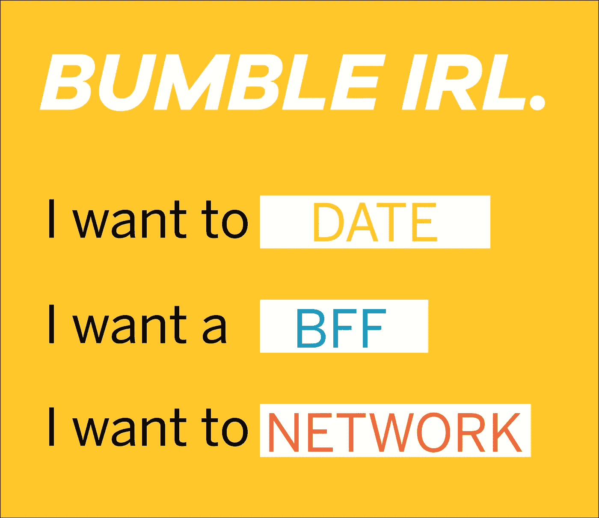

# 为 Bumble 应用程序 IRL 设计

> 原文：<https://medium.com/swlh/designing-for-the-bumble-app-irl-2721d1bb446>

众所周知，我们工作、个人和社交生活的范围很大程度上取决于我们在网上的活跃程度。无论是在社交媒体上发帖、写博客还是使用 Bumble 这样的酷应用。(剧透:我已经通过应用程序建立了几个很好的关系和一个合作伙伴，所以我可能有点偏见。但是我把我的成功归功于 T2。从第一次约会开始的两个小时，一个酒鬼喝了我的酒…