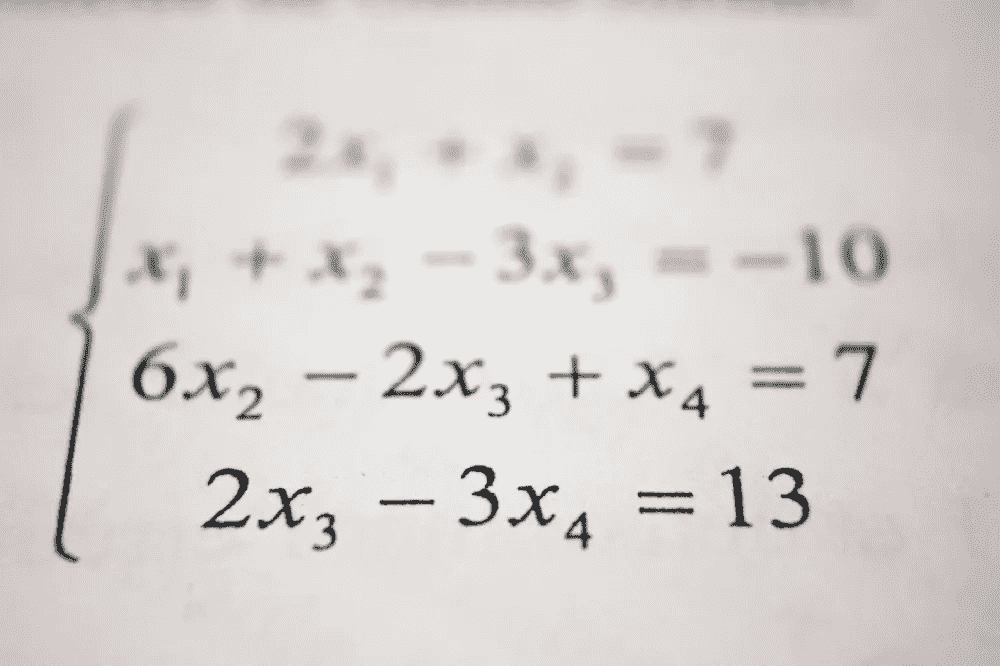
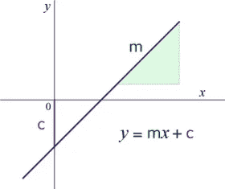
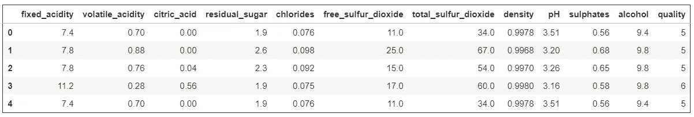
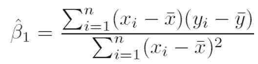
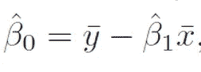
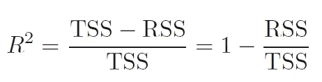
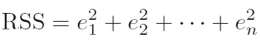
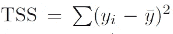
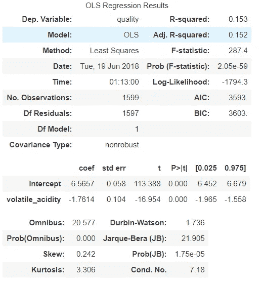

# 从头开始设计线性回归

> 原文：<https://medium.com/swlh/designing-linear-regression-from-scratch-ed542bf06943>



Photo by [Antoine Dautry](https://unsplash.com/@antoine1003?utm_source=medium&utm_medium=referral) on [Unsplash](https://unsplash.com?utm_source=medium&utm_medium=referral)

## 目标

在这本笔记本中，我们将尝试使用线性代数原理，以 Python 作为编程语言，从头开始构建线性回归算法

## 线性回归背后的思想

要开始理解机器学习算法如何在内部工作，线性回归通常是最符合逻辑和最直观的起点，因为它基于对基本线性代数的理解

在**线性代数**中，坐标系中的一条线由以下等式定义:

```
y = mx + c
```

其中，
m 是系数(也称为直线的斜率或 y 随 x 变化的速率)
c 是截距，表示直线与 y 轴相交的点

给定 m & c，等式可用于找出对应于给定的一组 x 值的 y 值。
另一种思考方式是，是否存在给定的这种值 m & c，可以在 x & y 之间建立线性关系。如果存在，那么一个变量(y —因变量/响应变量)可以说与另一个变量(x —自变量/预测变量)线性相关



在**机器学习**中，同样的概念可以用来确定现实世界实体之间的关系。
例如，给定特定年龄的一组人的属性“体重”&“身高”，并且目标是找出他们的体重是否与他们的身高相关——在这里应用线性回归算法将有助于确定是否存在这样的值组合，即他们的身高与他们的体重线性相关

## 工作原理:

线性回归算法从假设两个给定变量之间存在线性关系开始，这被称为初始**假设**
算法然后试图找到系数‘m’&的值，即截距‘c’。然而，对于真实世界的实体，绝对线性可能并不总是可能的-因此目标是以这样一种方式找到值，即 x & y 之间的关系在最大可能的程度上是线性的，也就是说，产生的线应该尽可能接近所有给定的数据点。有不同的优化方法，但在本笔记本中，我们将探索普通的最小二乘法
，计算值可用于预测响应变量(在**预测分析**)。通过这种方式，算法继续确定假设或初始假设是否正确——给定变量之间的线性关系是否(完全)或有多强

# 设计算法

## 关于数据

在本练习中，我们将使用 UCI 数据集库中的葡萄酒质量数据集:[https://archive.ics.uci.edu/ml/datasets/Wine+Quality](https://archive.ics.uci.edu/ml/datasets/Wine+Quality)
该数据集列出了影响葡萄牙“Vinho Verde”葡萄酒质量的不同属性的记录值。该分析将找出在目标变量“质量”的任何属性&之间是否存在线性关系



这里，由于目标是从头开始构建算法，我们将只使用属性之一(**单变量**)作为预测变量(挥发性酸度)，&尝试确定其与响应变量(葡萄酒质量)的关系

## 步骤:

*   基于普通最小二乘准则确定系数和截距
*   使用这些值来预测响应变量
*   使用 R 平方标准计算精度
*   使用 Python 库中可用的线性回归模型实现相同的功能:Statsmodel & Sci-kit learn
*   将此模型的准确性与 Statsmodel & Sci-kit learn 实现的准确性进行比较

## 使用 OLS 确定系数和截距

**普通最小二乘法**是一种估计线性回归模型中未知参数的方法，目标是最小化结果线上的点与实际数据点之间的差值的平方和

按照这种方法，
系数由公式给出:



截距由以下公式给出:



我们现在将在数据集上应用这个公式来确定系数(m)和截距

```
xm=df["volatile_acidity"].mean()
ym=df["quality"].mean()
m = np.sum((df["volatile_acidity"] - xm) * (df["quality"] - ym))/np.sum(np.square(df["volatile_acidity"] - xm))
c = ym - b1*xm
```

运行上面的代码，我们得到了下面的结果:
系数:-1.761437780112675
截距:6.2676676767

## 预测响应变量“质量”

现在，使用这些系数和截距值来预测葡萄酒质量

```
# y=mx + c
df["pred"] = m*df["volatile_acidity"] + c
```

## 计算精度(R 平方度量)

r 平方度量由以下公式给出:



其中，
RSS=残差平方和
TSS=总平方和



其中，e[ith]= y[预测]—y[实际]，代表第 I 个残差，即第 I 个预测值与第 I 个观察响应之间的差值，以及



我们将使用上述公式来计算我们预测的 R 平方:

```
r2 = 1 - (np.sum(np.square(df["pred"] - df["quality"])) / np.sum(np.square(df["quality"] - ym)))
```

r 的平方:0.153858686866

# 统计模型线性回归

现在让我们使用 Statsmodel & Sci-kit learn 实现同样的功能

```
X = df[['volatile_acidity']]
y=df[["quality"]]model = ols("""quality ~ volatile_acidity""", data=df)
model=model.fit()
predictions = model.predict(X)
```

模型摘要:



系数:-1.761438
截距:6.565746
R 的平方:0.15667686866

# Sklearn 线性回归

```
lm = linear_model.LinearRegression()
model1 = lm.fit(X,y)
predictions1 = lm.predict(X)
```

系数:-1.76143778
截距:6.56574551
R 的平方:0 . 4367586667

# 结论

正如我们所看到的，所有的值在不同的实现中都是相同的:

*   系数:-1.76
*   截距:6.565
*   r 平方值:0.152

这表明我们的线性回归的自我实现与库定义模型的实现是同步的
。因此，我们可以断定**已经从零开始成功地构建了一个线性回归模型**

[](https://medium.com/swlh)

## 这篇文章发表在 [The Startup](https://medium.com/swlh) 上，这是 Medium 最大的创业刊物，拥有+412，714 人关注。

## 在此订阅接收[我们的头条新闻](http://growthsupply.com/the-startup-newsletter/)。

[](https://medium.com/swlh)