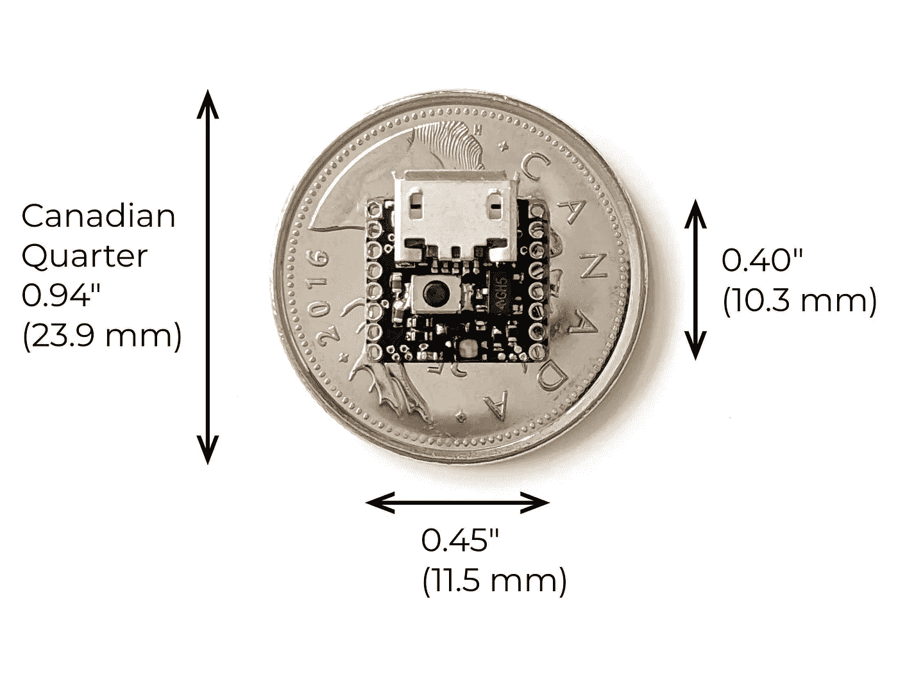
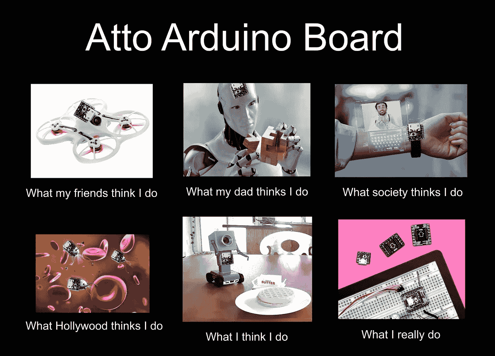
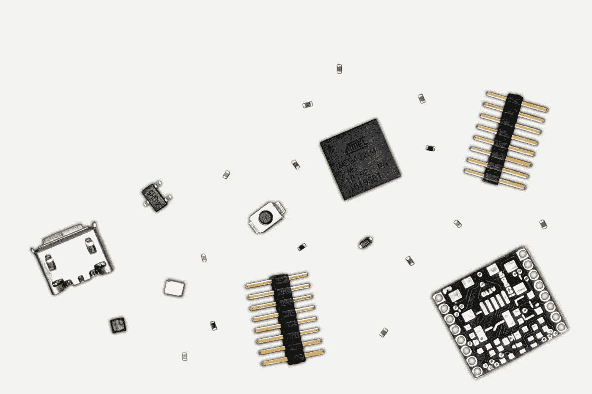
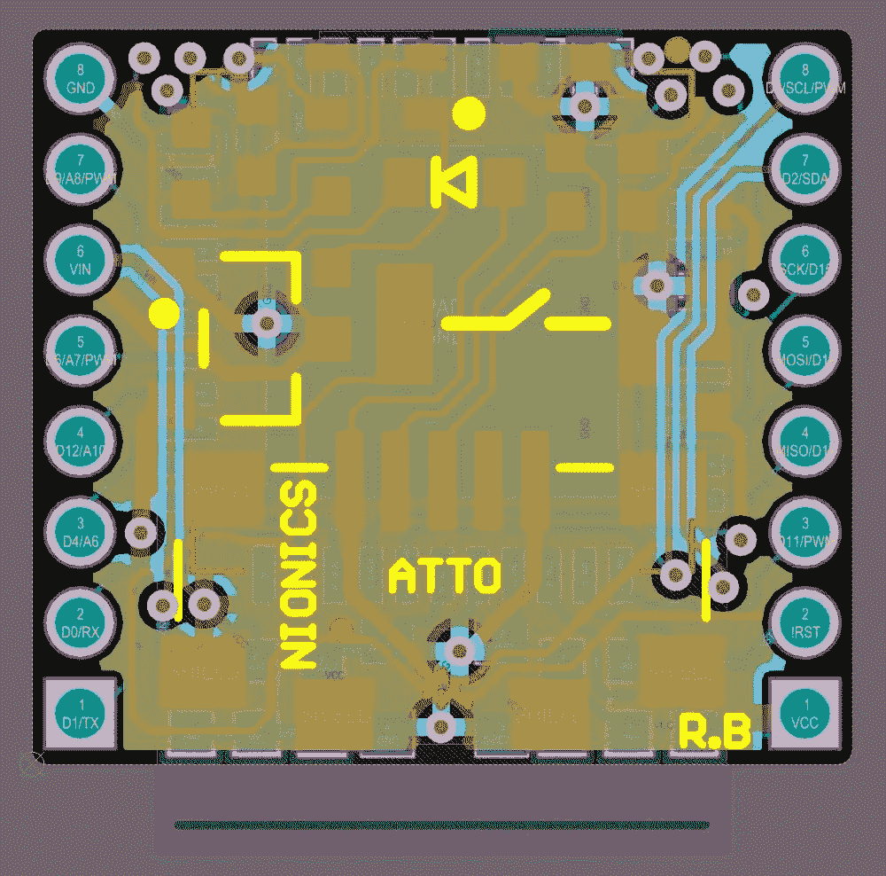
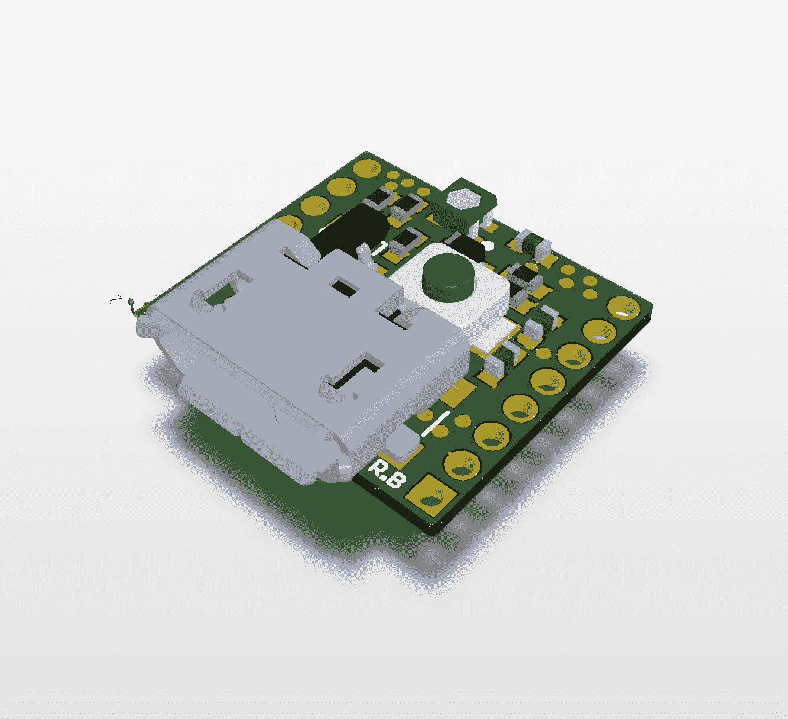
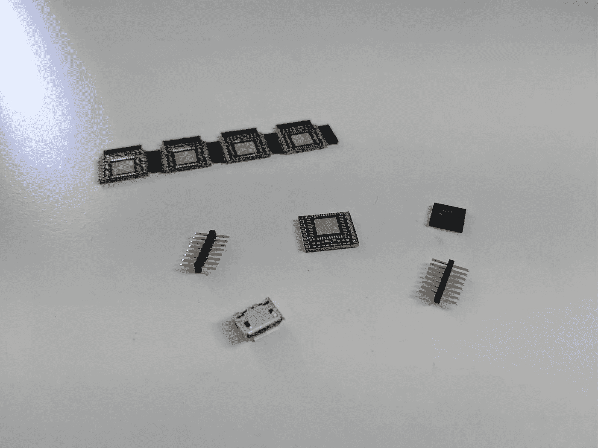
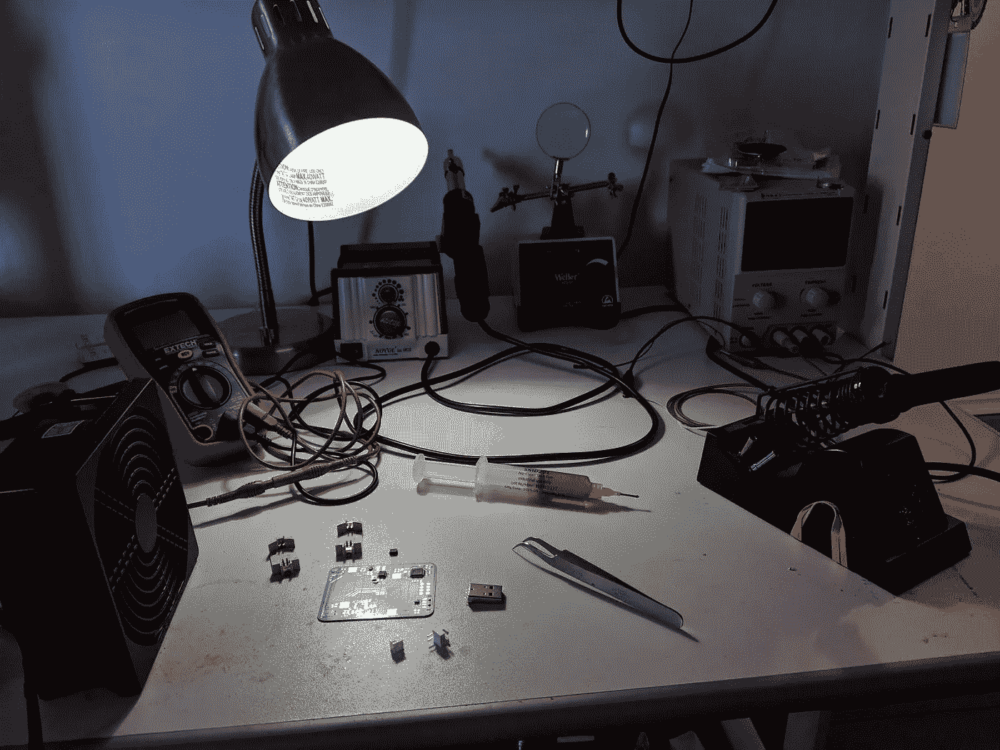
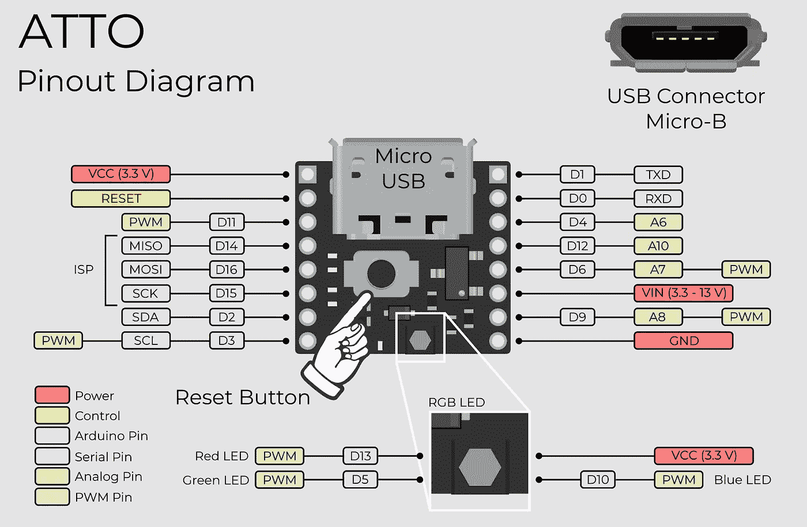
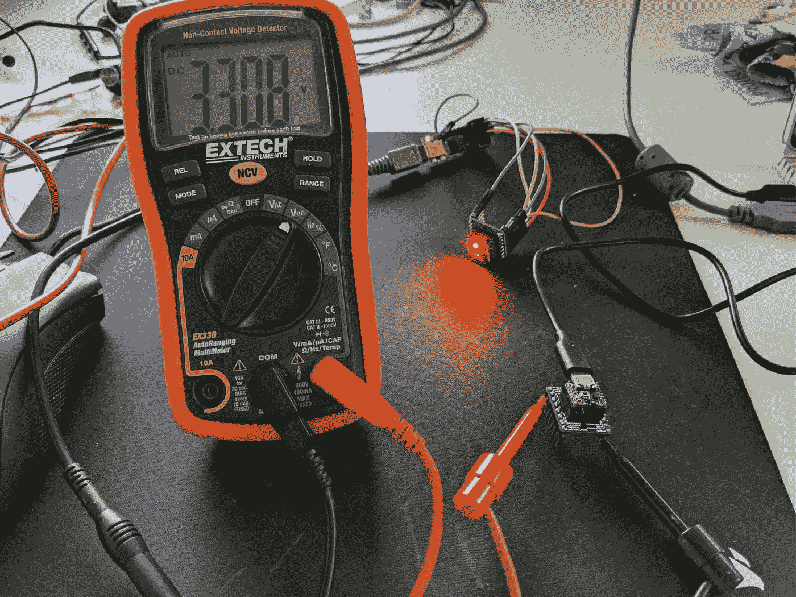
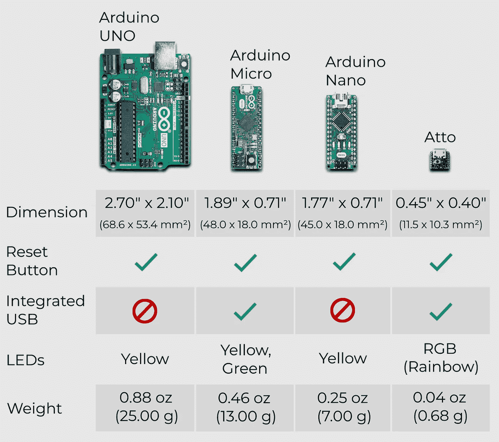

# 设计世界上最小的 Arduino！

> 原文：<https://medium.com/swlh/designing-the-worlds-smallest-arduino-f0606934d6ac>

在我的最新项目中，我和我的朋友们一起制作了世界上最小的 Arduino 兼容板，名为 Atto！下面的视频显示了 Atto 的 RGB(彩虹)LED 灯亮起的情况。想知道 Atto 有多小？0.4”x 0.45”小一点怎么样？(10.3 mm x 11.5 mm 给我的公制同胞兄弟姐妹)。

对于那些可能不熟悉的人来说，Arduino 是一个带有微型处理器的通用电路板，可以对它进行编程，让它做任何你想做的事情，它背后有一个巨大的社区。拥有一个巨大的社区(对任何事情来说)是很棒的，因为你有来自世界各地的支持(有点像媒体)！所以，你可能想知道，当你几乎拿不住或看不到这个该死的东西时，你能用这么小的设备做什么？

嗯，很多！想象一下，你想为可穿戴设备创造一项新技术，让耳环或其他珠宝根据你的体温或心跳改变颜色。或者，一个微小的机器人项目怎么样，Atto 充当机器人的大脑？可能性是无限的！

所以，我们现在知道了我们想要创造什么样的硬件产品，但是我们实际上如何制造它呢？它始于工程规范，或者我通常称之为，从淋浴的想法到纸上潦草的想法的过程。规格准确地告诉我们希望从我们的硬件中获得什么，这反过来又让我们知道构建硬件需要什么组件。

一旦规格到位，我们就可以开始电路设计，特别是原理图和布局。这是一项单调乏味的工作，但从长远来看，一个好的初始设计会帮助我们，并为我们节省大量的开发成本。所以，很重要！

在我们完成原理图和布局之后，我们希望确保我们的元件布局(上图所示的实体)在设计时考虑到了制造和维护。我们最不希望的事情就是因为糟糕的元件布局而在组装产品时遇到困难！

完成的电路设计被送到中国这片神奇的土地上进行加工。现在，我们有两个选择。第一选择是向制造厂提供电路元件清单，并为我们组装完整的原型。第二种选择是，你可能已经猜到了，我们购买零件，然后自己组装。

第一种选择更可取，但价格昂贵，而第二种选择更便宜，但需要大量的体力劳动。作为一名靠拉面和学校活动免费午餐为生的穷研究生，我选择了第二种选择。上图显示了我的焊接站和热空气返工站，它们可以在超过 300 摄氏度(572 华氏度)的温度下进行组装。出于显而易见的原因，我将我的热风返工站命名为“经理”。

电路组装好后，就该在我们的原型上编写初始测试固件了！

有了 Atto 上的固件程序，我们就可以进行测试(验证)了！我们的初始测试将是在上电后检查输入和输出引脚的行为。这通常通过将电路板直接连接到计算机或使用万用表/示波器来完成。我个人使用我的可靠的(也就是旧的和相对便宜的，但是超级可靠的)Extech EX330。不是 Extech 赞助的(…但我希望是)。

验证完成后，你要么有工作的东西，要么有东西被烧焦，到处都是魔法烟雾。幸运的是，Atto 的最新版本幸存了下来，它已经准备好在你房间的某个地方丢失了，因为它实在太小了！(在验证阶段，我可能已经丢失了一两个 Attos)。

一旦我们收集完测试数据，我们会检查以确保我们的初始规格得到满足，并且我们会继续我们的测试以查看是否需要任何必要的改进。朋友们，这就是 l̶i̶f̶e̶的发展圈。

感谢你花时间阅读我的帖子，我希望你喜欢并学到了一些新东西！如果你感兴趣，你可以去 https://nionics.com 看看我们。