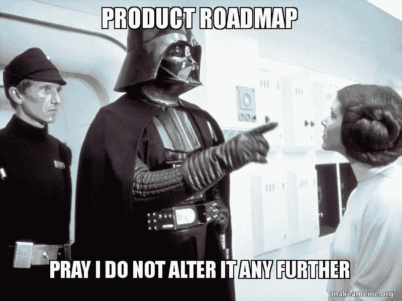

# 为新产品开发产品路线图

> 原文：<https://medium.com/swlh/developing-a-product-roadmap-for-a-new-product-383ba92db98d>

当不确定性成为常态时…

如果你是一名产品经理，在你职业生涯的某个阶段，你有可能负责制定一份[产品路线图](https://www.productplan.com/what-is-a-product-roadmap/)。在一些组织中，特别是那些(1)拥有成长中或成熟产品的组织，或者(1)主要是[瀑布](https://www.projectmanager.com/software/use-cases/waterfall-methodology)的组织，产品路线图是在未来 2-3 年内以水晶般的眼光和高精度制定的…