# 在沙漠中培养感恩之心

> 原文：<https://medium.com/swlh/developing-gratitude-in-the-desert-9f1c6a346f23>

就在最近，我登上了飞往亚利桑那州凤凰城的飞机……嗯，实际上事情没那么简单。加拿大的冬季漩涡导致出国飞行变得极其困难。我的航班在旧金山转机，事情变得有趣起来。

当我揭开我的旅行故事和经历时，我会给你带来我所经历的艰辛和教训。

旅行是一种可以真正改变一个人人生观的经历。亚利桑那沙漠让我重塑了自己的哲学。

*播放戏剧性的音乐*

这次旅行是**包装**和**革命。**但出于篇幅的考虑，我将分享我在航行中最有影响力的 5 次经历。

# **三藩市的斯多葛主义**

我飞往旧金山的航班是早上 8 点整。作为一个准备过度的家庭，我父亲坚持让我们至少提前 3 个小时到达机场。现在我不喜欢争论，所以我保证我会在 4:45 起床准备去 YYZ。到了午夜，我已经打包了一半，我的狗觉得这是在雪地里玩耍的时间。我试图向她解释，我需要收拾我的东西，但很难对一只摇着尾巴，哭着在雪地里玩耍的白色毛茸茸的小狗说不。

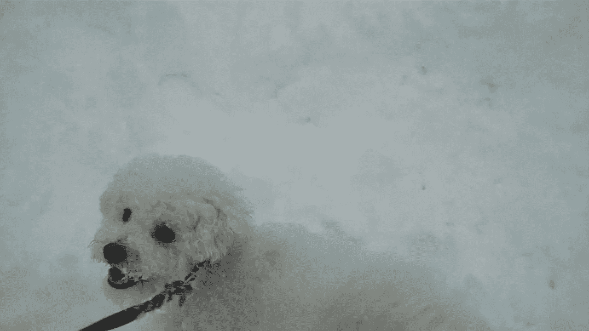

Summer, playing in the snow, in the middle of the night.

长话短说:伊莎贝拉没有睡觉。

睡觉时间？凌晨两点半。起床时间？凌晨 4 点半。睡眠时间= 2。

对于凌晨 4:30，我有惊人的精力，但我设法在 4:45 离开我的房子，5:00 去机场，清醒地通过所有的机场安检。

所以…感谢加拿大航空公司:然后我的航班被延迟半小时到 8:30。如果他们能在我到达机场之前提醒我就好了。但我还是忍气吞声，抓了几本 tims，读了一些保罗·格拉厄姆的散文(也就是我的新圣经)。

我们坐在 8:30 的飞机上，我很兴奋。但是飞机上有很多不同的问题。首先，我们直到上午 10 点才准备起飞。

我开始不耐烦了，我们会错过去凤凰城的联运车。

10 点 06 分:开始起飞。飞机开始沿着跑道移动，每个人都嚼着口香糖，做好了起飞的心理准备。飞行员说“好的乘客们，我们开始上升到空中”。

1

2

3

我们开始采取-

“救救我妈妈，她没有呼吸了”——飞机上的一位女士

“有人是医生吗”

“停下飞机”

有一次医疗急救。护理人员来了。我们回到我们的大门。治疗花了一段时间。可怕又痛苦。

我们 8:30 登上飞机，10 点左右开始起飞，直到 11:30 才结束医疗急救；基本上，在这个时候，我已经在飞机上坐了 3 个小时了。

哦，我们肯定会错过转机的。

最终，我们到达了空中，由于糟糕的天气，飞行了大约 6 个半小时，但总的来说，我在从多伦多到旧金山的飞机上坐了 9 个半小时。

我觉得自己运气不好:*“为什么我坐飞机总是这么倒霉？”。*

但是在飞机**实际上在空中**的第一个小时左右的某个时刻，我意识到这一切都不是我的错。我必须看到光明的一面。我本打算在旧金山度过我的**下午(因为我们错过了转机，白天没有更多的航班)，这很糟糕。**

我感到坚忍。我学会了如何管理自己的情绪。这种情况也有助于我和我哥哥建立感情。飞机上 9 个半小时=被迫和兄弟说话。

在过去的几个月里，我们疏远了，因为我们都很忙。但是我认为整个**飞机延误-医疗急救-被困在旧金山的经历**对于建立我们的关系是非常必要的。

他是我的弟弟，我意识到我需要为他腾出时间。我从这次旅行中真正领悟到的第一件事就是家庭很重要；他们就像是天生的好朋友。我知道，不管发生什么，我会有我的小弟弟，我觉得我们一起被困在飞机上近 10 个小时是很酷的。这构成了一个有趣的故事。

我的旧金山弯路也显示了将糟糕的情况转变为好的情况是多么重要。我可能一直都很生气。我可能会破坏我的心情和态度，因为飞机晚点，破坏了我原来的计划。但是为什么呢？我为什么要因为一些我无法控制的事情毁掉我的一天呢？

> 生活不会总是按计划进行。我需要开始接受这个事实。

马库斯·奥勒留是个非常聪明的人。我试图在日常生活中贯彻禁欲主义。但是整个 SF 事件帮助我经历了如此难以置信的压力，并且考验了我的坚忍。

有人很容易读到斯多葛主义或其他心理模型，这些模型也很容易“有意义”。但是当你在一个全新的环境中受到挑战时，你能够挑战这些心智模型，并实际上直接体验它们。我不认为我真正理解了斯多葛主义，直到我的 SF 事件发生。此刻，这有点像在公共场合向某人挥手，然后意识到你不知道他们是谁(又名傻逼)，但回头看，这是因祸得福。

我意识到:**我不够信任宇宙**。也许是因为有些人做的事情很愚蠢。可能我不相信宇宙或者宇宙中发生的事件是因为像俄亥俄州这样的州规定周日买玉米片是违法的(？？？？？？→这是我在俄亥俄州托莱多的一个周日晚上去塔吉特百货买该死的玉米片时，收银员说他不能卖给我的想法；下次再说吧)。

关键是，人类的愚蠢和美国怪异的法律让我质疑一切。我是说周日吃玉米片有什么不好？但是我实际上需要接受的是**每件事的发生都是有原因的**(我知道这很老套)。我一直都明白“凡事皆有因”，但旧金山真的让 gather 对凡事皆有因有了不同的理解。

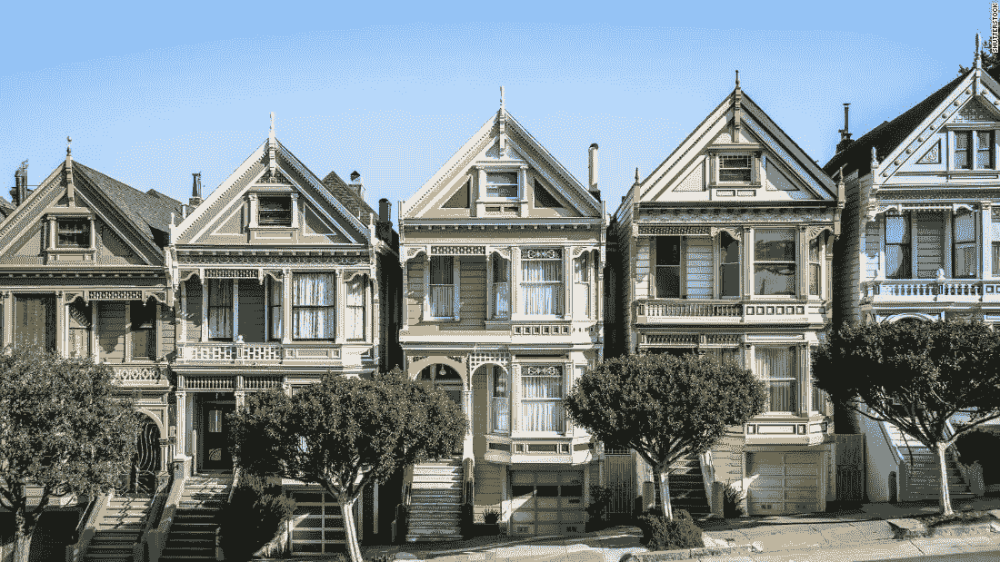

San Francisco, California

生活中的每件事要么是**的祝福**，要么是**的教训**。有时祝福会变成教训(比如你 15 年来最好的朋友死于交通事故，你没有机会说再见；15 年来，它们是一种祝福，因为它们为你提供了友谊，但它们是一个教训，因为生命是短暂的，你需要告诉你爱的人你爱他们)，而其他时候，教训变成了祝福(就像有一段有毒的关系，你从中吸取了教训，这导致了你生命中更牢固的关系)。

科幻小说让我明白，生活只是一系列的祝福和教训，无论如何你都必须从中学习。两者都不优越。教训和祝福可以帮助你成长，让你保持动力，实现最佳自我。

对生活中的每一件事都有积极的看法(无论是教训还是祝福)对有意义的生活是如此重要。如果你不珍惜你的幸福，有一天你会失去它们，并后悔没有花更多的时间去珍惜它们。

> 如果你不积极地面对生活中的难题，事情只会变得更难，你也不会学得那么快。

看，我们的生活中都有令人惊奇的事情和糟糕的事情。我从这次冒险中得到的主要收获是感激和珍惜我的祝福；因为它们不会永远持续下去(其中一个主要原因是我的哥哥)，而且我还打算有一个更光明的人生观。

因为…

**硬的东西好。**

你生命中大多数有价值的事情都很难实现。但这才是重点。这就是这些事情的价值所在。

比如说。奥林匹克运动员需要多年的严格训练，也许有一天会赢得金牌。他们可能需要超级早起，每餐都吃生菜，一天多次去健身房。就我个人而言，我会远离这种生活方式(或者喜欢适度快走，因为跑步很累)，但人们会这样做。没有人喜欢在早餐、午餐和晚餐时吃草，但运动员为了更大的目标而这样做。虽然他们的饭菜很糟糕，但他们可能会以积极的态度对待训练和用餐时间，因为这将让他们有动力继续努力工作。

当运动员很难。如果你是一名训练中的奥林匹克运动员，对健康饮食和锻炼持消极态度，你将不会有很大的动力，你肯定不会赢得金牌。

对我来说，经历了艰难、紧张的一天，我才意识到我有多重视我的家庭。

**心态**就是一切。你如何处理情况**很重要**。

旧金山是我一生中最疯狂、最激动人心的日子之一。我吃了披萨，聊了很多，还得了一件很恶心的夹克。学到了很多，尽量积极向上。

从这个冒险的下午开始，我的大脑发生了转变:

*   我*理解*斯多葛主义
*   想出了如何把糟糕的情况变好
*   我告诉自己一切都会好起来的(这一切的发生都是有原因的)，我应该更加相信宇宙。
*   对生活中的一切，无论是好是坏，都抱持积极的态度
*   开始与我的爸爸和哥哥建立更牢固的关系(我也爱你，妈妈，虽然你没有参加亚利桑那州的派对🙄)

有趣的是我没有做任何引人注目的事情。我确实遇到了一点小麻烦，吃了披萨，进行了有趣的谈话，还买了一件外套。这可能发生在世界上任何一个城市。我在多伦多吃了成吨的披萨，谈了很多，买了很多夹克，但当我在旧金山做这些普通的活动时，我只是开发了新的心智模型，并理解了我现有的模型。是环境的**变化**。将自己暴露在不同的环境中。这是了解你自己的一个重要因素。

> 以不同的方式做事。

因此，也许你不会坐在从多伦多到旧金山的 9 个半小时的飞机上，但在你生活的某个时刻会发生一些你无法控制的不方便的事情。你将被挑战去实践**禁欲主义**。你会烦躁不安。但这实际上可能是发生在你身上最好的事情之一，所以带着积极和兴奋的态度去学习，我保证，你会成长的。

作为一个人成长是令人兴奋的，有时你会面临许多挑战。

但是如果仙人掌能在炎热干燥的沙漠中生长(如果你问我的话，这是一个非常具有挑战性的环境)，你就可以在世界上任何地方亲自种植。以积极和坚忍的态度对待每一件事。

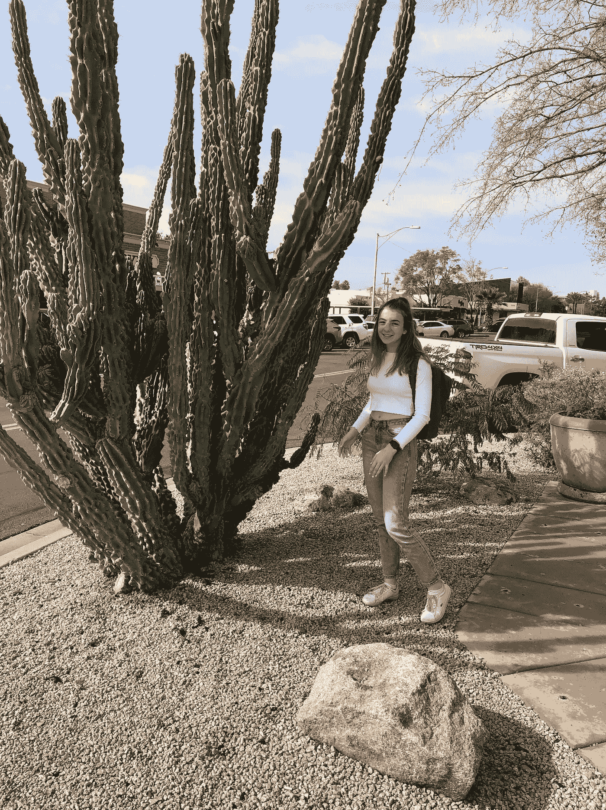

Look at this freaking cactus

# **在大峡谷中无足轻重**

作为普通的过度准备游客，我在参观大峡谷之前做了所有必要的研究。我什么都知道，从站在哪个岩石上拍最好的照片，到他们用来印大峡谷门票收据的树的类型。

然而，我并没有为自己的情绪反应做好准备，我感觉到自己正俯视着一望无际的峡谷。

> 这比第一次吃墨西哥卷饼更令人兴奋。
> 
> 总比你没准备的考试得 100 分好。
> 
> 甚至比不上在地板上找到的 50 美元。
> 
> 见鬼，这比赢得皇家胜利还重要。

## 我所感觉到的是**受鼓舞的、热情的、**和**令人向往的。**

你可能会想:伊莎贝拉，一堆石头他妈的怎么会让你觉得有灵感，有激情，有欲望？好吧，我们开始吧。

谷歌地图在大峡谷国家公园导航时不太方便；它让我们迷失了无数次。所以我们做了任何一个理智的外国游客都会做的事情:关掉手机，自己想办法解决。我们把车停在森林中央，出发去寻找这个大屁股国家公园里的大峡谷。

找到一个巨大的地质遗址不会很难。这是大峡谷。至少我是这么认为的。

在承诺“弄清楚”峡谷的位置后，我们走出了汽车。作为一个来自加拿大的小女孩，我只是假设在南方的亚利桑那州会很温暖。我以为亚利桑那是沙漠。沙漠不是温暖干燥的吗？？

嗯，**有趣的事实**，亚利桑那州北部不是沙漠，也一点也不暖和。此时，我从车里走出来，只是质疑我为什么不看天气预报。

幸运的是，我在我们汽车的后备箱里有一些额外的夹克。我浑身上下都是**层叠起来的**，只有**稍微有点冷**。接下来，我们随意朝各个方向走，祈祷我们不会被熊吃掉。过场动画 45 分钟后，我们走向写着“大峡谷往这边走”的路标。

那 45 分钟又冷又泥泞，还有很多上坡路。我饿了。我提到冷了吗？

郑重声明，这并不是我生命中最喜欢的 45 分钟。但我们最终做到了，我们找到了标志。我们就快到了！！！！

长途跋涉之后，我离看到世界上最伟大的奇迹只有一座山之遥:感觉超现实。

爬上山坡，然后下山。差点在冰上滑倒掉进峡谷。但是我在那里。我在该死的大峡谷。沉重地呼吸着。

尽管有 4 个小时的车程和长途跋涉；我正凝视着地球上最美丽的地方之一。这是一次糟糕、寒冷的旅程，但终点的景色值得每一秒钟的痛苦和寒冷。

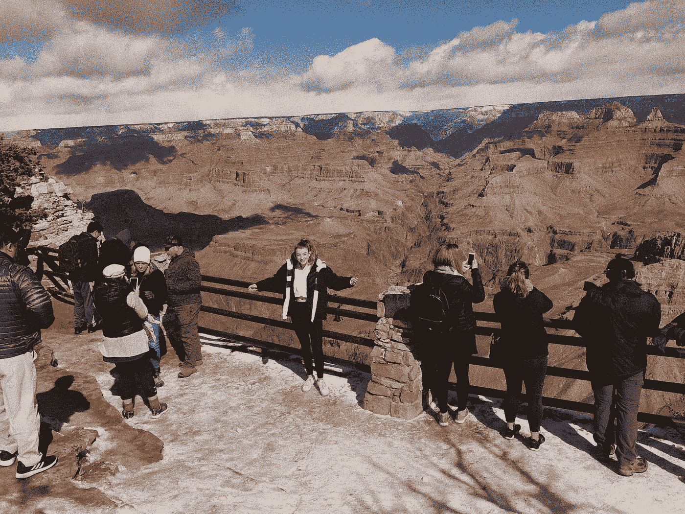

I’m the one in the middle that looks like she’s about to scream

自从我经历了一次艰难的冒险到达那里，它几乎变得更加值得。因为它在如此偏远的地区，离文明社会超级远，所以旅程很长。但是如果是 10 分钟的车程，我不认为我会如此欣赏风景。我意识到在(挣扎的)那一刻，挣扎是糟糕的。但是从长远来看，奋斗才是真正的奖励。

我呼吸着大峡谷的空气，感觉受到了鼓舞。**激励我在生活中多奋斗，**这样我就能找到更令人兴奋的目的地。这就像暴风雨结束时的彩虹或艰难旅程结束时的美丽大峡谷，奋斗使最终产品变得更好。

我变得有了奋斗的灵感，但也变得有了看到更多美好事物的灵感。我甚至不知道是否可以用语言来描述我在看峡谷时的激动。我的眼睛湿润了。我重重地呼吸着。那一刻我非常感激。

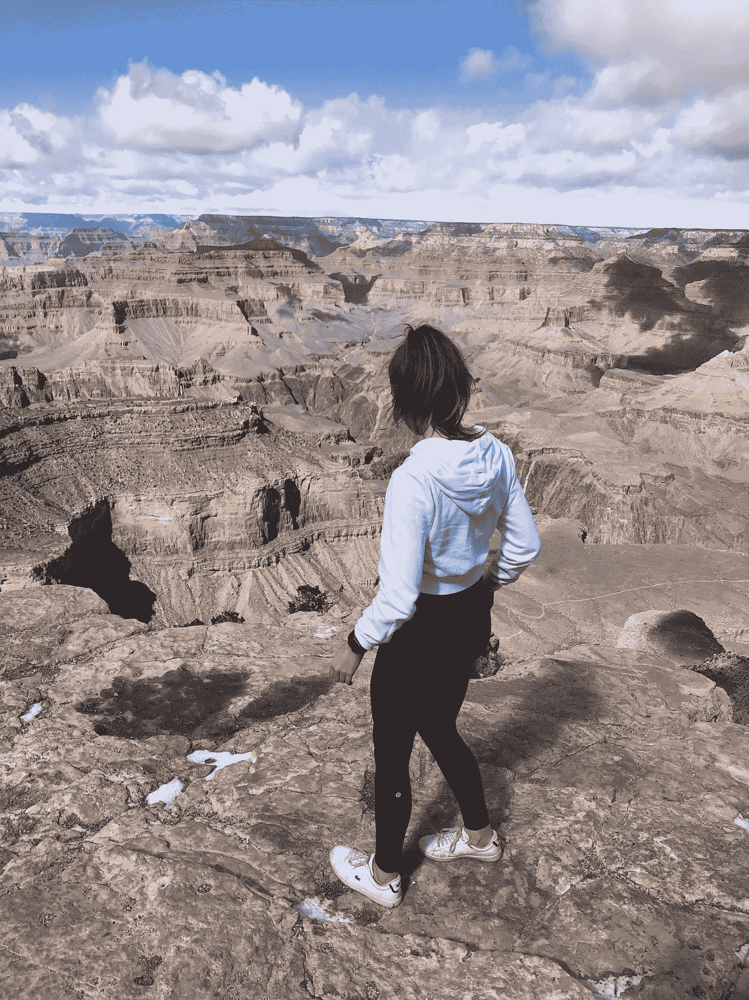

Me turned away from the Camera because things were getting sappy

在那之前，我对我的整个生命都充满感激**。就像所有的挣扎和我所经历的一切都是值得的**。我知道一切都会好的。我的生活终于平静了；我觉得一切都在掌控之中。****

**这是真正的幸福。**

**除了那种“鼓舞人心”的更加努力奋斗的感觉之外，我对**做出改变**充满激情和渴望。**

**我只是个孩子，看着这个美丽的大峡谷。与这个峡谷相比是个小孩儿。感觉无穷无尽，而我很渺小。**

> **你向下看，意识到你基本上与这个世界无关。**

**从那时起，我基本上对自己发誓要让生活成为我真正的婊子，因为这个世界很大，很破碎，很美丽，有这么多要做和要看的，而我只是这个世界的一部分。还不如抓住我生命中的这一点，让它变得有价值。**

**我想我甚至哭了一点，因为我第一次，生活被奉献给了我的婊子😎。**

# ****斯科茨代尔的意外事件****

**在我离开之前，加拿大的天气保持在零下 15 摄氏度左右。换句话说:冷得要命。所以离开这个鬼地方的想法令人欣慰。凤凰在沙漠里，我的大脑翻译成“真的很热”。现在，让我第一个通知你，在二月中旬，亚利桑那州并不是一个灼热的沙漠。**

**就像我的大峡谷探险一样，我在亚利桑那州的大部分时间比预期的要冷。**

**我让这个阻止了我吗？实际上算是吧。头几天，我发现自己抱怨很多。我无法改变天气预报，所以几天后我决定这个凤凰城冬天的天气不会阻止我享受快乐时光。**

**类似于旧金山的情况:我把不太好的东西变成了好东西。我利用寒冷来帮助我开始交谈。实际上，我遇到了一些非常酷的人。**

**因为有一段时间，我们在看我弟弟的足球比赛(加油，斯特凡！)，我本来可以和很多人交谈。我是活泼的自己，我只是去随机的人引发随机的对话。这让人感觉不舒服，但也引发了一些有趣的讨论。结果，大多数人和我一样，认为凤凰城总是很热。**

**气候变化🙄。**

**尽管我不能从手提箱里拿出我的短裤，我还是遇到了来自芝加哥、夏威夷、佐治亚、密歇根、哥斯达黎加、墨西哥、科罗拉多、温哥华、古巴和澳大利亚的人。他们都有一条共同的主线:对足球的热爱(哦，我们中没有人在来亚利桑那州之前查看过天气)。**

**但是，我学会了激情和爱。对足球的热情和对家庭的爱。**

**我遇到的一些父母为了让他们的儿子或女儿有机会在亚利桑那州的知名机构踢足球，并有可能获得奖学金或其他东西，已经透支了他们的全部银行账户。一些父母有这样惊人的故事，我开始明白什么是爱。**

**每个人都深爱着自己的孩子。无论如何他们都会支持他们。**

**大多数家长都是足球爱好者。像吃饭，睡觉，呼吸足球的热情。**

**所有的足球队也彼此深爱着对方；他们非常支持我。当我哥哥的足球队赢得冠军时，所有的男孩都挤在一起拥抱。他们都哭着唱“我们是冠军”。父母哭了。见鬼，我哭了。他们是一家人。**

**尽管天气不太理想，我们还是让旅行变得很有趣。我们支持男孩们踢足球，并在每一场比赛中都留下来。每次传球后都尖叫。说“牛逼”、“干得好”、“不错！!"“继续努力，小伙子们”，还有“漂亮的一脚”在重复。(我真的听起来像一张破唱片)。**

**我们正在团队中的男孩和他们的支持者(父母、兄弟姐妹)之间创建一个*社区*。我参与发起支持者之间的对话。旅行结束时，每个人都很亲密。**

**在冠军赛中，当男孩们罚点球时，我们所有的支持者都聚集在一起为他们加油。当他们赢了，每个人都挤在一起的那一刻感觉很疯狂，因为仅仅一周前我们还是陌生人。**

**这是我发展 **Yolo 心态的第一步。**(有些人甚至称之为“去他妈的”心态)。**

**在这次旅行中，我说去他妈的，做了一些我平时不会做的事情。它得到了回报，因为我遇到了很酷的人，留下了更酷的记忆。**

**外卖？？永远说去他妈的，想干嘛干嘛；YOLO。**

**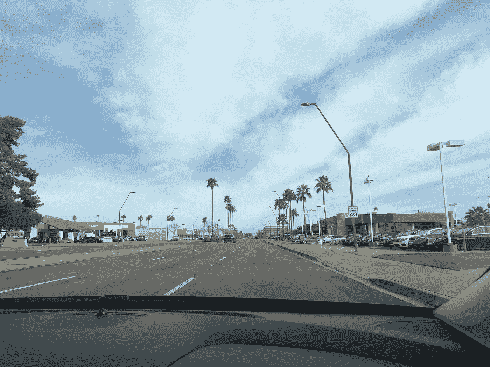**

**Scottsdale, Arizona (Not as warm as it looks lol)**

# ****北亚利桑那州的感恩****

**假期中我最喜欢的部分可能是穿越亚利桑那州北部的公路旅行。**

**我们停留的地方绝对美丽。**

**亚利桑那州塞多纳到处都是绚丽的红色山脉，这可能是我见过的最美丽的景色。(是的，有史以来最漂亮的*)。***

******

***Sedona, Arizona***

*****亚利桑那州弗拉格斯塔夫**我们在一个可爱的小镇停下来，那里有一家叫做“帕迪烧烤”的牛仔牧场餐厅。(试着想一些更美国西部的东西……)。但无论如何，这家餐厅有不可能的汉堡；如果你了解我，你会知道我是*吓坏了*。感觉就像一场梦。***

******

***I ate the impossible burger and it was **amazing.*****

*****亚利桑那州，燧石族公园:**我们在高速公路上漫步，路过这片沙漠，这里的景色是根据《燧石族》改编的。我童年的梦想实现了。***

***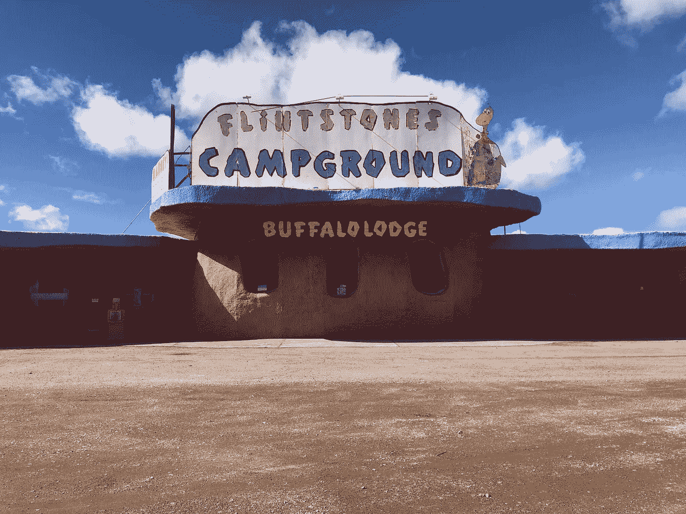***

***这个网站展示了意外收获的力量。去沙漠中的燧石族聚集地是我此行的亮点之一。而且完全不是我策划的；就这么发生了。***

> ***一些最好的事情是偶然发生的。***

*****亚利桑那州佛得角**有最美丽的山脉和仙人掌农场。我一生中从未见过这样的事情。这是令人兴奋和疯狂的酷。***

***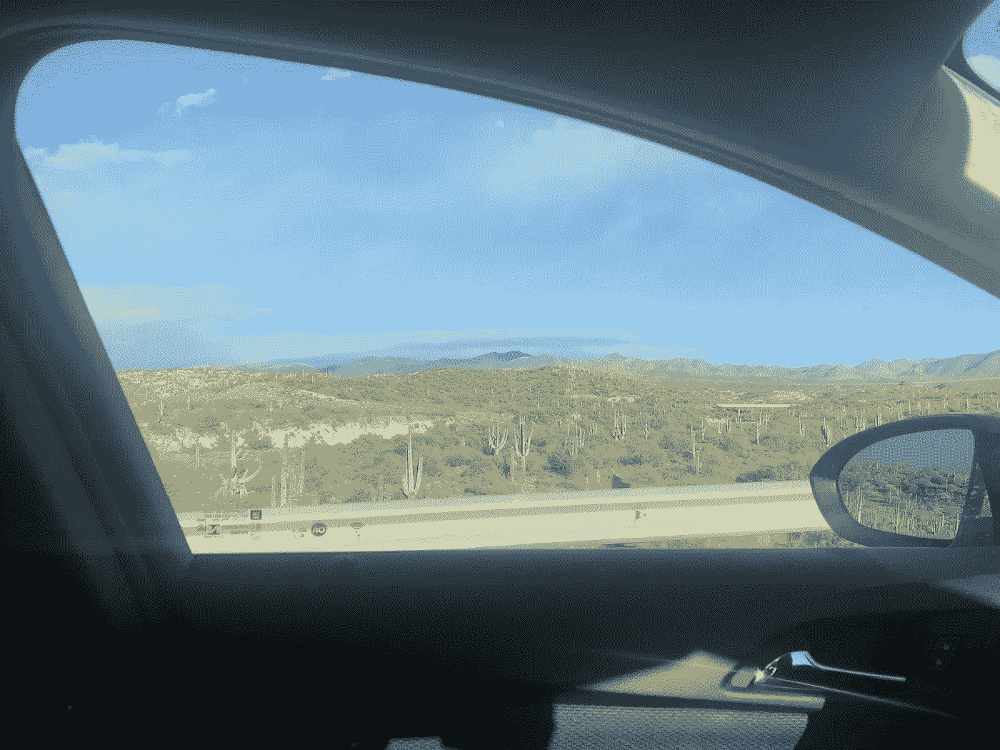***

***Cactus Farms in Cape Verde, Arizona***

***哦，我还去了世界七大奇迹之一的大峡谷，没什么大不了的。***

***是的，我非常感谢有机会参观所有这些地方；所有的目的地都很棒，令人大开眼界。***

***但是，事实上，开车去这些美丽的地方，相比之下，我会更加感激，因为我真的看到了它们。***

***我的父母在逃离南斯拉夫的战争后移民到了加拿大。我从未真正理解战争到底是什么样的。我没有足够的同情心。***

***车里有我、我爸爸和另外两位妈妈，她们的孩子和我哥哥一起踢足球；我们一起在亚利桑那州巡游。关于这场战争，其中一位母亲和我父亲的处境相似。所以他们在车里交流了战争故事，这些故事太悲伤了，我都不能保持清醒。但是他们讲述故事的方式就像他们讲述在麦当劳看到一只可爱的狗的故事一样。***

***他们已经接受了他们的现实和命运，他们经历了相当于 100 万普通人的痛苦。在车上 3 个小时的讨论中，我对这个世界了解了很多。***

***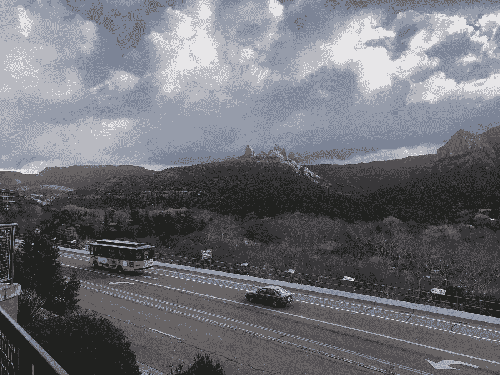***

***The view driving***

***(是的，我们正开车去生病的地方，我很感激那些千载难逢的景点。但是汽车之旅更有冲击力，让我心存感激。)***

***在学校里，了解一战和二战阵亡士兵是一回事。WW1 老兵约翰尼·阿普尔西德很难理解战争的条件，也很难理解战争的影响(因为缺乏个人联系)。***

***但当你从自己的父亲那里听到同样的故事时，情况就有点不同了。更私人化。***

*****战争很可怕**。它们不必要地结束生命并助长仇恨。但这不应该是什么新消息。我个人一直很清楚战争不是好事。***

***但事实是我的父母不得不经历最让我伤心的事情。而所有在车上分享的故事，只是让我更好地了解了父母的历史；这也让我为他们给我的一切感到如此幸运。***

***当一个人冒着生命危险搬到一个新的国家去建立一个家庭时，无论谁是这个家庭的一员，都一定会感到非常幸运。***

***从这些温暖人心、催人泪下的谈话中，我对这个世界、我的家庭和我自己了解了很多。***

***我明白了这个**世界是不公平的**,而且永远都是如此——面对现实吧。如果人们可以经历地狱，找到逃避战争或奴役的方法，我遇到的问题甚至都算不上问题。***

***我抱怨的东西甚至无法与其他地方正在发生的事情相比。我应该感谢我所经历的问题。像等公共汽车这样的问题；我很幸运生活在一个有公共交通的国家。困境当外面太冷，我需要买更厚的衣服时；我很幸运，我有能力和经济稳定性去买更厚的衣服。***

***听到我父亲的个人故事帮助我**理解我的问题**并重新思考它们。这让我感到**更加感谢我的父母为我所做的一切。但最重要的是，它有助于加强我和父亲的关系。*****

***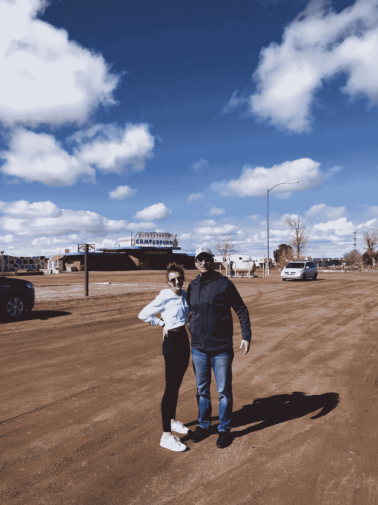***

***#squad***

***我沙漠之旅的收获:***

*   ***总是有人死去，有人经历地狱。这就是这个世界的运作方式，因为它太不公平了。作为一个幸运地过着人们渴望的幸福生活的人，我应该用我的知识和力量去改善这个星球上的其他地方。***
*   ***告诉你爱的人你爱他们是很重要的:他们不会永远在你身边。现在，我要更加关注我生命中的人，我要确保让他们知道我有多感激他们。***
*   ***除非你去问别人，否则你不会真正了解他们的生活。每个人都有有趣的故事和经历。你可以从中学习和发展的东西。***

***我意识到所有这些愚蠢的事情都发生在亚利桑那州风景优美的车道上；谢谢 AZ！***

# *****沙漠植物园的激情*****

***旅行中的一天，我们在亚利桑那州的凤凰城。这里的主要景点之一是**凤凰沙漠植物园**。不出所料，它定价过高，但我和我爸爸 YOLO 买下了它，并去查看了一下。***

***原来是一堆仙人掌(这也恰好是亚利桑那州其他地方的*)。我们很快就厌倦了植物园，因为它看起来完全一样。****

***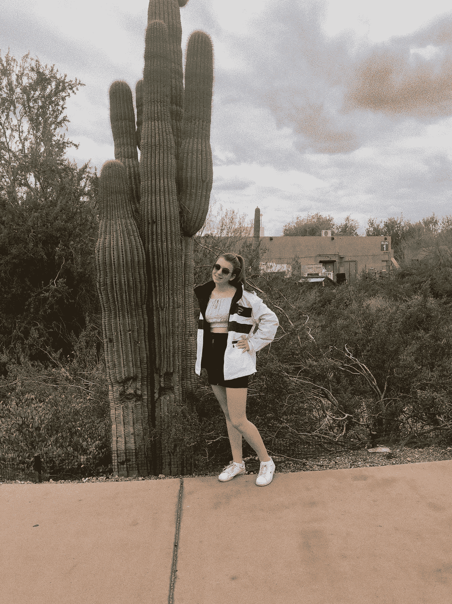***

***Me and a cactus in Arizona, shocking!***

***我们不会因为放弃花园而浪费门票…***

***所以，我们**寻求冒险**。在一大片仙人掌和退休老人的丛林中很难找到。***

***但是，我和我爸爸看到一个女人(她是花园的志愿者)盯着一些花。我们问她在看什么花:期待一个简短的回答。***

***不。当我问这位女士她在看什么花时，她继续说了大约**一个小时**关于四种不同的花。我几乎后悔问了。除了这个女人在谈论鲜花时是如此的*热情和兴奋，我很钦佩她。她可能会持续几天。****

***我和我爸只是把花看成五颜六色的小野草，但她看到的是不一样的东西。每朵花都以不同的方式让她兴奋。她认为它们不仅仅是无足轻重的杂草。我永远不会明白是什么让花如此令人激动，但我会永远钦佩她对花的热情和热爱。***

***观点有多重要真是疯狂。在这种情况下，对花的不同观点导致了两种截然不同的观点。对女人来说，花是迷人而有意义的；对我来说，它们只是普通的花。***

***我从凤凰沙漠植物园的经历中学到了一些东西:***

*   ***激情有各种形式:它是享受你所做的事情，直到你可以连续几天谈论它。***
*   ***当经历不是你所期望的，与人交谈；学习新的东西***
*   ***植物园被高估了，而且很贵，去走走吧。***

***不管价格如何，这对我来说是一次重要的经历。它定义了我如何看待激情，并创造了一个衡量成功的标准(能够连续几个小时谈论一个话题。***

***植物园里的那个女人基本上改变了我的生活，她永远也不会知道。她永远是我对激情的定义；我希望有一天能像她喜欢花一样喜欢某样东西。***

***最后，这里有一张我和一棵大仙人掌的照片。***

***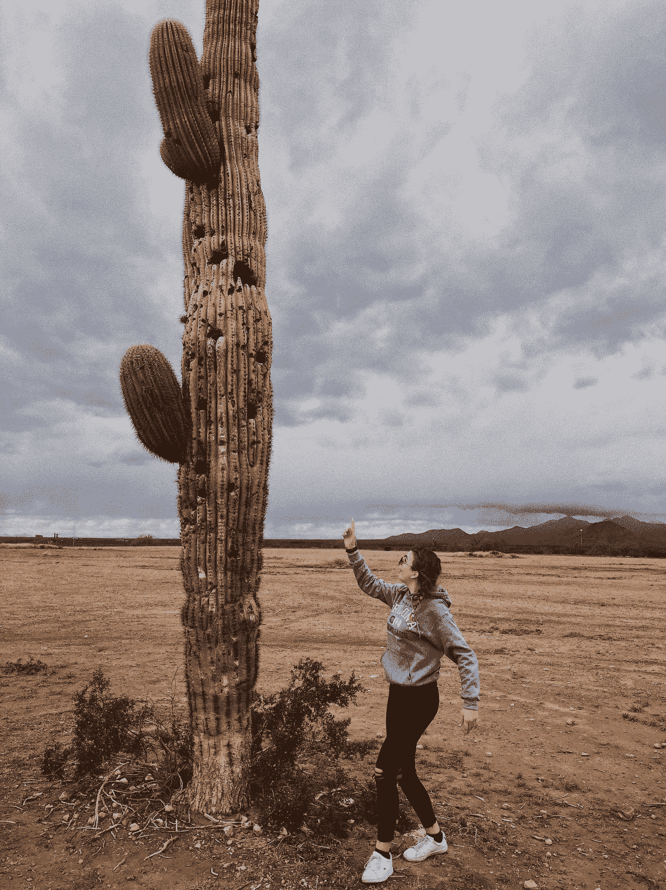***

***It looks like I was yelling at it, but I was actually just shocked at the height.***

***亚利桑那州，也许你应该把你的车牌从“大峡谷州”改成“振作起来，实现你的人生目标州”。***

*****连接上**[**LinkedIn**](https://www.linkedin.com/in/isabella-grandic-000b25172/)**和** [**Twitter**](https://twitter.com/isabellagrandi3?lang=en)***

***给这篇文章一些掌声+与你的网络分享:)***

******

## ***这篇文章发表在 [The Startup](https://medium.com/swlh) 上，这是 Medium 最大的创业刊物，拥有+426，678 名读者。***

## ***在这里订阅接收[我们的头条新闻](https://growthsupply.com/the-startup-newsletter/)。***

******