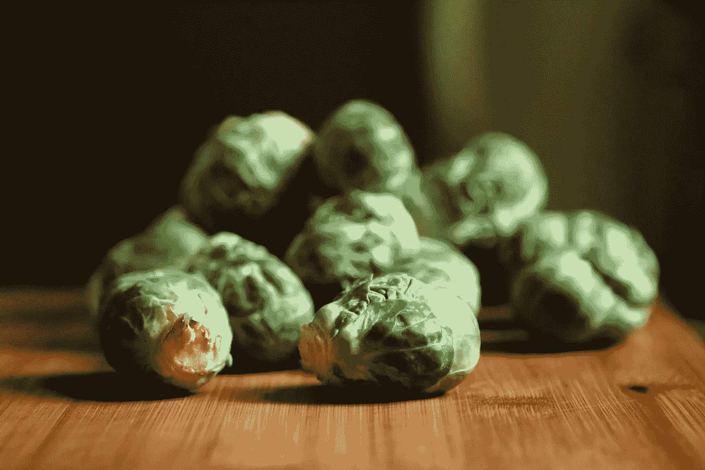
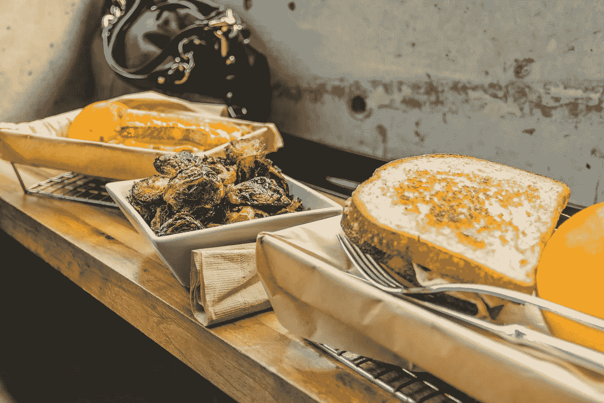

# 培养自律就像每天吃生球芽甘蓝一样

> 原文：<https://medium.com/swlh/developing-self-discipline-is-like-eating-brussels-sprouts-every-day-a6ad7e3a4ddc>

我从人们那里得到很多关于如何提高日常自律的问题。它有各种各样的形式，但最常见的是那些身兼两职的人:他们懒惰，而且*真的*绝望。他们想要快速解决问题。他们想要小费。他们希望他们中的一个能改变游戏规则，这是他们一生都没有得到的。 [Quora's](http://www.quora.com/profile/Adam-Bergen-4) 这是一个很好的地方来看看这一行动。事情是这样的:

**问题:**嗨，有什么*一条建议*(说真的，伙计们，一条建议)可以帮助我发展自律？

**答案:**先生/女士，我这里有你的一个建议，但首先让我为你列出另外 10 个随机建议。* *插入 10 条毫无用处的建议，来自一个没有纪律的人**

这是一个改变你生活的小贴士，让你从当地的毒贩变成沃伦·巴菲特。你可能不贩毒，但这是一个极端的例子。你想要确凿的证据，但话说回来，我们不都是吗？绝望散发着恶臭，我明白了。但是当你意识到没有短期的解决方案时，你最终会感到非常失望。

**你希望这个快速致富的计划能够满足你的自我******，然而你却得到了一个五年商业计划，而且前期没有任何资金。****

**哎哟。**

**现在，您可能想知道这篇文章的标题是从哪里来的。**

**让我们共同鄙视一些地球赐予我们的最讨厌的蔬菜，那些你小时候觉得恶心，现在想起来可能还觉得恶心的蔬菜。我研究了几个最讨厌的蔬菜的经典清单:这里[这里](https://www.mensjournal.com/food-drink/10-most-hated-foods/)，这里[这里](https://www.ranker.com/crowdranked-list/vegetables-i-won_t-eat)，这里[这里](https://www.care2.com/causes/top-10-most-hated-foods-in-the-u-s.html)。如果你点击它们，你会看到一些明显的趋势；有一个明显的赢家:球芽甘蓝。并且声明一下，这是 Brussel *s* ，不是 Brussel。**

**起初，我认为西兰花是一个不错的选择，因为它有一种相当不令人满意的味道，很多人都无法忍受。这几乎就像吃坚硬的草一样。不过，最终很明显，它需要球芽甘蓝。为什么？即使它们最近通过油炸、切成薄片、加入一堆酱料和干酪的艺术变得相当时髦，它们仍然是球芽甘蓝。记住，为了这篇文章的目的，我说的是生蔬菜本身。没有任何美味的添加剂。因为真的，任何你觉得恶心的蔬菜加了 48 种香料和 3 种酱料都会变得足够美味。**

****

***This* ***isn’t*** *what I’m talking about when I say you have to eat it daily.***

**所以，为了便于说明，我们用球芽甘蓝。略欠火候(仍然松脆，多么美味)，而且完全不加盐。这是大自然给人类的礼物。好好享受吧，混蛋。**

# **抱子甘蓝和自律有什么关系**

**假设我这样说:如果你每天吃满满一盘球芽甘蓝，你至少可以活到 120 岁。只需要一天一盘。但是这里有一个很大的难题:你*讨厌*抱子甘蓝。你用一种只有杰克·托兰斯这样的人才能与之匹敌的邪恶眼光看着享受这些的人们。在你眼里，这种多叶的卷心菜纯粹是卑鄙的恐怖。我明白了，这不像你可以打响指，喜欢脆脆的块状美味生锈的味道。所以你有一个问题:你可以成功活到 120，但是你要吃你不想吃的东西。每一个。该死的。日。**

**听起来很糟糕。**

****日常自律的理念遵循着*与*完全相同的逻辑。我们知道，善于自律意味着我们会以各种方式获得成功。但问题是，你不想坐下来做必要的工作。你真的不在乎提高自己的自律能力。实际上，让我重新说一遍。你真的在乎改善它，但是你讨厌强迫自己坐下来努力实现你的目标，当你不想的时候，日复一日，年复一年。又不是打个响指就能突然喜欢上的。就像你不能打个响指就觉得球芽甘蓝好吃一样。哭丧着脸。****

**但是你真的想要爱芽甘蓝。所以你可以去网上看看如何在没有呕吐反射的情况下成功地摄入食物。你跳上 Quora，问，*“我怎么会对芽甘蓝上瘾？”*，或者*“吃抱子甘蓝有什么最好的小窍门？”*。你不缺人的意见，都和爱吃抱子甘蓝没关系。事实上，它们可能是十大清单，甚至没有回答这个该死的问题，而是偏离了主题，旨在让作者得到一些曝光。但是，Quora 上有很多专家。*旁注:不要让我把你从 Quora 吓跑。上面有一些了不起的人提供了合理的答案。***

**所以你走吧，尽你最大的努力沉浸在夸润人赋予你的知识中。它不起作用。你还是讨厌球芽甘蓝。**

***“不可能”，*你认为。“一定有办法让你想坐下来吃满满一盘抱子甘蓝。”**

**你的大脑以每小时 150 英里的速度运转，左摇右摆地想出可感知的解决方案。前一分钟还是个灯泡，下一分钟只是一片寂静。什么都没有。但是你真的想要爱抱子甘蓝。你在绳索上；你的希望正在破灭，你感到进退两难。**

**直到有一天，你说去他妈的。你决定坐下来忍受它。他们说，直面你的恐惧。这可能不是恐惧因素，但对你来说已经很接近了。当你盯着大自然母亲最健康的美食之一时，你的胃会发酸。你决定吃一口。也许不是满满一盘，而是一块。你从小事做起。你继续几周每天吃一块。这并不令人愉快，你可能会有轻微的呕吐反射，但球芽甘蓝还是下去了。**

**最终，你掌握了最基本的窍门，所以你每天都会增加一点。事情永远不会变好，但你能处理好。与此同时，你希望你会爱上它，但你没有。**

***“哦好吧”*，你想，*“我就继续我正在做的事情。”***

**然后在未来的某一天，你再次坐下来，才意识到你正在吃满满一盘子的豆芽，这些蔬菜你仍然讨厌，也不希望落在你最大的敌人身上。但是吃它已经成了第二天性。你不会考虑太多。你只管去做。因为活到 120 比抱子甘蓝稍微好吃一点。**

# **日常自律没有捷径**

**球芽甘蓝的故事，或者如果给你选择，你永远不会吃的最糟糕的蔬菜，正是日常自律的工作方式。**

> **没有人真的喜欢吃腐烂的蔬菜。每个人都认为他们已经掌握了如何享受它的秘密。加入 48 种香料。把它浸在三种不同的调味汁里。也许再加第四个因为去他妈的，你可以。那也许会很可口。当然，就这一次，你也许能够忍受。这 48 种调料就像是小窍门，而三种(或四种)调料就像是动力的破折号。暂时的善良，但是你猜怎么着……你还是不喜欢(也不会喜欢)抱子甘蓝。永远不会。就像你不喜欢(也不会)养成自律一样。**

**但是你花了一生的时间去寻找爱它的方式。你尝试了 Quora 作家推荐的 435 条不同的建议，这些建议来自你从相关书籍中找到的，也来自你认识的人。**

****

***You and your friends deciphering all the Quora tips on how to develop daily self-discipline.***

**在第 436 点，你意识到你仍然不喜欢自律。所以你放弃了。**

**心态不对。自律不是寻找享受它的方法，因为坦白地说，你不会。我们的大脑天生喜欢感觉良好并能提供即时满足的事物。空闲时间坐下来工作感觉并不好，也不能提供任何即时的满足感。这是一个两败俱伤的局面。所以你试着欺骗自己，但是你意识到你只能在人类的大脑反击之前智取它。试图欺骗它享受平凡的，蹩脚的任务基本上是不可能的。**

**所以你只需要明白一件事:就是坐下来，做所有你需要做却不想做的事情。你必须有足够的渴望。就像你知道的，如果你每天吃满满一盘球芽甘蓝，你很容易活到 120 岁。因此，你想办法摄取它。该死的每一天。**

**就像你知道自律对你有好处，并提供一个更好的未来，你会找到一种方法每天摄取它。你在浪费你的时间和精力去寻找享受一些明显不好玩的东西。**

**你永远不会*有*去享受在自律上的工作。没人知道。这对你有好处，就像一盘没有煮熟的无盐球芽甘蓝。**

***感谢阅读！最初发表于***。****