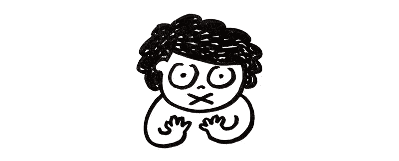

# 培养创造性的声音

> 原文：<https://medium.com/swlh/developing-the-creative-voice-ff91db1d49d>

## 我们的弱点如何让我们变得强大

我是一个非常害羞和安静的孩子。我的姐姐很健谈，直言不讳，我很高兴让她带头，在大多数时间里为我们俩说话。在我们小时候的家庭视频中，你可以听到我的父母要求我的妹妹停止说话一分钟，这样我也可以对着镜头说点什么，因为画面在缩放…