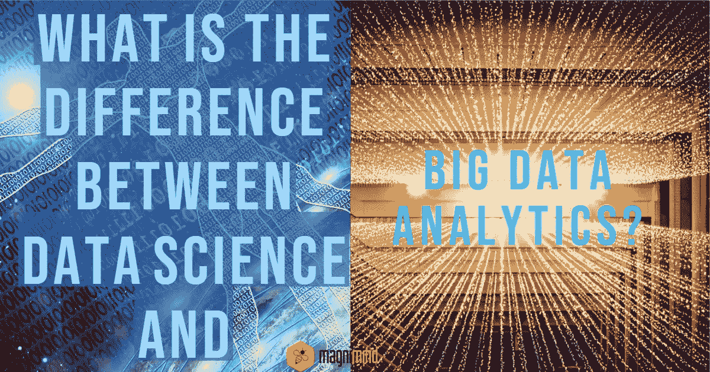

# 数据科学和大数据分析的区别

> 原文：<https://medium.com/swlh/difference-between-data-science-and-big-data-analytics-7f1d902746bc>

在当今的数字环境中，数据已经成为几乎所有组织最大、最重要的资产之一。数据可以从任何地方获取，它实际上正在改变我们的生活方式。

如果您对处理数据感兴趣，清楚地了解与数据相关的不同途径是极其重要的。在本帖中，我们将讨论 ***数据科学*** 和 [***大数据分析***](https://searchbusinessanalytics.techtarget.com/definition/big-data-analytics) 的区别。虽然这些术语是相通的，但它们之间几乎在每个方面都有巨大的差异。让我们开始讨论。

# 1-概念:

## 数据科学

*这是一个*领域，涵盖了几乎所有与数据相关的内容—从数据准备到数据清理，再到 [***数据分析***](https://ori.hhs.gov/education/products/n_illinois_u/datamanagement/datopic.html) ，并且处理结构化和非结构化数据。

> 数据科学可以被认为是一个包含各种科学方法的总称。

它结合了统计学、数学、问题解决等等。

## 大数据分析

*这个*领域涉及机械或算法流程的应用，以便为复杂的业务解决方案获得运营洞察力。这一切都是为了检查原始数据以支持决策。

> **大数据分析**涉及检查、转换、清理和建模数据。

# 2-应用:

## 数据科学的应用

*   数字广告:**数据科学**算法被整个数字营销领域使用——从数字广告牌到展示横幅。
*   互联网搜索:数据科学搜索引擎利用算法在几秒钟内为搜索查询提供最佳结果。
*   推荐系统:在这里，公司使用**数据科学**技术来推广他们的产品，并根据信息和用户需求的相关性进行推荐。这些系统不仅增强了用户体验，还让从数十亿个系统中找到相关产品或服务变得更加容易。

## 大数据分析的应用

***大数据分析*** 应用于多种多样的领域。其中一些包括:

*   游戏行业:在这里，公司使用**大数据分析**来获得用户的喜好、厌恶、关系等洞察。
*   医疗保健部门:医疗保健服务提供商使用**大数据分析**来执行任务，如跟踪和优化患者流量、跟踪设施中设备和药物的使用情况、组织患者信息等。
*   旅游行业:旅游公司使用**大数据分析**通过不同渠道优化购买体验。他们还获得消费者的偏好和欲望，并找到当前销售和后续浏览之间的相关性，这让他们优化转换。

# 3-工作职责:

## 数据科学专家

***数据科学专业人士*** 执行探索性分析，从数据中获得洞见。不同种类的 ***机器学习*** 算法用于识别未来特定事件的发生。他们专注于识别未知的相关性、隐藏的模式和市场趋势等。

## 大数据分析专家

*大数据分析*的*职责*包括处理从不同来源捕获的大量异构数据，并以高速到达。这些专业人士描述了大数据解决方案的行为和结构，以及如何根据需求利用 Spark、Hadoop 等大数据技术交付这些解决方案。

# 4-所需的技能:

## 数据科学专家

*   ***要成为一名数据科学专业人士****你应该具备出色的分析能力和出色的数据管理能力。很大一部分数据科学专业人士拥有硕士学位或博士学位，在统计、编程和数学方面拥有非凡的技能。*
*   *所需的编程技能包括 C/C++，Python，R，SAS，Pearl，Java 语言等。*
*   *所需技能包括机器学习工具、数据挖掘、数据管理技能、非结构化数据技术等。*
*   *良好的数据库系统知识以及必要的商业技能，如沟通、行业知识等。*

## *大数据分析专家*

*   *作为一名有抱负的**大数据分析**专业人士，你需要对 R 和 Python 等编程语言有深入的了解。*
*   *你应该在统计和数学方面有出色的技能。*
*   *数据争论技巧对于绘制数据和将数据转换成另一种格式也是极其重要的。*
*   *其他必需的技能包括数据可视化、机器学习技能和沟通技能。*

# *5-薪资包:*

**

**虽然*这两个专业人员在同一个领域工作，但是**数据科学**专业人员和**大数据分析**专业人员的工资差别很大。*

> *一名**数据科学**专业人员的平均年薪大约为**113，436** 美元，而一名**大数据分析**专业人员的预期年薪大约为**66，000** 美元。*

# *6-职业道路:*

**

**如果*你是数据领域的新手，**数据科学**和**大数据分析**可能看起来是可以互换的，但实际上它们是不同的，它们的职业道路也是如此。让我们来看看它们。*

## *数据科学专家*

**鉴于世界各地每天都有大量数据通过不同设备产生，组织对从其数据收集流程中收集有价值的见解非常感兴趣。以下是你成为数据科学专业人士的理想途径。**

*   *您应该熟悉该领域中最常用的编程语言，如 R、Python 和 Java，并更新您在统计学和应用数学方面的知识。这也有助于了解数据科学专家的角色是否适合你。*
*   *数据科学最受欢迎的专业是数学、统计学、信息技术、计算机科学等。对这些领域中的任何一个或几个领域有一个很好的理解会帮助你在竞争中领先一步。你还应该继续学习数据库架构、编程语言等。*
*   *试着通过建立和培养与不同社区的联系，加入实习机会等来开始发展你的职业网络。*
*   *有许多组织提供数据科学领域的入门级工作。寻找像**初级数据科学家**或**初级数据分析师**这样的职位。尝试获得一些系统特定的认证或数据相关领域的培训(例如数据可视化软件)，因为它们可能会帮助你更快地获得入门级的工作。*
*   *如果你想让自己的职业机会相对高一些，那就努力去获得博士、硕士之类的高级学位吧。*

*如果你想得到快速提升，或者成为一名需求量很大的数据科学专业人士，努力获得额外的经验。请记住，企业重视结果。因此，拥有领导和项目管理经验，再加上强大的技术技能，将有助于你获得更多重要的机会。*

## *大数据分析专家*

**你的*主要职责将包括理解庞大数据集揭示的洞察力和趋势。让我们来看看如何成为**大数据分析**专业人士。*

*   *考虑将数据分析或应用统计学与侧重于数据库管理和项目管理的计算机科学课程一起学习。*
*   *作为一名没有任何经验的**大数据分析**专业人员，获得直接就业可能有点困难。所以，试着接受实习机会，获得有价值的经验和一些相关的培训，这将有助于额外的技能发展。*
*   *尽量找一份统计助理之类的入门级工作，以获得宝贵的经验和在职培训。*
*   *考虑尽可能多地参加内部培训课程，特别是关于大数据管理和分析软件程序的课程。他们会帮助你获得重要的知识和经验，这反过来会让你达到你想要的水平。*
*   *更高的学位会给你带来更多的工作机会，从而帮助你在职业生涯中更进一步。*

*企业希望他们的员工熟悉尖端工具和技术，同时具备扎实的知识。所以，建议考一个*大数据管理*或者*数据分析*或者*数据科学*的硕士。*

*此外，有一些在线学院提供有价值的认证，这将有助于你获得宝贵的现实世界的经验。这些证书最大的好处是你可以在保住工作的同时继续学习。*

# *7-要记住一件重要的事情*

**

**不管*你是选择成为**数据科学**专家还是**大数据分析**专家，你都必须在你的领域保持相关性。在当今这个技术不断创新的时代，继续教育变得比以往任何时候都更加重要。*

> *一个以职业为导向的数据专业人员应该不断学习，并保持在他/她各自行业的趋势之上。*

*所以，继续发展你的人际网络，通过会议、训练营等继续寻找职业和教育发展机会。*

# *结果*

**

**如今*，数据已经成为几乎每个行业的支柱，这是一个普遍的事实。企业已经从只关注产品或服务转变为关注数据。如今，即使是最微小的信息也能为组织带来巨大的价值，组织可以从中获得大量的洞察力。这导致对能够帮助公司实现目标的专业人士的需求呈指数级增长。*

*T 在**数据科学**专业人员和**大数据分析**专业人员的帮助下，通过使用正确的技术和工具，从分析数据中获得的知识和洞察力可以帮助这些公司推动产品和服务创新。 ***数据科学*** 和**大数据分析**的每个领域对组织来说都极其重要。因此，如果你想进入数据领域，你可以考虑根据你的偏好和能力为这些领域中的任何一个绘制职业道路。*

* [## 数据科学和大数据分析的区别——Magnimind 学院

### 在当今的数字环境中，数据已经成为几乎所有人最大、最重要的资产之一…

magnimindacademy.com](https://magnimindacademy.com/difference-between-data-science-and-big-data-analytics/) 

> 点击此处订阅接收[我们的头条新闻。](http://eepurl.com/gjDwwP)

## 这篇文章发表在 [The Startup](https://medium.com/swlh) 上，这是 Medium 最大的创业刊物，拥有+445，678 名读者。

## 在这里订阅接收[我们的头条新闻](https://growthsupply.com/the-startup-newsletter/)。

*