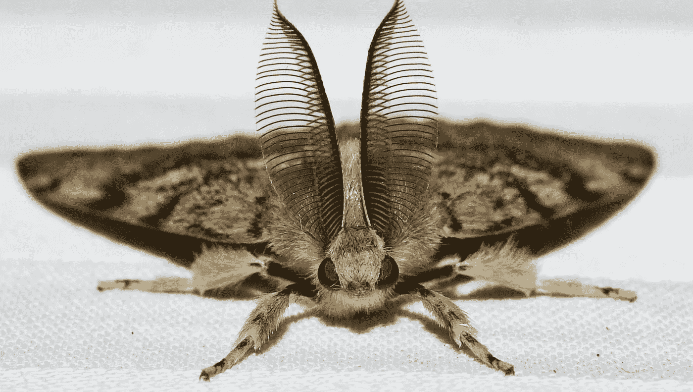

# 并非所有的软件错误都是有害的

> 原文：<https://medium.com/swlh/differentiating-software-pest-from-bug-ab261e454e19>

## 软件世界

## 识别它们有助于确定应该修复的优先顺序

那是 1945 年 9 月 9 日。[格蕾丝·赫柏](https://en.wikipedia.org/wiki/Grace_Hopper)发现了一种飞蛾，这种飞蛾当时给机器带来了问题。Bug 现在被称为软件缺陷，维基百科对它的定义如下。

> 软件缺陷是指软件中的错误、瑕疵、失败或故障