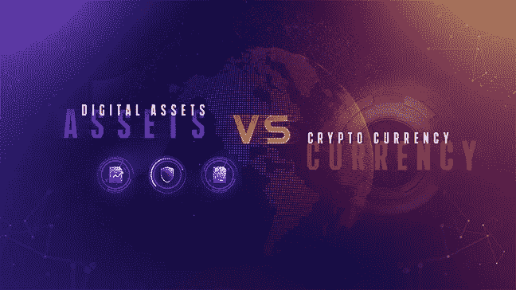

# 作为加密货币升级的数字资产

> 原文：<https://medium.com/swlh/digital-asset-as-an-upgrade-of-crypto-currency-b127273e719c>

从出现的那一刻起，加密货币就收到了褒贬不一的反馈。在描述这一现象时，金融界的代表(银行家、主要投资者和经济学家)使用了“投机泡沫”这个名称。与此同时，纸币加密替代品的创造者为他们的发明预言了一种革命性金融工具的命运，这种工具本应成为新数字经济的基础。

**加密硬币有什么弱点？**

首先，加密货币没有实物资产支持。当谈到价格时，它们只受到买卖双方利益的支持。

它们的高波动性使得难以预测价格波动，并阻碍了加密货币向实体经济领域的扩张。

此外，没有法律依据来监管加密硬币的流通。如今，只有比特币在中国、日本和韩国被认可为支付手段。没有法律保证需要用加密货币支付的服务将根据双方之间的协议提供。

如果哈希密钥丢失，几乎不可能恢复对电子钱包的访问。

另一个问题是，加密货币的应用领域仅限于商品和服务的销售。

最后，关于加密货币的安全性和脆弱性还有很多问题。带有加密支付的欺诈方案、窃取用户私钥和偶尔的黑客攻击是经常讨论的话题。

**数字资产是如何产生的？**

以区块链为基础的分散货币的想法和技术本身为数字经济的发展提供了无限的机会。大多数加密货币都有智能合约算法，有助于减少交易时间，并自动监控特定条款的履行过程。数字资产，即由实物资产(证券、房地产、汽车、企业股份等)支持的数字货币。)，保证遵守合同条款。

**数字资产的主要属性**

数字资产基于一个协议工作，该协议明确规定了其使用的条款和条件。

有一个数字化程序，这意味着创建现有资产的独特数字副本，区块链的相关记录登记获得数字化资产产权的事实。

用于访问数字资产的散列码不可能丢失。它的恢复机制不仅仅是在发展中，他们已经在实施，此外，数字资产也可以被继承。

实物资产的评估程序根据被评估资产所在国或注册国的适当方法进行。

真实资产的可靠安全和会计在其唯一的数字副本的整个存在期间得到保证。

以资产为后盾扩大了在新的高科技经济中使用数字资产的可能性。

加密货币的开发者正在积极寻找降低使用硬币和替代硬币的风险的方法，越来越多的情况下，术语“加密货币”被替换为“数字资产”，但在大多数情况下，改变的名称并没有赋予硬币任何真正数字资产的属性。

可以肯定地说，“加密货币”正在成为过去，它为用户做好了准备，并为数字经济的基础设施奠定了技术基础。金融领域和商业的未来在于数字资产。

点击[链接](https://www.bitbon.space/en/news/global/crypto-currency-or-digital-asset)，了解有关新数字资产的更多信息。

*最初发表于*[T5【coinconnecter.com】](https://coinconnecter.com/digital-asset-as-an-upgrade-of-crypto-currency/)*。*

## 这篇文章发表在 [The Startup](https://medium.com/swlh) 上，这是 Medium 最大的创业刊物，拥有+421，678 名读者。

## 在此订阅接收[我们的头条新闻](https://growthsupply.com/the-startup-newsletter/)。

