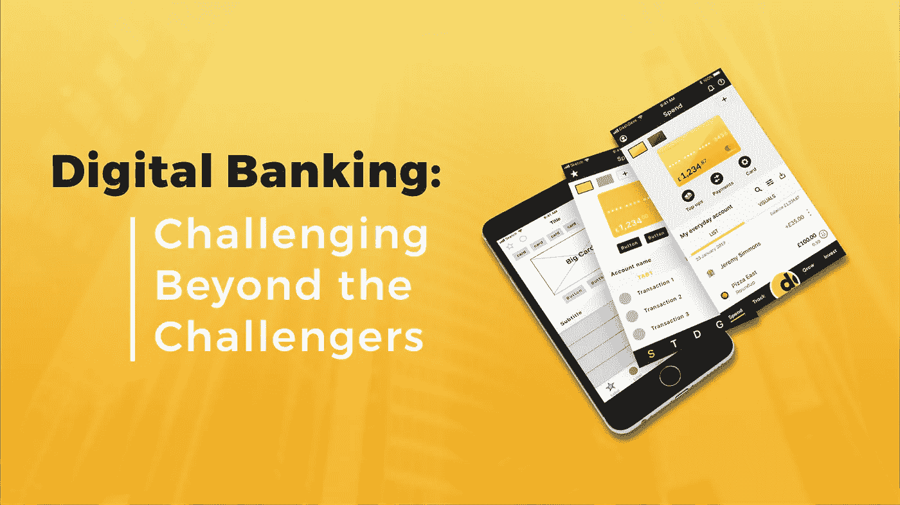

# 数字银行:超越挑战者的挑战

> 原文：<https://medium.com/swlh/digital-banking-challenging-beyond-the-challengers-cf44183c90d>

> 我明白了成功与其说是由一个人在生活中所达到的地位来衡量，不如说是由他在试图成功时所必须克服的障碍来衡量—布克·华盛顿

阅读名人的个人成功故事是令人愉快的、有趣的，也是如此鼓舞人心。但是，有两点是读者在阅读时需要牢记的。第一，你永远不会知道这个人取得成功的真实条件和陷阱。第二个概念是，你不能把实践中的经验应用到你的生活中。许多人和公司谈论他们完成的挑战。读到这里，我们变得更有动力，并准备采取行动。但是，我们错过了多少机会？很多。主要原因中，可能有选错了团队，浪费了时间，没有能力承担风险。

我们想在这里谈论挑战的原因是我们现在正在进行的项目。Dashdevs 公司为英国市场开发了数十种电子货币和投资公司。然而，公平地说，这个项目每天都在刺激着我们公司。自从我们开始使用这个产品已经有一年了。然而，我们似乎已经在数字无分行银行的利基市场工作了很长时间。这个大范围的项目源于最初的小客户的要求，我们抓住了这个机会，几十个项目已经改变了我们的生活。

让我们告诉你一点关于我们的情况，这将有助于你充分了解规模。作为一家软件开发公司，我们已经上市 9 年多了。从第一天起，我们公司就选择了发展战略。用一句话来说——接受挑战，实现它，并从中获得乐趣。每个项目都会带来新的知识和新的体验。我们正在使用科学的方法来提高产品开发的质量。我们将我们的专业知识应用于不同的领域和市场。这一战略有助于我们提高解决方案的先进性。我们的一些结果是[这里](https://www.dashdevs.com/blog/2018-we-re-making-headway/)。

2018 年春天，我们接到了一个相当小的开发登陆页面的请求。然而，这个项目开始迅速扩展。一个月后，我们收到了一个对 iOS 和 Android 原生移动应用程序、编排层和后台面板的请求。一切都必须在交钥匙的基础上进行。

*   我们以前创建过挑战者银行平台吗？**没有，但我们口袋里有 fin 技术经验。**
*   我们有产品范围的描述吗？从广义上说，是的。
*   我们有完整的现成设计吗？**号**
*   这对我们来说有挑战性吗？**是的。**
*   是技术责任让我们冒了很多风险吗？是的。

我们权衡了风险，决定投入这项产品。我们设计了移动应用程序(iOS 和 Android)。我们设计了系统的总体架构。下一个难题是与所有第三方服务和合作伙伴协商。目前，整合合作伙伴的总数超过 24 个。他们都有不同的需求，让他们一起工作是至关重要的。我们想强调客户团队的奉献精神和辛勤工作。对他们大多数人来说，银行业是一个新领域。然而，几十个的想法实际上触动了他们的心——如果客户赚了，几十个也会赚。他们做事从不半途而废。他们日以继夜地深入了解市场，做出了一个伟大的产品。这个想法能给团队带来巨大的推动力，真是令人惊讶！

世界上有成千上万家银行。正是因为这个原因，我们对这种产品的可实现性有把握。但是我们面临着一系列意想不到的障碍。每一个产品开发都有一定的挑战性。这就是为什么我们准备克服任何可能的问题。

因此，如果你正考虑投身金融科技，你需要做好迎接这些障碍的准备。

# 集成的架构和管理方法

首先，每个往来账户必须与卡和支付处理商、支付系统、发卡商、 [KYC/KYB 处理商](https://www.dashdevs.com/blog/know-how-to-know-your-customers/)合作，以发布支付的基本功能。所有这些对 API 都有不同的需求和相反的管理方法。有两个主要问题在一段时间内阻碍了发展。

# 环境和管理方法

让我们从第一个开始— **开发环境**。据你所知，开发过程至少需要三种不同的环境:开发、测试和生产。我们的大多数集成只有两个环境:开发/测试和生产。检查环境的第一件事是访问它们。他们中的一些被锁住了。在进入合作伙伴环境之前，我们无法访问原始环境。我们意识到这一点时已经太晚了。对于某些环境，需要通过提供商方面的渗透测试(在某些情况下需要一至三周)。有一点延迟，但我们成功了。环境已经建立。然而，如果您发现 API 调用的列表和结构对于测试和生产环境是不同的，您会怎么做？我们通过反复试验发现了这一点。我们在产品上部署了一些功能，但它们不起作用。没有一个综合服务部门的人告诉过我们这件事。令人沮丧。

合作伙伴的另一个大问题是所谓的**经理驱动的开发**。

通话中，综合服务的经理们点头称一切都可以。我们已经在我们这边开始了开发，但是后来发现我们的需求不能在他们那边实现。我们需要重新开发我们这边的一切。请记住，这种情况值得单独撰写一篇文章。

# 发展劳动力能力

我们从一个 20 人的团队开始开发这个项目。这里需要提到的是 [Dashdevs](https://www.dashdevs.com/) 不是单一客户公司。从开发几十个开始，我们同时有 30 个不同的产品在进行生产。我们不能只是从其他项目中重新分配资源。这一行动可能会降低公司业绩的质量。随后，我们开始为公司雇佣新员工。在 3 个月的时间里，我们的团队增加了 60 名中高级专家。我们的额外优势是我们已经将开发工作流程系统化了。正是这种系统方法简化了新员工的入职流程。每个新成员都以既定的速度开始与忠诚的团队一起工作。只要我们有一个坚实的基础，扩大规模和持续改进是顺利和富有成效的。

# 同步系统的各个部分

本质上，fintech 包含移动应用程序、编排层和后勤办公室。

顺便说一下，后勤办公室是支持、财务、投诉服务的工作场所。他们需要独占访问权限和特定功能，以便能够管理几十个内部流程。

然而，像银行这样的结构的最大挑战是检查每个变化如何影响系统的所有其他部分。例如，如果一些 API 需要额外的信息，我们需要将它添加到 iOS 和 Android 移动应用程序中，将这些信息存储在我们的数据库中，并在管理面板和 Zendesk 帮助插件中更改信息的表示。蝴蝶效应的精髓。

# 重新确定优先次序并扩大范围

所描述的创业开始于这样一个想法——只有用户赚钱，银行才能赚钱。

我们需要验证这个假设。有几个选项可以测试它。一个客户的团队创建了一个社区——300 名潜在的银行应用程序用户。几十个产品团队与人们谈论他们的需求和烦恼。他们收到了反馈。在设计的第一个版本完成后，我们创建了一个可点击的原型。因此，下一步是重点小组的数量。几十个产品团队在测试原型和改进设计时尽了最大努力。结果，我们发现我们的假设没有一个是精确的。有些功能对客户和企业来说比我们想象的更有价值。社区一直在产生新的想法。我们需要重新安排它们的发展优先次序。最重要的结果是应用程序的主要思想抓住了潜在用户的头脑。他们喜欢它。他们在 Google Play 和 App Store 等待应用发布。

# 非设计冻结

正如你所看到的，十几个是一个有吸引力的设计解决方案的应用程序。但是，我们在没有最终设计的情况下就开始了移动应用程序的开发。这是几十名首席技术官——伊戈尔·托米奇(Igor Tomych)有意识的决定。我们的截止日期非常紧迫。如果我们想合群，我们需要处理设计上的瑕疵。这里唯一的解决方案是就屏幕列表和这些屏幕的所有元素达成一致。风格的其余部分是可以改变的。因此，设计师改变了风格指南和图标 3 次，以引出最终的设计。应用了设计的版本系统。

我们在这篇文章中描述了我们的设计过程改进——如何停止浪费设计师的时间。

# 结果呢

这个产品的结果无疑是令人印象深刻的。几十不仅仅是一个产品。这是一个现成的业务系统。App Store 和 Google Play 中有几十个应用程序。在这个产品的创作中，最有价值的是团队的奉献精神。产品团队、设计团队、开发团队——我们都作为一个整体工作。他们把他们的心和灵魂放入几十个。我们理解像这样的项目工作是艰巨的。这需要大量的责任和参与。开发团队在巨大的压力下工作，因为他们用的是真实用户的钱。不是每个人都准备好承担责任，并让自己面临犯错的风险。不是每个人都准备好迎接这个挑战。

最终，我们与合作伙伴一起克服了挑战。大多数人都非常支持我们，总是站在我们这边。

总的来说，我们从这个项目中获得了丰富的经验。没有好坏之分。正是这种体验让我们走得更快，质量更好。

对我们来说，最具挑战性的事情是决定投入其中。我们感到鼓舞的是，我们的经验和金融科技背景帮助我们超越挑战，为这样一个挑战者做出了正确的选择。

"没有持续的成长和进步，进步、成就和成功这些词就没有任何意义."正如本杰明·富兰克林所说。

我们非常感谢帮助我们取得成功的客户。

## 这篇文章发表在 [The Startup](https://medium.com/swlh) 上，这是 Medium 最大的创业刊物，拥有+446，678 名读者。

## 订阅接收[我们的头条新闻](https://growthsupply.com/the-startup-newsletter/)。

