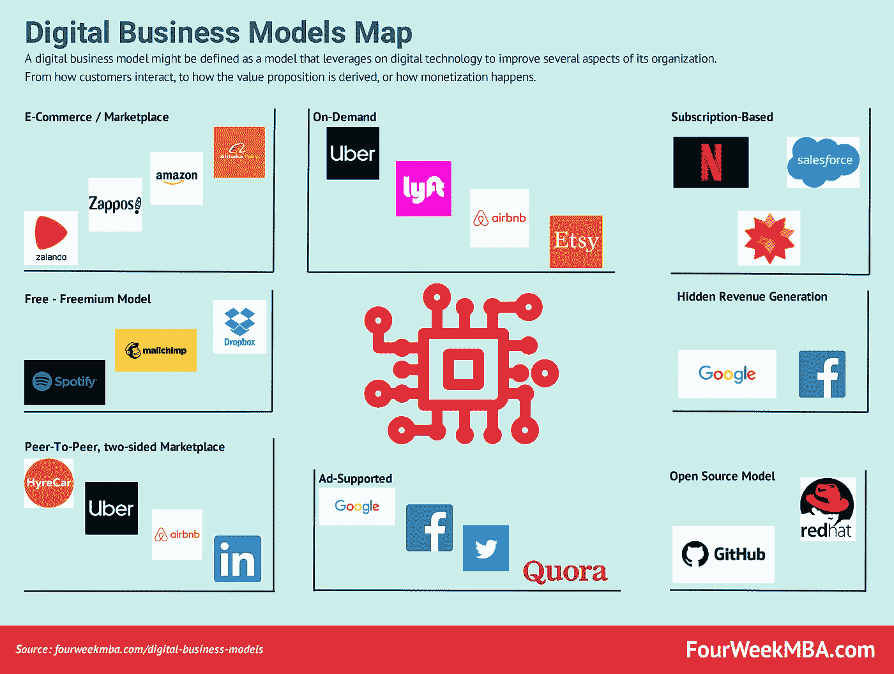
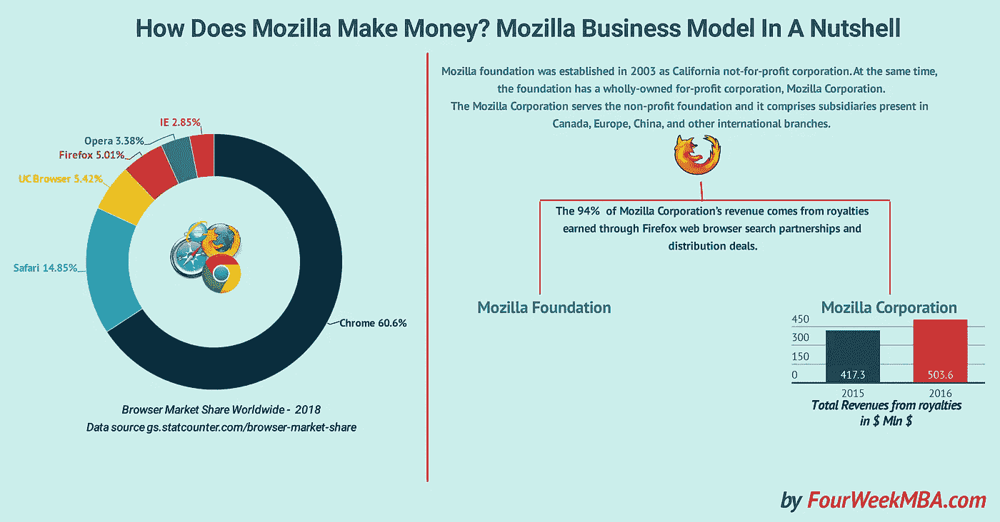
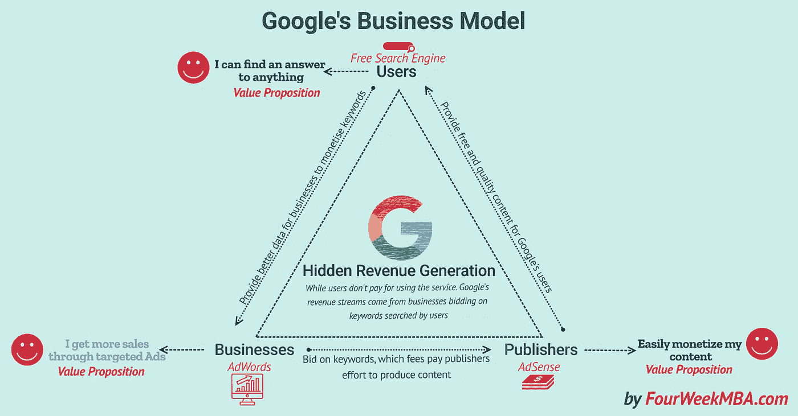
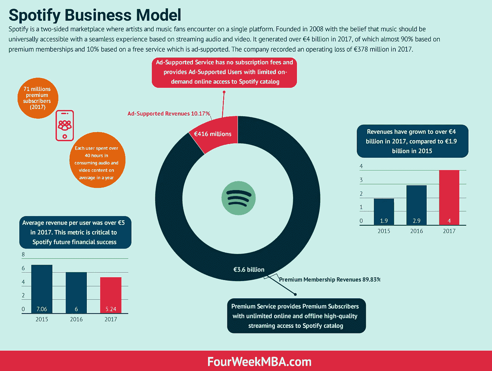
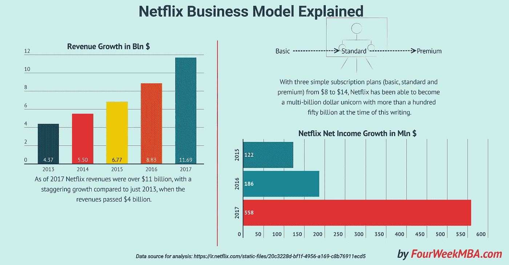
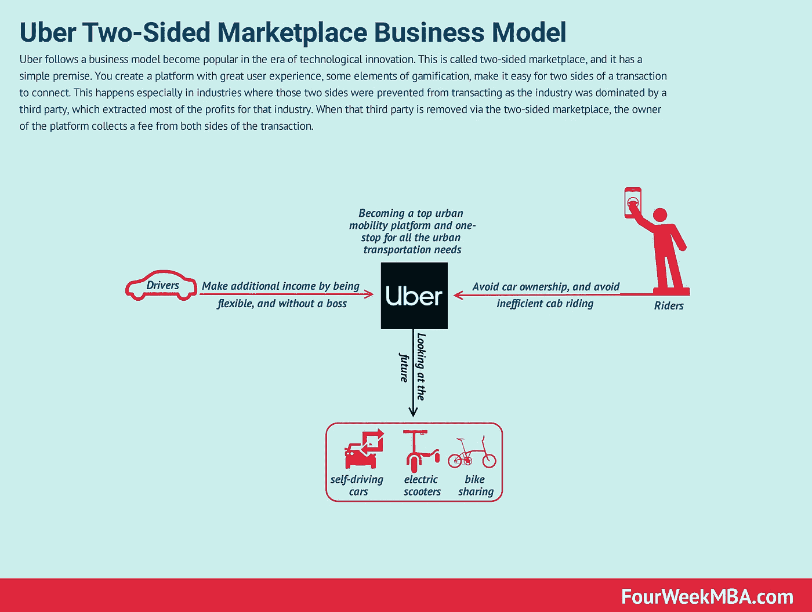
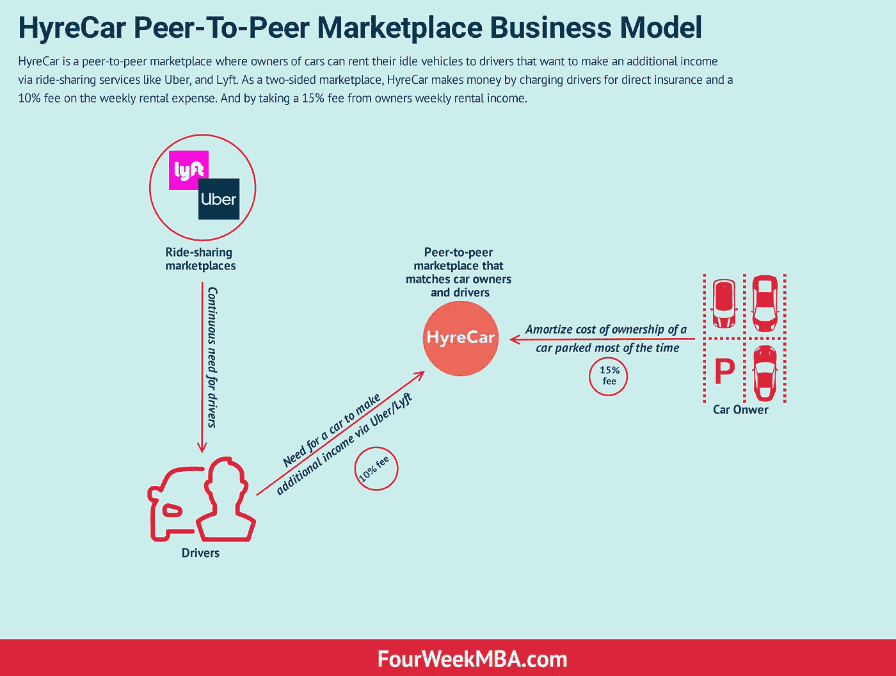
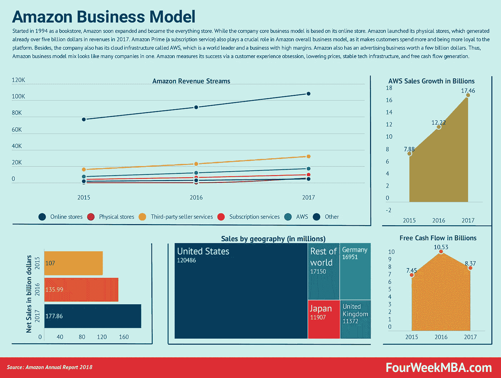
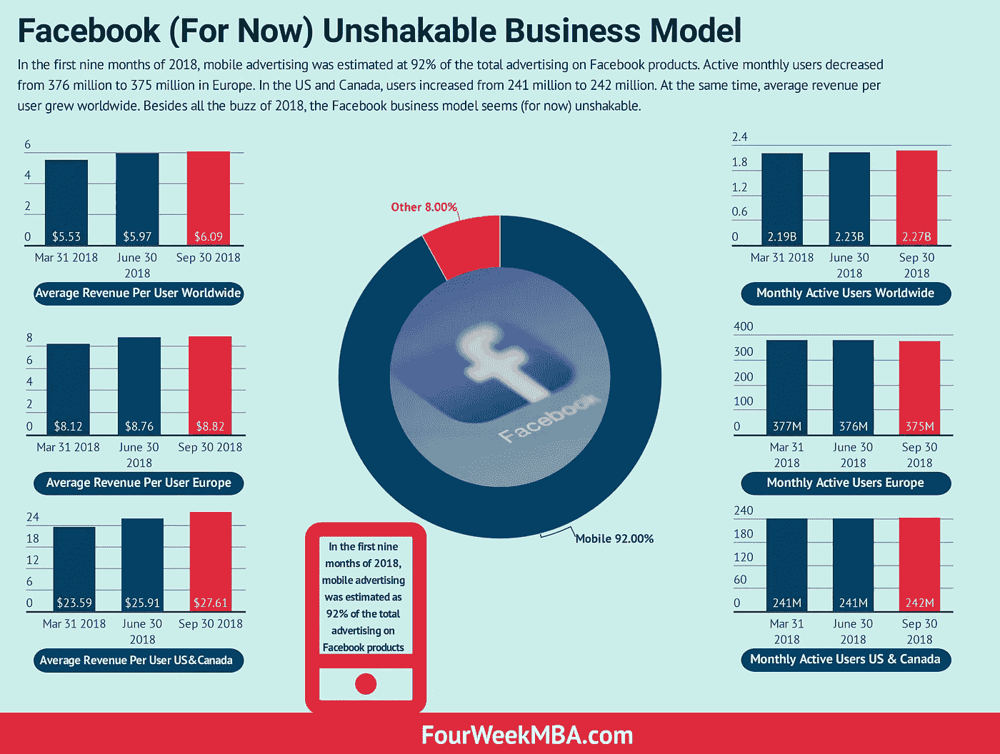

# 数字商业模式图

> 原文：<https://medium.com/swlh/digital-business-models-map-ac1210c1cbb3>

数字[商业模式](https://fourweekmba.com/what-is-a-business-model/)可以被定义为一种利用数字技术来改善组织的几个方面的模式。从客户如何互动，到如何得出[价值主张](https://fourweekmba.com/value-proposition-canvas/)，或者如何实现货币化。

我们都喜欢认为数字[商业模式](https://fourweekmba.com/what-is-a-business-model/)本身就是创新的。然而，在许多情况下，创新是通过结合现有的[商业模式](https://fourweekmba.com/what-is-a-business-model/)来创造一个独特的模式。

几乎就像用相同的原料，通过使用不同的数量和烹饪时间来重新混合，一种“创新的”商业模式通常是这些重组的结果。

在这篇文章中，我们将会看到一些在网络上占主导地位的数字商业模式，这些模式可以用于你的下一个数字商业。

# 开源商业模式

开源模型使得软件可以自由访问，并且它通常赋予程序员社区为之做出贡献的能力。这两种成分是必不可少的。免费让它传播的非常快。它的社区方面最终决定了它的成功。

开源不是一种公司可以用来建立可持续商业模式的模式。例如，像 Red Hat 这样的公司通过收取额外费用以及与其开源软件相关的培训和服务来赚钱。

事实上，在 2018 年，红帽创造了超过 29 亿美元的收入，其中 25.7 亿美元来自订阅，3.46 亿美元来自培训和服务。红帽并不是开源软件唯一可能的盈利方式。

例如，我们已经介绍了 Mozilla 的商业模式，以及它的盈利部门如何通过与搜索引擎的合作和分销协议来赚钱。

回到 Red Hat 案例研究，通过查看其年度报告，Red Hat 对其[商业模式](https://fourweekmba.com/what-is-a-business-model/)解释如下:

> ***发展*** *。我们采用开源开发模型。开源开发模式允许我们使用全球贡献者社区的集体投入、资源和知识，这些贡献者可以合作开发、维护和增强软件，因为该软件的人类可读源代码是公开可用的，并且许可证允许修改。*
> 
> ***发牌*** *。我们通常在开放源码许可下分发我们的软件产品，开放源码许可允许访问软件的人类可读源代码。*
> 
> ***订阅*** *。我们主要通过年度或多年订阅以及通过我们的认证云和服务提供商(“CCSPs”)按需提供我们的软件产品。*

因此，正如其年度报告中所强调的，由于开源商业模式，红帽有三个关键优势:

*   通过不在公司资产负债表上的合格贡献者的全球社区进行快速有效的开发
*   通过其软件的免费许可实现巨大的销售
*   高级和企业客户的付费订阅

建立一个基于开源的商业模式并不简单，它的成功在很大程度上依赖于项目是否有能力让开发者和贡献者社区参与到改进源代码的工作中来，并使其变得非常有价值。

此外，这种免费服务的模式确实允许对产品进行强有力的营销。但这不一定会转化为公司的收入。例如，Red Hut 在 2018 年花费了 12 亿美元的销售和营销费用来分发其付费订阅。

这占其总收入的 41%，主要包括销售和营销人员的工资和其他相关成本、销售佣金、差旅、公共关系和营销材料以及贸易展览。

# 自由模式

免费模式在网络上已经变得相当普遍。从网景开始，公司已经开发出了很棒的产品，免费发布，希望一旦足够多的人习惯了它们，赚钱就不是问题了。

虽然这种模式对于快速扩大规模、积累投资以在短期内维持基础设施、然后找到货币化战略的产品非常有效。

像谷歌、T2 和脸书这样的公司都是这样起步的。他们向越来越多的用户提供免费服务。吸引了第一批[天使投资人](https://fourweekmba.com/startup-lingo/)，然后是[风险投资人](https://fourweekmba.com/startup-lingo/)他们不得不迅速转向广告模式，将用户货币化，以避免没有现金和投资人。

因此，尽管免费服务允许在营销层面上扩大规模，但该公司仍将不得不找出如何将所提供的服务货币化。通常有几条路线:

*   产品的一个基础版本，和一个更高级的付费版本(免费增值模式)
*   一方免费获得服务，另一方出资(非对称模式)
*   与产品核心主题(教育模式)相邻的培训材料或信息产品
*   免费的基本服务和更高级的付费服务(使用模式)
*   将有才能的人与员工联系起来的工作公告板(工作公告板模式)

这些只是开源模式如何赚钱的一些例子。

# 免费增值模式

免费增值模式在过去十年里越来越受欢迎。原因很简单；这种模式允许高病毒式增长。像 [Dropbox](https://fourweekmba.com/dropbox-business-model/) 、 [MailChimp](https://fourweekmba.com/freemium-business-model/) 、 [Spotify](https://fourweekmba.com/spotify-business-model/) 这样的案例，以及其他许多案例，都是得益于这些模式而创造了病毒式增长。

免费增值模式的核心是向任何人提供免费版本，没有摩擦。这些免费服务中的提示切换到付费订阅，以获得更多的量，没有广告或更多的数据。

例如，Spotify 提供免费的有限服务，由广告支持。但是如果用户决定获得付费服务，他们可以不受广告干扰地听音乐，也可以下载音乐离线听。

相反，Dropbox 可以让你通过付费服务使用更多空间。MailChimp 为您提供了高级功能，能够在您的电子邮件列表中处理更多的订户。

如果您选择这种模式，您需要确保具备以下条件:

*   强大的企业客户群
*   一个优化的转换漏斗，将免费用户转换成付费用户
*   一个强大的技术基础设施，可以处理大量的免费用户

# 基于订阅的模型

我们生活在订阅经济中。我们今天所知道的最具娱乐性和以顾客为中心的服务，从[网飞](https://fourweekmba.com/how-does-netflix-make-money/)到 [Spotify](https://fourweekmba.com/spotify-business-model/) 和[亚马逊 Prime](https://fourweekmba.com/amazon-prime-revenue-model/) 都遵循订阅模式。

这种模式非常强大，因为它具有一些内在优势:

*   忠实的用户群
*   源源不断的可预测收入
*   更可预测的销售渠道

简而言之，许多公司正在“订阅”这种模式，因为它允许他们随着时间的推移建立可持续的收入流。然而，有必要指出的是，创建这种模型并不是一项简单的任务。

事实上，像网飞和 Spotify 这样的公司花费数十亿美元制作原创内容，可以让那些订阅者想要更新他们的计划。

通常，依赖订阅的模式也需要对基础设施进行必要的投资，因为通过这种模式提供的服务是这些平台准确知道接下来要看或听什么的能力。

此外，您还需要建立一个向卓越客户体验倾斜的流程，以最大限度地降低流失率并提高客户终身价值。当你的 CAC 或客户获取成本高于客户的终身价值时，你的企业很快就会破产。

# 按需模型

网络最终允许人们按照自己的节奏和时间表消费内容。电视和广播等大众媒体没有做到的，网络做到了。按需消费允许人们在不同的时间间隔访问内容。

此外，为任何人提供单一产品或服务不再有意义。多亏了按需模式

这不仅适用于内容，也适用于任何其他类型的服务。网飞通过该平台随时提供其节目，推广了这种模式。

然而，其他服务，如优步和 Lyft 也通过利用按需模式取得了成功。由于技术平台允许人们即时互动，这使得这些服务成为可能。

按需模式可以通过多种方式实现货币化。从订阅到平台上每笔交易的费用。

关键的因素是创造一种流畅的用户体验，在这种体验中，你几乎意识不到有人在后台制造这种体验。

# 对等的双边市场

点对点市场是一个平台，通常双方都参与交易，交易可以是关于产品(Etsy)或服务([优步](https://fourweekmba.com/uber-business-model/)、 [Airbnb](https://fourweekmba.com/airbnb-business-model-explained/) 、 [LinkedIn](https://fourweekmba.com/multi-sided-segment-business-model/) )。

点对点或双边市场经常陷入先有鸡还是先有蛋的困境，市场需要双方互动。

然而矛盾的是，要想在平台上有需求，你需要一个持续产生的供应。同时，要有供给，你需要创造需求。

想象一下优步的例子；一旦路上有足够多的司机，该平台就会工作，以便在乘客需要时提供按需和便捷的服务。

然而，司机们希望在方便的时候驾驶，并且当费用高到足以证明他们的努力是值得的时候。因此，在确保供应方充分满足需求方面，点对点市场通常面临几个挑战。

优步、Airbnb、Etsy 都面临这个问题。例如，优步通过使用动态定价策略，如激增定价，使用几种策略来增加其平台上的司机供应。

事实上，像 HyreCar 这样的公司已经基于优步的供应短缺建立了他们的整个[价值主张](https://fourweekmba.com/value-proposition-canvas/)，你就能体会到司机供应对优步的重要性。

# 电子商务模式

亚马逊是第一批证明网络不仅仅是由联网的电脑组成，也是由准备在网上购买实物的人组成的公司之一。这家公司起初是一家书店，但很快就扩展到销售音乐和相关产品。直到它变成了无所不包的商店！

今天，电子商务商业模式被认为是理所当然的，并且是最常用的数字商业模式之一。

# 广告支持的模型

如果亚马逊证明了网络可以成为无所不包的商店，那么改变媒体消费方式的公司就是谷歌。人们可以搜索任何他们想要的东西，而不仅仅是在浏览器中输入网址。

谷歌使其所有的服务和应用程序完全免费。而另一方面，它通过一个名为 AdWords(现在的谷歌广告)的广告网络，将通过其搜索引擎页面获取的数据货币化。

当谷歌在 2004 年首次公开募股时，它向商界展示了其数字广告业务的强大。事实上，在几年的时间里，谷歌突破了 10 亿美元大关。2017 年，其广告业务突破了 1100 亿美元大关！

可以肯定的是，虽然数字广告业务可能很容易建立，但运营并盈利却不容易。除非你是谷歌或脸书，在广告市场占据主导地位，否则你可能无法仅靠广告赚钱，除非你有非常庞大的用户群。

隐性创收是为了赚钱，而大多数使用你的服务的人几乎没有意识到这一点。一个很好的例子是脸书(和谷歌)。

如果你问一个普通的脸书或谷歌用户，她不会知道公司是如何赚钱的。这是因为这些公司投入了大量资源来创造这种体验。

# 这就是把事情混在一起

我们在上面看到的每一个模型都不是可以完全适用于一个公司的蓝图。通常[的商业模式](https://fourweekmba.com/what-is-a-business-model/)是几种模式结合的结果。例如，Airbnb 和优步都是点播的点对点市场。

我们在整篇文章中分析的许多企业使用几种模型来构建成功的商业模型。例如，谷歌的一些产品利用开源模式，而它利用隐藏收入模式将核心产品(搜索引擎)货币化，它还利用向大众免费提供产品来快速获得牵引力，并使其产品成为标准！

*原载于 2019 年 1 月 31 日*[*fourweekmba.com*](https://fourweekmba.com/digital-business-models/)*。*

## 这篇文章发表在 [The Startup](https://medium.com/swlh) 上，这是 Medium 最大的创业刊物，拥有+418，678 名读者。

## 在此订阅接收[我们的头条新闻](http://growthsupply.com/the-startup-newsletter/)。

