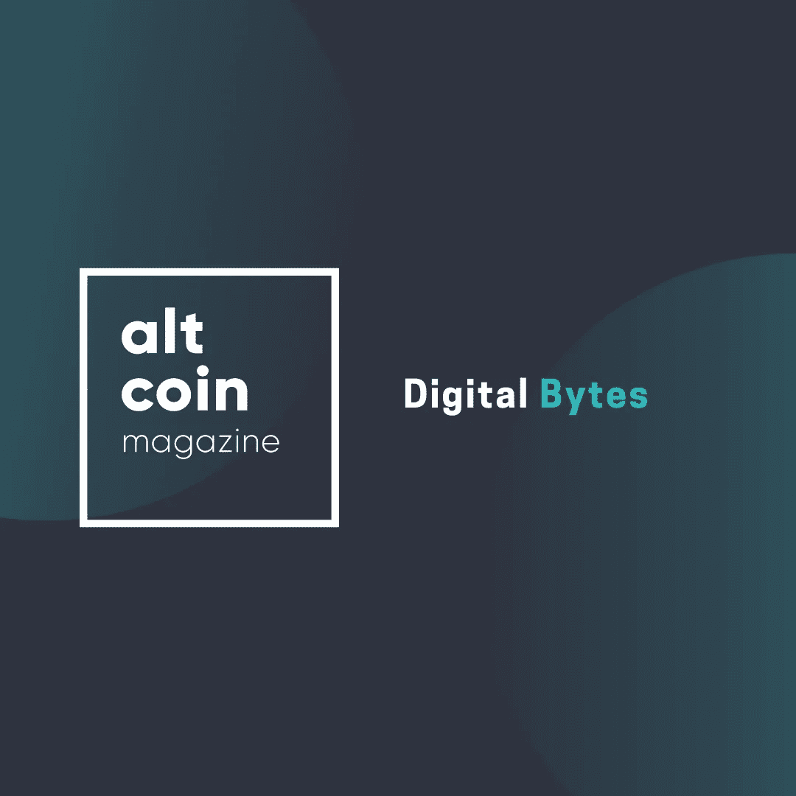

# 数字字节

> 原文：<https://medium.com/swlh/digital-bytes-36b110976b09>

## 【2019 年 7 月 6 日周末

**如果你想要一篇文章，读读这个**

围绕数字资产的使用，已经发布了许多有趣的公告，一些有趣的产品和公司获得了监管机构的批准。

在欧洲，我们已经看到一家总部位于卢森堡、名为 Argento 的企业脱颖而出，而在英国，伦敦大宗商品交易所(London Block Exchange)也推出了……