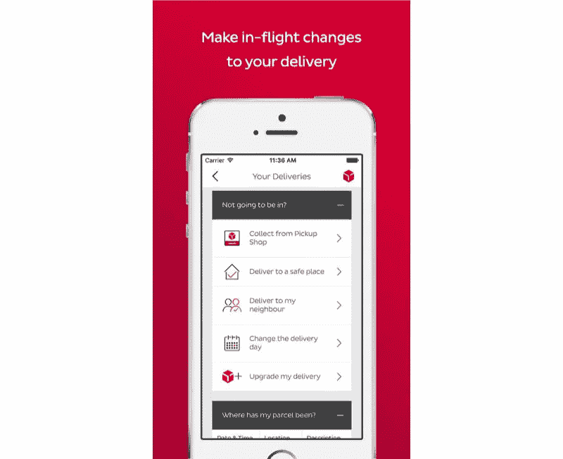
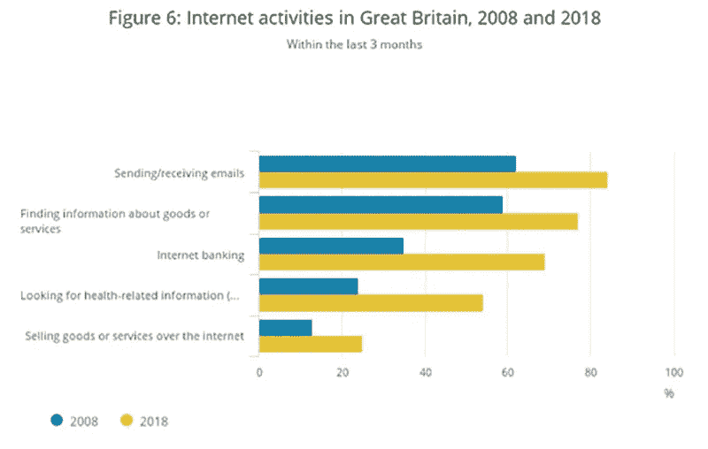
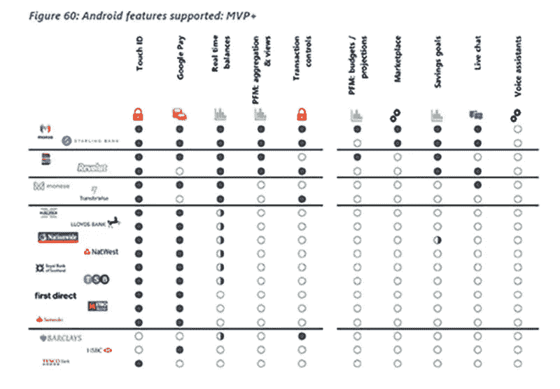

# 数字客户服务:更智能的服务方式

> 原文：<https://medium.com/swlh/digital-customer-service-a-smarter-way-to-serve-c1178a301c47>

纳丁·克拉克

# 伟大的客户服务过去需要员工，这是昂贵的。难怪它只在事情出错的时候才发挥作用…

然而，近年来，数字优先的企业已经从部署创新的客户服务产品作为其品牌展示品的诀窍中获益匪浅。

在银行业，安永会计师事务所(Ernst Young)的一项研究发现，“客户体验是开立和关闭银行账户最常见的原因，超过了费用、利率、地点和便利性”。有趣的是，在过去“足够好”确实足够好的行业中，创造性思维和成熟技术的正确结合正日益将客户服务转变为高度差异化的竞争优势。

以下是一些最好的例子:

# **部分&包裹**

在互联网购物的早期，一群挑战者送货品牌开创了一些非常令人兴奋的体验改进。2011 年，DPD 率先推出了一小时送达窗口——几年后,[金融时报](https://www.ft.com/content/64ffd934-275f-11e2-abcb-00144feabdc0)报道称，该公司发展非常迅速。尽管挑战者快递很快成为不可靠的代名词:

> 当一家公司未能向工党消费者事务发言人伊恩·穆雷发货时，他被告知这是因为他的爱丁堡选区办公室实际上并不存在。后来，该公司发布了一份澄清，指责“苏格兰不是英国的一部分”这一事实。——[*【新政治家*](https://www.newstatesman.com/jonn-elledge/2013/01/missing-presents-and-parcels-bins-why-are-private-delivery-firms-so-terrible)

Source: DPD

……省钱专家[开展的 2017 年消费者调查将 DPD 评为英国最受欢迎的快递公司，将皇家邮政挤到了第二位。精通技术的客户服务显然是吸引力的一部分。](https://www.moneysavingexpert.com/news/2017/01/yodel-tops-list-of-worst-parcel-delivery-firms-again/)

除了一小时的递送时段，DPD 的“预测”服务还包括 GPS 包裹跟踪，以及最令人兴奋和有用的是，当包裹已经在运输途中时，可以修改您的递送指示。您对交付的额外控制是一个重要的例子，说明简单的技术策略如何能够让客户满意。(我看到的)没有数据证明皇家邮政包裹递送这一核心服务比竞争对手提供的服务更好或更差。在 21 世纪初，面对相对缺乏经验的竞争，皇家邮政认为其市场领先地位不会受到挑战是情有可原的。

当然，顾客会等几个小时来送货，如果他们选择了错误的 10 分钟来洗澡，就会被迫重新安排时间。但至少这次经历是最可靠的。今天，在皇家邮政的股价连续 5 年下跌并且看不到结束的迹象之后，这种想法再也站不住脚了。如果你认为你的“足够好”的客户服务真的足够好，请密切关注你的数字竞争对手，因为他们几乎肯定在策划一些特殊的东西来吸引你的客户。

# **情感值**

不管是好是坏，客户服务总是会做出情绪化的回应。被告知你的包裹将在上午 11:13 通过斯旺奇，这实际上可能没什么用，但知道这一点还是很好的。这种情感价值并不比银行业更重要，在银行业，安全感和控制感是必须的——在银行业，客户最初不愿信任数字服务。然而，今天 65%的人每周至少查看一次他们的账户余额，根据[金融咨询服务](https://www.moneyadviceservice.org.uk/blog/when-did-you-last-check-your-bank-balance)的数据，并且有一个明显的消费者偏好网上进行的银行活动，这从 Gov UK 的互联网访问调查[目录](https://www.ons.gov.uk/peoplepopulationandcommunity/householdcharacteristics/homeinternetandsocialmediausage/bulletins/internetaccesshouseholdsandindividuals/2018)中可以看出。

Source: Gov UK

银行将此视为关闭昂贵分支机构的受欢迎信号，并且他们继续兴致勃勃地这样做。在英国，自 2015 年以来，已有 3000 家关闭。这造成了一个客户服务真空，最初由呼叫中心承担。不过，很快，一批金融科技挑战者品牌涌入，开始比传统企业更快、更有效、更便宜地照顾客户。专业支付咨询公司 Optima 在 2018 年进行了一项[有趣的初步研究](https://thefinanser.com/2018/06/best-digital-offer-uk-challenger-big-banks.html/)，将挑战者银行应用程序与更成熟品牌的应用程序进行了比较。它做出了一些可预测的发现:在可能的五星中，用户对挑战者应用程序的评分平均比传统银行应用程序高 0.5 星。明显的区别在于所提供的服务。

只有 Monzo 和 Starling 两家银行的 Android 应用程序允许客户执行以下所有操作:

*   Touch-ID 登录
*   实时余额
*   交易过滤器
*   控制开支
*   谷歌或 Apple Pay

Source: Optima Consultancy

资料来源:Optima 咨询公司

乐购、汇丰银行和巴克莱银行表现不佳。值得称赞的是，Lloyds 通过其应用内聊天功能找到了一个很好的解决方法。我最近有理由抱怨，并惊喜地发现，如果我通过应用程序打电话，我会绕过所有那些乏味的安全问题，直接找到我从一开始就知道我需要的真正的人。该行业作为一个整体正在提升自己的水平。

客户服务被视为[所有地区银行的第一投资重点，除了美国](https://www.pwc.com/gx/en/banking-capital-markets/banking-2020/assets/pwc-retail-banking-2020-evolution-or-revolution.pdf)，在美国，客户服务仅次于监管合规性。同样值得指出的是，四大银行仍然提供英国 70%的支票账户，挑战者的崛起可能部分归因于“多银行”——客户在保留传统银行的同时寻求挑战者的情感吸引力。也许挑战者不一定渴望完全篡夺旧派。

在接受《卫报》采访时，Monzo 首席执行官汤姆·布隆菲尔德说:

> “这是关于可见性和控制。这是一种感觉:“在我以前的银行，我从来不知道在任何时候我有多少钱，我会花一个周末，周一早上所有的费用都会打到我的账户上，我会意识到我超支了，这让我感到焦虑和压力。”"

不管怎样，这是大银行本可以提供给自己的安全和控制。相反，challenger brands 首先相对快速地提供了这种服务，围绕客户服务进行了相对简单的数字创新。

# **智能题**

通过提供更全面的服务，挑战者银行给了消费者他们渴望的与他们的钱的情感联系。但是他们是否已经预先排除了打电话的需求呢？我的直觉——即使是来自一家数字机构——是你总是需要某种程度的人情味。但是这种需求将会大大减少。

在美国的一项研究中，不同年龄组的 500 名成年人被问及:

> *“说到客户服务，你最看重什么？”*

尽管大部分顾客优先考虑与真人交谈，但优先考虑其他事情的顾客数量几乎是这个群体的 2:1。事实上，你想知道同样的 500 名受访者是否被问了一个不同的问题:

> *“你最看重什么:和真人说话，还是快速得到你想要的？”*

…结果可能会有多么不同。

事实是聊天机器人可以满足目前调查中列出的所有其他需求。正确的编程(当然)，他们可以知识渊博、彬彬有礼，提供即时和个性化的回应，如果需要，还可以将客户引向其他联系方式。他们还可以——就像我们已经看到的让挑战者品牌成为明星的技术创新一样——提供新的客户服务。

这方面的主要例子是航空公司 KLM 部署的 Messenger bot。它在第一年回应了[140 万次查询](https://aibusiness.com/chatbots-klm-interview/)；但除了客户服务之外，该应用还根据用户数据提供个性化服务。这并没有完全背离非数字化的客户服务趋势。丽思卡尔顿酒店的员工(现在还有许多其他人)被允许花费高达 2000 美元来避免负面的顾客体验。

但是数字替代的好处在于它是先发制人的。荷航尚未公布其聊天机器人发布的报价价值信息，但实际上，我们大多数人很容易为远低于 2000 美元的报价感到高兴。想象一下丽思卡尔顿的“问题预算”被分解并分发给所有顾客——在他们生气之前——通过高度个性化的服务来增强他们自己特定的顾客体验。

# **意大利面条**

人工智能有可能成为大约 10 年前由 DPD 等数字优先挑战者品牌开创的趋势的典范。我只会称赞品牌方面的创新者，他们把新服务做得像意大利面条一样，扔向会议室的墙壁。

但是，随着自适应、反应式智能融入到您的客户服务中，应该有可能实现更大的影响——很可能只是成本的一小部分。无论采取何种形式，似乎可以肯定的是，未来客户服务的成功将受到可能性艺术的推动:在明显缺乏迫切需求的企业和行业中进行创新，这留下了一个未实现的黄金机会。

公共事业是一个值得关注的领域——这不仅仅是因为 Tangent 已经在[帮助英国电网](https://www.tangent.co.uk/work/uk-power-networks-research)向 Ofgem 展示他们为提高客户满意度所采取的活动和措施。咨询公司和技术公司([埃森哲](https://www.accenture.com/gb-en/insight-utilities-companies-customer-centricity)、[源讯](https://www.smartcitiesworld.net/news/news/atos-predicts-profound-change-for-energy-sector-3614)等)的大量内容。艾尔。)，目标是能源行业，似乎表明数字客户服务的“把戏”开始击中要害。

无论你认为你的行业有多迷失方向，2019 年似乎都是确保你自己的品牌不会被超越或落后的关键一年。

*Nadine 领导着该机构品牌组合的战略团队。Nadine 在 B2B 和 B2C 数字营销领域拥有超过 12 年的经验，曾与可口可乐、Sainsbury's、Sky 和 UK Power Networks 等品牌合作，为大量项目提供战略指导，从全球社交活动到需要大量客户研究和利益相关方需求收集的大型服务设计项目。*

在这个空间里，我们探索客户对更简单、更快速、更吸引人的数字体验的更高期望。首先:我认为 2019 年最值得关注的 5 大趋势

阅读更多

*最初发表于*[*【www.tangent.co.uk】*](https://www.tangent.co.uk/idea/digital-customer-service-a-smarter-way-to-serve)*。*

*请点击掌声按钮向您的朋友推荐这篇文章！*

*您也可以查看我们的* [*网站*](https://www.tangent.co.uk) *和* [*推特*](https://twitter.com/ThisIsTangent) *、*[*Linkedin*](https://www.linkedin.com/company/thisistangent/)*和*[*insta gram*](https://www.instagram.com/thisistangent/)*上的帖子。*

## 这篇文章发表在 [The Startup](https://medium.com/swlh) 上，这是 Medium 最大的创业刊物，拥有+414，678 名读者。

## 在这里订阅接收[我们的头条新闻](http://growthsupply.com/the-startup-newsletter/)。

