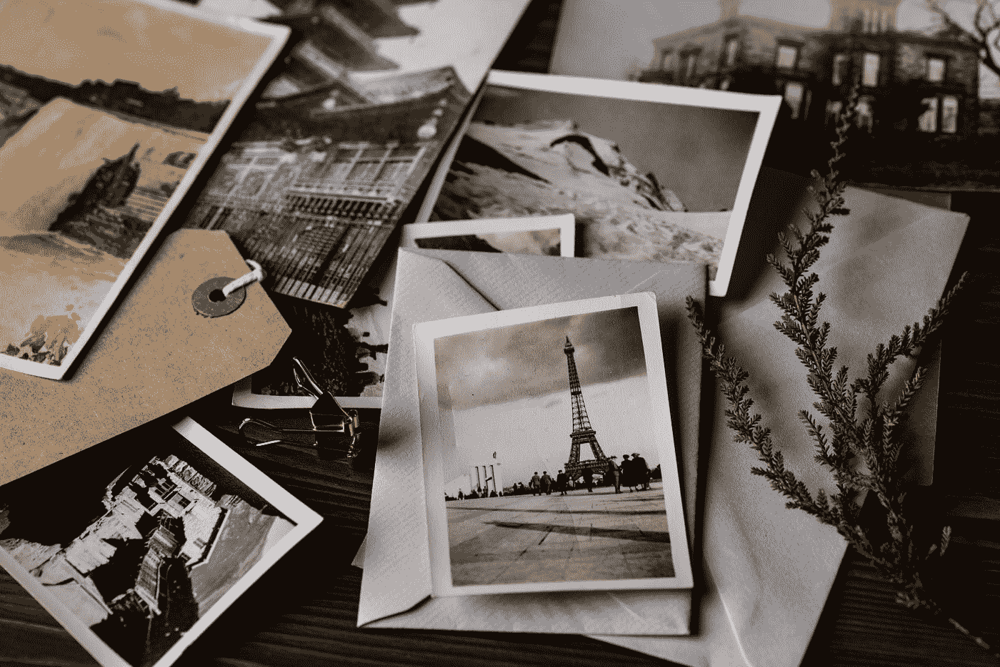

# 数码清理器—照片

> 原文：<https://medium.com/swlh/digital-declutter-photos-b2674eede444>

Photo by [Joanna Kosinska](https://unsplash.com/@joannakosinska?utm_source=medium&utm_medium=referral) on [Unsplash](https://unsplash.com?utm_source=medium&utm_medium=referral)

## 你为什么要保留所有的数码碎片？

你的生活是否充斥着数字混乱？不记得你把文件放在哪里了？你是否经常整理成千上万张照片，寻找你五年前或者八年前度假时拍的那张？即使你已经按照玛丽·近藤的方法整理了你的余生，我敢打赌你的数字生活已经进入了…