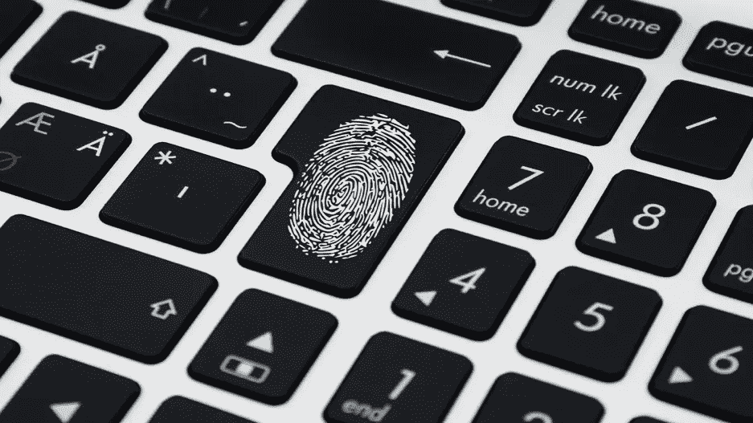

# 请出示数字身份证。

> 原文：<https://medium.com/swlh/digital-id-please-2d27ff2f4e11>

Photo taken from [here](https://www.opengovasia.com/malaysias-mcmc-optimistic-about-digital-id/)

在 2019 年，你可以用你的脸或指纹支付，你不需要记住所有的密码，你可以在自己家里舒适地申请护照或签证。感觉传统纸质身份证件已经过时，不方便，可以说不安全。随身携带一张逐渐腐烂的纸张，上面记录着您的大部分个人信息，会使您面临被盗、损坏或丢失的风险，而您可能离…