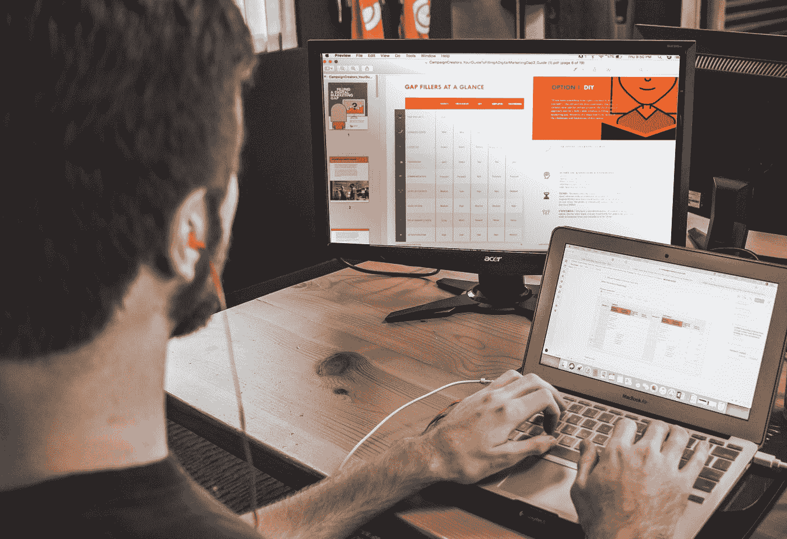

# 数字生活是真实的生活

> 原文：<https://medium.com/swlh/digital-life-is-real-life-ec58359be87a>

## 接受我们的数字方面是健康平衡的一部分是一件好事。

Photo by [Campaign Creators](https://unsplash.com/@campaign_creators?utm_source=medium&utm_medium=referral) on [Unsplash](https://unsplash.com?utm_source=medium&utm_medium=referral)

我们收到第一张免费的 AOL 光盘时，我才 15 或 16 岁。我们家里只有一台个人电脑才一两年，而 CD 是探索一个全新世界的钥匙。我立刻被吸引了进去。随着首字母缩略词成为我们日常用语的一部分，一些首字母缩略词比另一些更有分量…