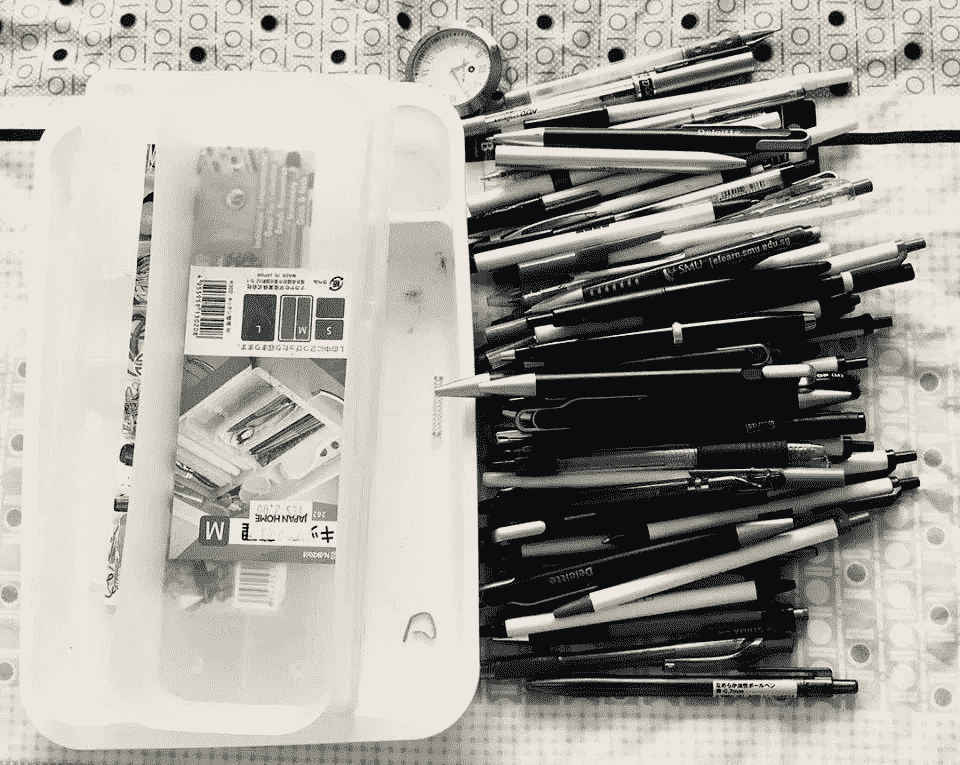

# 数字极简主义:过一个快乐的无杂乱生活

> 原文：<https://medium.com/swlh/digital-minimalism-lead-a-clutter-free-life-for-happiness-bdd16f42833b>

物理极简主义挑战是如何促使我使用数字设备的…

三个月前，我接受了广受欢迎和争议的极简主义挑战，在 30 天内移除了 465 件东西。最初挑战的结构是在第一天移除一个物品，第二天移除两个，以此类推，直到第三十天移除 30 个物品。总的来说，到 30 天结束时，它…