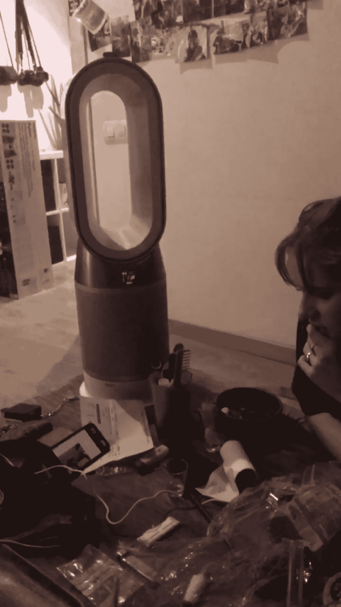

# 数字游牧生活:巴塞罗那的首次工作和旅行实验

> 原文：<https://medium.com/swlh/digital-nomad-life-first-work-and-travel-experiment-in-barcelona-fa2cba6eba1f>

西班牙—2019 年 1 月 11 日

[Hey! It's John here!](https://www.instagram.com/johnostrowski/)

这是一个简单的故事，关于我在欧洲作为一个数字流浪者的经历。如果你首先问自己什么是数字流浪者，让我把它总结为一个利用技术远程工作和谋生的专业人士，或者简单地称为 reddit 数字流浪者，你就会明白了。

我一直梦想着这种工作和旅行的生活方式，我试着开一个旅行博客，但我内心的工程师缺乏很多社交技能来把它作为一份兼职。

作为一名数据分析师(一名 [CRO](https://www.cvoteam.com) ，更确切地说是转换率优化者)，我一直在探索数字游牧生活方式，如何远程工作和旅行？是否可持续？这有可能吗？或者只是对少数人生活的浪漫看法？嗯，这是可行的，我在这里分享冒险和实验，另一个在巴塞罗那的数字游牧故事。

**这是一个没有判断的区域，这里只允许积极和良好的氛围**，如果你没有这种心态，请找到你浏览器的关闭按钮。

# 第一天是迷路的日子

每当我到达一个新的城市，我总是计划一次徒步旅行作为第一件要做的事情去探索它的遗址和历史。当第一个选项不可用时，我的冒险就变成了简单的迷路。

这次也不例外，从机场到我第一次预定旅馆的哥特式街区，旅途很愉快。签到是在下午 2 点，现在仍然是上午 10 点左右，我有点担心工作中的一些开放式问题，所以我找到了第一家有 wifi 的咖啡店，让团队打电话，数字游牧生活方式开始了。事情解决了，入住手续办完了，是时候迷路和拍照了。

Getting lost around the Gothic Quarter, in the middle of the winter under 15 degrees Celcius.

我是一个诚实的人，对人对自己都很诚实，在那些中世纪的街道上，有一个女孩引起了我的注意，手里拿着漂亮的 DSLR，很漂亮。我们相遇时，她打电话给我“你能呆在那里吗？”哦，天啊，我正在为这个旅游博客建模，开始得恰到好处。

而且越来越好了…

> “我喜欢你的风格，你知道的”
> “是的，就是这种极简主义与全黑的混合，还有一点专业的利昂”
> 我们都笑了。

意大利女孩，住在葡萄牙寒冷的西班牙计划很快移动国家。我喜欢冒险。我们换了 Instagram，[她的简介很有艺术感](https://www.instagram.com/rox.anoushka/)，我很喜欢。我们试图再次聚在一起，但我们已经有了不同的计划，两天后她离开了这个城市。不幸的是，她没有把她拍的照片发给我，去她的 Instagram 上评论#SendPicturesToJohnny，我可以稍后在上面运行一个 hashtag 分析，只是为了好玩。

尽管如此，在迷路的议程上，我的旅游待办事项中有一项是绕着兰布拉斯大街走，我们称之为旅游大道。令我惊讶的是，[艺术圣莫尼卡博物馆](http://artssantamonica.gencat.cat)正在举办一个漫画展，展示美国风格如何影响 80 年代以来的西班牙和加泰罗尼亚作品。我喜欢漫画，所以我花了一些时间阅读材料，观看视频样本，并对卡斯特利亚诺语和加泰罗尼亚语之间的差异感到好奇。

Comics timeline in North America.

第一天在 [G13](https://goo.gl/maps/cHGbFUrrcd72) 结束，这是一个难以置信的建议，来自一个约旦朋友，我不会很快在他身边。谢谢 [Marwa](https://www.instagram.com/holyprofanity_/) ，那正是我喜欢的地方，我终于找到了我喜欢去的俱乐部。

# 周末休息

从我远程工作的经验中，我知道如果你能像平常一样在周末工作，每天工作 6 小时比 8 小时更好，但是有什么问题呢？

在一天结束时，这种惯例转化为每周 36 个小时的工作，而不是 40 个小时，但你的承包商在他们的收件箱中有持续的工作，这就有所不同了。我决定将这个想法应用到我对如何成为一名数字流浪者的看法中，并分析结果。

> 如果你能像平常一样在周末工作，每天工作 6 小时比 8 小时要好。

所以我周六一大早就开始了，早上 6:30 起床，淋浴，三杯浓缩咖啡，回复 4 封工作邮件，做好准备，准备出发。我计划上午 11 点进行徒步旅行，直到那时我才有时间在附近的一家咖啡馆看书，不幸的是，我目睹了一群中国女孩的扒手行动，又一部 iPhone 在巴塞罗那的哥特式街道上丢失了，发生了，要小心。

我们的导游 Monica 带领我们从 SANDMAN's 开始的徒步旅行太棒了，我决定挑战自己，选择西班牙语作为旅行语言，我需要把我的西班牙语带回来。我们探索了许多不同的加泰罗尼亚历史遗址。旅行结束时她当地建议的 pdf 是最好的。真的，徒步旅行是值得的，无论何时旅行都要尽量保持一点文化气息，这很重要。

另一方面，星期天开始得又懒又晚，去了我去过的最好的咖啡馆之一的 MAG by El Magnifico。它现在和 T2 的卡费特里雅分享第一名。早晨的亮点是我阅读了《高效能人士的七个习惯》中的，我发现我一直停留在第三代时间管理上，在我的第一象限任务上花了太多时间，专注于紧急的“现在”。

缺点是对活动本质的误解，这通常不符合我的基本原则，甚至不符合商业目标。缺乏现实感通常会导致沮丧和过度安排的倾向，完全正确，加上减少关系，这是象限 2 的重要行为。对了，所有那些见解[听这个](https://www.youtube.com/watch?v=2X_2IdybTV0)。

Reading at MAG by El Magnifico

我在 MAG 一直等到了下午 3 点，周日过了这个时间巴塞罗那历史博物馆的门票就免费了，我总是很节省。看到这些小村庄是如何连接起来的，带来了巴塞罗那独特的社区氛围，这真的很有趣，这种多元化背后是有原因的。

晚上，我决定去参观圣家堂，在去那里的路上，我有点迷路了，想弄清楚 T-10 公共交通车票的问题。我向山姆求助，他一半是西班牙人，一半是德国人，生活有时对我们微笑真是疯狂。我们交换了 Instagram，取笑骗子和本周晚些时候可能的食物计划。她在高迪教堂前离开了我，而她去找了一个朋友，一个不错的女孩，我喜欢她的感觉。为了结束周末，我直接去了俱乐部。我们有爵士乐现场音乐，完全出乎意料地来自过去两天的纯嘻哈音乐。那天晚上，我遇到了德国人费利克斯，他告诉我他在西班牙为西雅特工作实习期间令人心寒的日常事务。完成汽车工程后，他每天开大约三个小时的车去车间。“耶老兄”。

> "但是在这种情况下，人为什么不住在离工作更近的地方呢？"
> “而在一份日报上失去这一切？我同意了，我们都笑了，这个德国的“耶曼”很有趣。

那天晚上的第二位嘉宾是[一个加泰罗尼亚人，也叫 Sam](https://www.instagram.com/samhellfishlee/) ，他让我们参与到他移居泰国的计划中，以便使他的格斗技术与泰拳更加完美，这就是奉献。来吧，你愿意为这样一个追求梦想的国家搬家吗？去学习一些你基本上在任何地方都能找到的东西，但是它是原创的，并且在地球上的特定地方得到完善？我应该已经在硅谷了。不，不完全是，这种数字游牧生活方式正在得到回报。

# 沙发冲浪永远是一种体验

我决定要求在巴塞罗纳的 Couchsurfing 到写在这里，直截了当。如果你不知道它是什么，请[查看他们的网站](https://www.couchsurfing.com/)，没有必要解释我如此支持的如此不可思议的平台的整个哲学。

Jorge 是我两个晚上的主人，他住在诺坎普附近，这让我有机会探索巴塞罗那的另一面，一个更接近人们在大城市实际生活的视角。

令我惊讶的是，Jorge 也是一名工程师，他来巴塞罗那是为了诺坎普改造项目，管理施工进度。一些更多的技术对话引起了我对 BIM 的好奇心，这是土木工程中项目管理和设计的新信息视图。由于他的工作，乔治给了我诺坎普的门票，我从来没有喜欢过足球，我从来没有去过体育场，让我告诉你这是一个好的开始。我决定去一个很小的地方。这是一次很棒的旅行经历。

顺便说一下，我和雨果参观了体育场，雨果是一个在欧洲旅行的墨西哥人，他是乔治在葡萄牙波尔图徒步旅行后的朋友。旅行是一种冒险，我无法形容我有多喜欢它。

Una experiencia.

在 Jorge 家的第二个晚上，我们分享了很多旅行经历，这个家伙已经走遍了整个亚洲，太令人印象深刻了！在巴塞罗那之前，他在新加坡从事公共交通规划工作，这给他提供了从日本到泰国的令人难以置信的照片，完成了他 38 个访问过的国家。他对印度-亚洲国家的看法令人惊叹。经过图片和成本效益分析，日本之旅正式推迟，2019 年的大冒险将在[曼谷作为一个真正的数字游牧民族](https://nomadisbeautiful.com/travel-blogs/digital-nomad-guide-thailand/)，Jorge 我会在今年晚些时候给你发图片！

# 忍者攻击城市的时候呆在巴塞洛内塔

我在旅途中的最后一个旅舍是在巴塞洛内塔前面，我把海滩留给了我的最后几天，我想完成这篇文章以及我对看海的 7 个习惯的阅读。这一天的计划是去卡梅尔掩体(El Bunkers del Carmel)游玩，这是距离市区 40 分钟车程的一个山区，据说是这个城市最好的风景。然而，我没想到的是，和我同时在这个城市的[蒙古忍者](https://www.instagram.com/ninjaboi.ig/)朋友，生活又一次微笑了。我们聚在一起看风景，非常棒。如果布达佩斯因为多瑙河的[城堡](https://goo.gl/maps/W64HKrfj8ys)景色而在我最喜欢的 5 个城市中保持第一名的话，那么从现在开始我会把第一名的位置让给巴塞罗那。

Beautiful view from Sagrada Familia and Barcelona's Superblocks

为了保持游客的身份，我们乘公共汽车去了加泰罗尼亚广场，在决定下一步去哪里时，我注意到我们离 Los 100 Montaditos 只有两个街区，这纯粹是因为运气好，那里有周四的特别菜单。所有三明治，los montaditos，每份 1 欧元。我向上帝发誓，这是神圣的。西班牙的食物是一流的。

# 昨晚和萨姆和艾玛在一起

这一天以来自工作的新闻和与团队的一次非常好的 scrum 会议开始，这是我们早上的例行公事之一。我在早上喝咖啡的时候，看着巴塞洛内塔海滩度过了 4 个小时，这是从旅馆酒吧看到的非常棒的景色，包括工作和旅行。

Coffee, work, beach.

我决定沿着海滩散步，寻找一些维生素 D、图片、想法和风景。一月中旬的 15 摄氏度，这是值得庆祝的事情，尤其是当我从我们称之为匈牙利的冰柜中逃离的时候。

La Playa de la Barceloneta.

在那之后，我决定去书店买一本书作为纪念，更像是迫使我回去学习西班牙语的东西。在看到不必要的额外数量后，我很快改变了主意，我很快就会为自己买一个 Surface Go 进行内容消费。

下午 2 点左右，我路过霍夫曼蛋糕店，这是市中心一家著名的时尚面包店，当然，他们已经打烊吃午饭了。[我在](https://www.donquijote.org/es/cultura-espanola/tradiciones/siesta/)之前就读过并听说过午睡，这是一种与众不同的工作心态。这好像是罗马的传统，OG。

好吧，我没有糕点，我需要午餐，我在霍夫曼之后拐进了第一条时尚街，进了一家阿根廷餐厅 [Morelia](http://moreliabcn.com) ，那里有非常好的午餐菜单。不错的开胃菜，美味的主菜和甜点，接着是红酒和一些工作邮件，完美。他们有很好的 wifi，所以我带着我的笔记本电脑查看了一些电子邮件，我尽力让这成为一个真正的数字游牧体验，工作正在进展，客户很高兴，到目前为止一切顺利。

Learning how to red wine.

午饭后，我当然需要咖啡。因为我已经和萨姆约好了(是的，地铁里的那个女孩！)那天晚些时候，为了在海滩附近见面，我开始往回走。喝咖啡的时候，我路过了 [El Bosque de Les Fades](https://goo.gl/maps/8C8EeYpwQ3T2) ，这是一家主题咖啡店，带来一些精灵的氛围，真的很好，也很贵。沿着兰布拉斯大道，我花了一些时间在[El Mercado La boqueria](https://goo.gl/maps/Zo9unSNEGJ92)吃我的最后一罐黑面包，我发誓黑面包是我生命中最美好的一天。

Pata Negra ❤

到了晚上，在解决了一些工作邮件后，我在巴塞洛内塔地铁站遇到了萨姆和艾玛，在拿了一些啤酒和 10 分钟的步行后，我们到了他们舒适的公寓，是啊，多么美好的夜晚。从人生哲学到一个基于思维模式的匹配应用程序的枢轴思想，以萨姆的电吉他上的一些涅槃歌曲为特色，我喜欢它，每一秒。

The future is here, they call it Dyson.

午夜时分，我回到宿舍，我必须睡一会儿，以便赶上第二天的早班飞机。在小雨中穿过狭窄的街道，我被告知，我真的有坚强的意志。在这次旅行中，我听了很多 Jocko 的播客，这种责任和决心的结合是数字流浪者继续前进的动力。

# 工作和旅行，有用吗？

是的，但是我需要变得更好，为什么？统计数据来了:

Emails sent per day, I want to say that the Pearson correlation with hours worked is close to 0.85

**进展顺利的事情:**

工作和旅行是迷人的，成为一名数字流浪者是件大事。对我来说，这是关于学习理论的聚焦和扩散模式[之间完美的日常平衡。成为一名数字流浪者绝对是我一直在寻找的职业未来，我从现在开始拥抱这种状态。](https://www.instructables.com/id/Learning-How-to-Learn/)

就工作程序而言，我可以在没有任何明显效率损失的情况下完成我的任务并与匈牙利的团队保持沟通。发送电子邮件的数量与工作时间相关。对于第一次工作和旅行的认真尝试，这是一个很好的分配，特别是考虑到我在周末，12 日和 13 日，强迫自己完成工作。

就乐趣而言，让我告诉你它是非常有趣的。

**需要改进的地方:**

回来后采取的第一个行动是在我的执行团队中建立我所谓的“共同工作时间”。从上午 10 点到下午 2 点，我知道我可以打电话给我的任何一个人，他们会在他们的笔记本电脑前。这改善了很多沟通流程，这在远程工作时至关重要，我觉得我们离最佳状态还很远。

下一次，我将使用项目管理软件上的时间戳更好地跟踪工作时间以及在此期间的通话次数。这将为作为一名数字流浪者如何管理时间提供一些更丰富的见解。

**关于工作和旅行趋势的旁注**

作为一名从事网络技术的数据分析师，我理解对内容进行 SEO 优化有多重要，这次也不例外。

在做我的技术分析时，我发现在过去的 5 年里，在 12 月的假期经历了一次大的下滑后，在 1 月份全球范围内“工作和旅行”的搜索有一个明显的趋势。

新年决心的后果？可能吧。重要的是跟随看涨曲线！

Worldwide search trend for work and travel for the past 5 years

作为我的第一个旅游博客，我真的很期待你的评论！在我错过的工作和旅行程序方面，你们这些数字游牧者做了什么？有什么技巧和窍门，或者是黑客？

如果你想知道我是如何在职业生涯中给自己留出工作和旅行时间的，请登录 [LinkedIn](https://www.linkedin.com/in/joaoostrowski/) 联系我。

在 insta gram[上关注我的冒险和下一个数字游牧故事](https://www.instagram.com/johnostrowski/)！

为了获得更多的生产力、工作和旅行小贴士，以及糟糕的无聊笑话，请在[productivity alk](https://ostrowskijg.wixsite.com/talkingproductivity)查看我们的更多故事！

## 这篇文章发表在 [The Startup](https://medium.com/swlh) 上，这是 Medium 最大的创业刊物，拥有+418，678 名读者。

## 在此订阅接收[我们的头条新闻](http://growthsupply.com/the-startup-newsletter/)。

