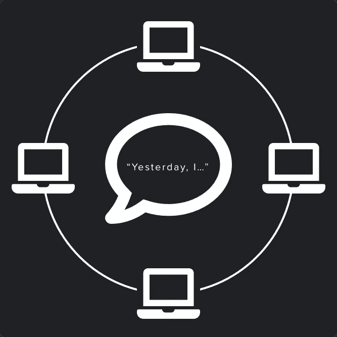

# 数字化你的单口相声！

> 原文：<https://medium.com/swlh/digitize-your-standups-5f8c889df7df>

*Icons via* [*Font Awesome*](https://fontawesome.com)*, licensed under a* [*Creative Commons Attribution 4.0 International*](https://fontawesome.com/license) *license*

站立是软件团队交换信息和确保一致性的重要工具。我在 Refinery29 和 Google 都使用过 stands up——以及其他敏捷原则和实践——来在分布式跨职能团队之间交付成功的软件项目，我相信它们是成功产品开发的基石。