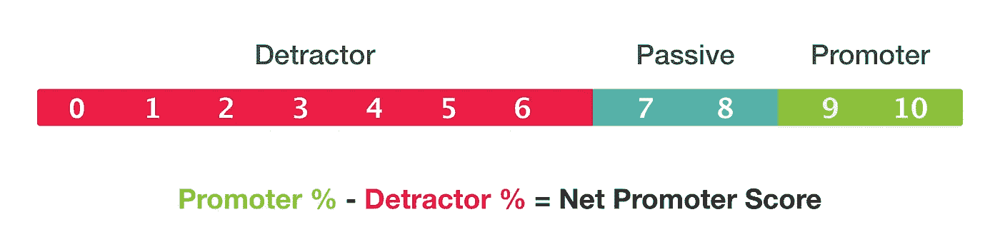
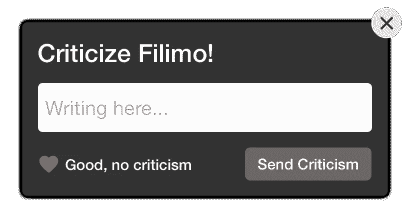
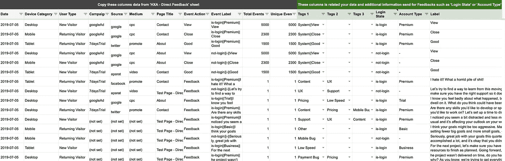
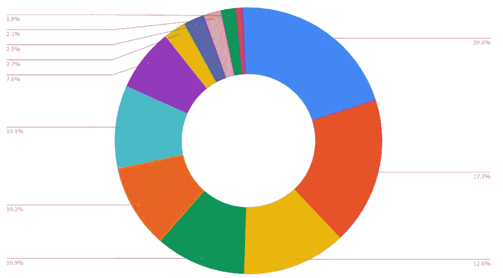

# 在短短 24 小时内与 5000 名客户交谈！

> 原文：<https://medium.com/swlh/direct-feedback-35eaebf42af9>

## 定性用户体验研究

## 我们的产品研究方法与新解决方案的故事！

Photo by [Farzad Mohsenvand](https://unsplash.com/@farzadme?utm_source=unsplash&utm_medium=referral&utm_content=creditCopyText) on [Unsplash](https://unsplash.com/?utm_source=unsplash&utm_medium=referral&utm_content=creditCopyText)

几年前，我们组建了一个产品团队，负责实施基于用户研究的产品路线图。

这是该团队努力成为数据知情团队的故事。但是怎么做呢？

我们考虑研究的三个步骤:

> 1.定量研究
> 
> 2.组合质量和**中的**数量研究
> 
> 3.定性研究:直接对话

## 我们团队研究的三个步骤

# 第一步:定量研究

在这些日子里，我们没有足够的关于用户研究方法的知识。但是我们研究它，从**定量方法开始:**

*   统计用户与 GA 事件的交互
*   定义谷歌分析的目标和转化率
*   A/b 测试或多重分割测试

我们研究的定量日非常有用，对我们的产品产生了积极的影响。但是我们发现我们需要更强大的东西，或者更多人类生成的数据！

# 第二步:研究中的质与量的结合

我们在研究 **:** 中加入了一些**定性方法**

*   会话记录
*   热图分析
*   漏斗分析

**热图**可视化所有用户交互及其结合的质量和数量研究。

在文章“[会话记录分析的 3 个重要步骤](https://link.medium.com/EjQYPjgCRX)中，我写到了**会话记录**。很简单，也很有用。

> 但作为产品经理，你总想找到更多定性的反馈。

# 第三步:直接谈！

这篇文章是关于我们这一步的研究。在这一步中，我们找到了一种获得纯粹质量反馈的方法。在前一步的最后几天，我们考虑了定性方法:

Net Promoter Score

# 🤷‍♀️净发起人得分

从 0 到 10 你能理解什么？！
好吧，7 比 5 好，但是**这个数字是怎么发现问题的？**

# 💁‍♀️反馈调查

例如，你问“你对我的产品最大的问题是什么？”；您的问题很好，但是您负担不起针对客户问题的最佳选择！

**假设我们挑了这些问题:**

*   定价
*   支持
*   移动应用
*   内容质量

**好的，反馈民意调查有两个主要问题:**

1.  你确定这些是最重要的选项吗？
2.  这种带有预定义答案的问题改变了客户的想法，他们不能反映他们真正的问题。

# 🤦‍♀️调查

谁有时间和耐心填写长表格？

再次重复之前的犹豫

1.  问题好吗？
2.  答案选择好吗？
3.  “顾客心态的变化”呢？

所有这些方法都是可行的，但是我们仍然不喜欢这些方法。

# ✍直接反馈

在发布的一天，我们的团队成员之一， [@payamshakibafar](https://twitter.com/payamshakibafar) 有了一个想法:

> 让我们给顾客一个机会，让他们想说什么就说什么！

我们用一个强有力的问题创建了一个反馈表单:**“批评菲利莫！”**还有一个空文本框，想写什么就写什么！

在进行这项研究之前，我认为我们的客户会写更多不同的主题，我们无法对反馈进行分类和分析。

Let’s give our customers the opportunity to say whatever they want!

但是结果令人难以置信！我们在短短 24 小时内收到了 5，000 条反馈，我们的客户提供了如此相似的问题，这使我们能够将问题分为五个主要主题，令人惊讶的是，不到 1%的反馈是不恰当的。

我们

**Criticize “Product Name”!**

# 直接反馈的好处

## 语音语调

首先会吸引你注意力的是你的客户的**语气**:

*   他们是青少年还是说话正式？
*   他们会用你网站上存在的同样的词语来询问功能吗？
*   他们到底生气不生气？
*   他们到底是感恩还是不感恩？

## 无反馈方向

直接反馈让人们用自己的话表达自己的观点，而不是在预先定义的答案中选择。

不要用 Textarea，用简单小的文本字段。当你使用 Textarea 时，人们认为他们必须为你写一封信，但如果你使用一个小的文本域，他们会试图用简短的话说出最重要的事情。

我们使用小文本字段，但没有字符限制，使那些想要更多的空间，可以写多行。

## 产品问题而非设计问题

如果你想从 UX 设计师转到产品设计师，你必须通过的一个重要阶段是思考主要问题而不是设计问题。

> 倾听直接反馈会告诉你，大多数客户不会考虑**像素完美设计或配色方案**等。他们对你产品策略的核心有更深层次的问题！

对于发现设计问题，会议记录工具要好得多，而**产品**、**营销**、**支持团队**以及**利益相关方**需要直接反馈。

## 问题详细信息

我们总是知道问题的大致范围，例如:
我们知道信息架构的一些问题，但是，

*   这个问题到底是什么？
*   我们的产品缺少哪些内容？
*   客户希望在主页上看到什么内容？

你可以在直接反馈中找到问题的细节。

## 竞争对手分析

*   他们在谈论竞争对手吗？
*   你的竞争对手哪个名字重复，哪个更出名？

**忠诚度检查:**

*   当客户谈论竞争对手时，他们谈论的是什么具体功能？
*   他们想转向你的竞争对手吗？还是只想要竞争对手产品的小功能？

## 创建路线图

我们每六个月进行一次研究，作为产品经理，最棒的是你可以根据频繁的反馈创建一个**路线图**及其优先级。

# 如何记录客户反馈？

我们用**谷歌标签管理器**和**谷歌分析**轻松实现这些反馈。

这种实现方式**免费且简单**，您可以在 Google Analytics 中获得更多关于客户的附加信息，这些信息可以与设备类别、推荐、用户类型(新用户与老用户)、目标等反馈合并。您可以提交带有反馈的各种信息；例如，用户状态(登录或访客)等。

 [## parhumm/直接反馈

### 我们找到直接获得客户需求的完美方式，客户的真实需求会向你展示一个美好的…

github.com](https://github.com/parhumm/Direct-Feedback/releases) 

## 不要想它，让我们尝试这种方法来了解直接反馈的好处:

1.  打开**谷歌标签管理器**账户
2.  在您的 GTM 发生任何变化之前，在**管理>导出容器**中导出当前版本
3.  现在，转到**管理>导入容器**
4.  下载我的 GTM 导出的 [**最新版本**](https://github.com/parhumm/Direct-Feedback/releases) 。
5.  选择 **JSON** 文件并选择**已有的**工作空间进行上传。
6.  准备好了！转到**变量**，在**“HXA—Google Analytics ID**”**变量**上更改您的 **GA ID** 。
7.  点击**预览**按钮查看反馈框。

我为所有的标签和变量定义了唯一的名字，所以不用担心冲突！另外，在**“HXA—直接反馈—设置”标签上有一些自定义反馈框的设置。**

你可以在**谷歌分析>实时>事件>事件类别:HXA —直接反馈**中查看结果。

**警告:**您不得上传任何允许 Google 识别个人身份的数据(如姓名和电子邮件地址)，即使是散列形式的数据。

[Copy Make A Copy Of Feedback Template](https://docs.google.com/spreadsheets/d/1KIbcCaFwHQh1EO3zxfGo4_RxzBq1VhesDG-vK6gLckQ/edit?usp=sharing)

# 如何分析客户反馈？

我们将用户反馈的谷歌分析事件导出到谷歌表单(感谢谷歌服务！)然后开始阅读，给每个反馈添加 1、2 或 3 个标签。

**哪些标签？** 阅读反馈意见，留心反复出现的问题；这些是标签。

**比如:**

*   内容
*   定价
*   疯狂的
*   功能请求
*   对手

## 我在 Google Sheet 上创建了一个反馈模板，从 Google Analytics 导入数据

复制一份此表，并开始分析您的用户反馈:

 [## HXA -直接反馈-模板

### 自述文件所有者，更多信息，下载 GTM JSON Parhum Khoshbakht，https://medium.com/@parhumm…

docs.google.com](https://docs.google.com/spreadsheets/d/1KIbcCaFwHQh1EO3zxfGo4_RxzBq1VhesDG-vK6gLckQ/edit?usp=sharing) 

# 如何呈现或可视化结果？

如果你标记了所有的回复，你可以创建一个有用的标签数量图表，如上图所示。

# 如何回应你的客户？

> **对客户的最佳回应是解决他们的问题。**

如果你马上回答客户的反馈，下次你做这个调查时，问题的类型必须改变，同样的问题不能再提了。

我们第一次做这项调查时，**客户满意率为 30%** 。我们根据反馈遵循产品路线图，并在 9 个月后重复调查。**满意率提升至 60%！**

让我们尝试一下，并在评论或 [@parhumm](https://twitter.com/parhumm) 中自由讨论这个主题。