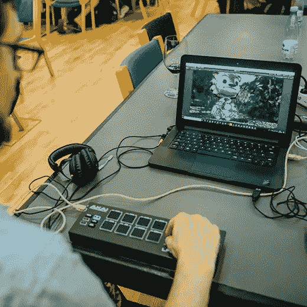
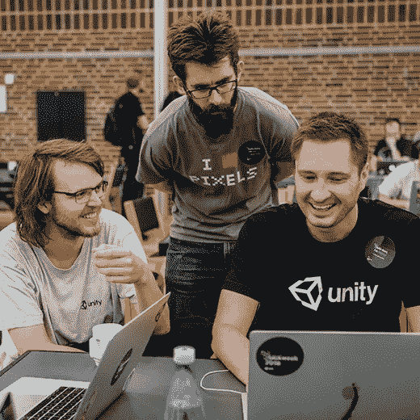

# 用心指导业务，而不仅仅是金钱

> 原文：<https://medium.com/swlh/directing-business-by-the-heart-not-just-the-dollars-c6c59da797c3>

***“底层文化关注的是开发者。当然，我们是营利性的，我们赚钱，我们成熟，但这一切都是为了个人开发者。”——戴夫·罗兹***

[Unity](https://unity3d.com/community) 是全球最大的 3D 计算公司之一。它们让世界能够讲述故事。电影、医疗保健、建筑等行业以及很大一部分视频游戏行业使用他们的软件和创新技术来创建实时图形体验。该品牌为当今创造的所有增强和虚拟现实内容提供了 70%的动力。

我们与 Unity 的首席收入官戴夫·罗兹(Dave Rhodes)就这个以客户为中心的品牌以及它如何从一个以产品为中心的公司转变为一个以开发者为先的公司进行了交谈。

***“我们的使命不是一堆文字，它指导着我们每天的决策，并使我们能够创建一个社区。”***

Unity 的使命是使技术民主化——把历史上复杂的、大多数人都无法企及的东西带给每个人。我们的使命不是一堆空话，它指导我们的决策，并使我们能够在全球范围内创建一个开发人员社区。这个开发社区是一个竞争优势，因为我们有一个伟大的粉丝群创造伟大的内容。

***“我们解决难题。”***

我们专注于为客户创造成功。而是支持他们，帮助他们实现目标。有时这意味着帮助他们创造产品，有时这意味着赚钱，有时这意味着帮助非营利组织创造艺术——成功以各种形式出现。

“我们推出了核心产品的全功能版本，而且不收费。”

免费产品往往是基于试用或有限的。我们无限制地提供产品。我们希望人们使用它。我们希望人们成功。当我们认为我们应该得到报酬时，我们会列出条款和条件。然而，免费提供我们的产品迫使我们在如何将我们创建的社区货币化方面有所创新。我们做得很好，但在软件行业的其他方面，我们一直标新立异。当然，我们是营利性的，我们赚钱，我们成熟，但这一切都是为了个人开发者服务。

***“底层文化聚焦于开发者。”***

公司本身已经从产品第一转移到开发者第一。我的意思是，无论是在游戏行业还是其他领域，我们已经开始与开发者合作，思考优先事项和创新。我们已经发展到花时间在现场，并与他们合作，以获得理解产品周期过程的洞察力。

***“我们拥抱 FBI:基于领域的创新。”***

当我们的开发人员社区需要时，我们向他们提供源代码访问。我们与他们在真实的项目中实时合作——从模拟视频游戏到拍摄电影。我们将自己放在一个位置上，在产品功能的基础上进行修改和构建，为我们的客户创造差异化。我们采用这种基于领域的创新，评估它是否适用于更广泛的规模，如果是，我们将它集成到我们的产品中，并呈现给现实世界。

***“不要考虑收入，你会比你想象的更成功。”***

*品牌*的一个重要组成部分就是建立在创造体验的基础上。Unity 遵循的不寻常原则是超越美元回报。我们不会考虑我们接触的产品、解决方案或客户的短期投资回报。我们关注开发者对产品的见解和创新，这是成功的关键。

***“一个视觉计算的世界正在以超乎你想象的速度到来。”***

就像移动改变了许多行业一样，视觉计算将改变我们未来学习、交流和购物的方式。Unity 是帮助加速世界向视觉计算转变的核心。这是虚拟计算机的早期阶段，许多品牌都在试验。实验，但不要把垃圾放在那里。与和你的品牌价值相匹配的 AR 和 VR 领域的专家合作。

要体验 Unity 提供的功能，请[下载](https://unity3d.com)他们的产品，并开始构建您的作品。或者在世界各地体验他们设计的活动。

## 这篇文章发表在 [The Startup](https://medium.com/swlh) 上，这是 Medium 最大的创业刊物，拥有+409，714 名读者。

## 在这里订阅接收[我们的头条新闻](http://growthsupply.com/the-startup-newsletter/)。

