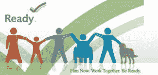

# 为那些功能受限的人做好灾难准备

> 原文：<https://medium.com/swlh/disaster-preparedness-for-those-with-functional-limitations-254b0e7b49cd>

几年前，我从事社区范围的灾难准备工作，在读到火灾对老年人和残疾人的影响后，我写了一篇文章。当我还很年轻的时候，我一点也不知道我会经历我自己的功能限制。

重要的是要认识到，大多数救灾系统是为那些“能走、能跑、能看、能开、能读、能听、能说、能迅速理解和响应指示和警报”的人设计的。老年人和残疾人受到其中一些活动的挑战，比一般人更难撤离。

想起这篇[文章](http://exclusive.multibriefs.com/content/disasters-6-actions-to-avoid-leaving-the-elderly-and-disabled-in-danger/healthcare-administration)，我也想澄清术语“功能限制”为此，让我们看看疾病控制中心的关节炎项目大纲[对这一病症的具体功能限制](https://www.cdc.gov/arthritis/data_statistics/disabilities-limitations.htm)。他们说，“这些限制组成了一组常见的日常活动，许多关节炎患者报告说这些活动“非常困难”或者他们“不能”做这些活动。”这些活动是:

*   抓小物件。
*   举过头顶。
*   坐 2 小时以上。
*   举起或搬运 10 磅。
*   爬一段楼梯。
*   推重物。
*   走 1/4 英里。
*   站立超过 2 小时。
*   弯腰，弯腰，或跪下。

每种医疗条件或诊断都有其潜在的局限性，但许多都跨越了多种诊断。考虑到这一点，功能受限的人可以做些什么来为紧急情况或灾难做准备，特别是当他们有新的限制时。

1.  前往[Ready.gov](https://www.ready.gov/make-a-plan)了解更多关于一般个人准备的信息。但是，考虑到你可能需要更多的时间来回应，或者需要建立家庭和朋友的支持，包括在他们自己的计划中向你提供帮助。
2.  联系当地的公共卫生部门，帮助他们改进帮助弱势群体的计划，改善预警机制，促进更快速的疏散，并满足受影响的个人等待返回家园和从破坏中恢复的需求。更具体地说，了解人口的需求和范围将有助于他们完善当前的计划。
3.  在灾难/紧急情况演习和训练期间，志愿帮助医院和其他医疗机构。这些演习旨在测试工作人员和功能受限的疏散人员以及普通人群的技能，帮助他们做好更充分的准备。

为什么这如此重要？因为这篇文章注意到了一个重要的趋势。随着婴儿潮一代逐渐变老，人们的思维必须发生转变，从“特殊需求”人群是局外人，转变为他们更多地属于普通人群。这是因为患有慢性和急性疾病的老龄化婴儿潮一代的"[银色海啸](http://exclusive.multibriefs.com/content/is-americas-broadband-infrastructure-ready-for-the-silver-tsunami/healthcare-administration)"将很快导致功能受限的人数超过总人口的 50%。"

留下你对紧急事件和灾难的经历的评论。你学到了什么？

*最初发表于*[T5【https://thielst.typepad.com】](https://thielst.typepad.com/my_weblog/2017/06/disaster-preparedness-for-those-with-functional-limitations.html)*。*