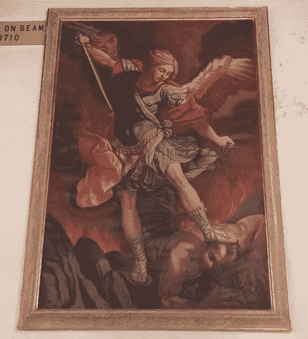

# 探索美国最古老的教堂——新墨西哥州圣达菲圣米格尔教堂

> 原文：<https://medium.com/swlh/discover-the-oldest-church-in-the-u-s-san-miguel-chapel-santa-fe-nm-c53ff61a9ab0>

一个神圣的地方，尽管时间的冲击，美国最古老的教堂是 400 岁的宝藏，位于 Barrio de Analco 国家历史区。

过去，总是在欧洲，我们沉溺于对古老教堂及其艺术和历史的热爱。但是因为我们住在美国西南部，我们也成了大西洋这边的老教堂的狂热爱好者。

我们的教堂可能不像中世纪的大教堂或天主教改革时期的巴洛克式教堂那样奢华，但它们讲述的历代故事同样充满了牺牲和苦难，闪耀着希望和信念。

天主教是西班牙殖民地日常生活的核心，教区教堂是社区的中心，在现在与墨西哥接壤的州，许多教堂仍然存在。虽然它们欢迎游客，但大多数仍然是天主教信徒的礼拜场所。

这是美国最古老教堂的故事。

关于圣米格尔教堂存在的最早文献记载是在 1628 年。口述历史认为,“圣米格尔修道院”最初是在方济各会修士的指导下建造的，约 1610 年。土坯教堂建在一个古老的 kiva 遗址上，由 1598 年随唐璜·奥尼亚特率领的西班牙特遣队从旧墨西哥来到新墨西哥的 Tlaxcalan (Tas-cal'-en)印第安人建造。

这座小教堂为一小群士兵、劳工和住在 *Barrio de Analco 的印第安人服务，之所以这样命名是因为 Tlascalan 印第安语“Analco”的意思是“河的另一边”它将南区与圣达菲河的广场区区分开来，圣达菲河是政府官员和其他知名人士居住和参加弥撒的地方。*

在过去的 400 年里，这座小教堂被修复了几次。

圣米格尔在 1640 年被一位与教会当局不和的省长部分摧毁。它被重建，但在 1680 年普韦布洛印第安人反抗西班牙殖民者的起义中再次遭到严重破坏。在忍受了多年的 T2 强迫劳动和强迫皈依制度后，土著印第安人反抗了西班牙的统治。

Analco 是普韦布洛印第安人摧毁的第一个圣达菲社区，圣米格尔教堂被部分烧毁。400 名西班牙人被杀，剩下的 2000 名定居者和他们的大多数特拉斯卡拉印第安仆人逃到了埃尔帕索。

12 年后，西班牙人回来了，在几乎没有遭到反对的情况下重新占领了新墨西哥州。他们很快着手修复这座小教堂。

时间对简单的土坯结构造成了损害，一个世纪后，需要进行大修。1798 年，圣达菲市市长出资进行了翻修，就在那时，添加了光彩夺目的雕刻彩绘祭坛屏风。

大约在 1856 年，建造了一个精致的三层钟楼，并安装了一个 780 磅重的钟——被称为*圣何塞钟*。

可悲的是，仅仅 16 年后，一场特别猛烈的风暴席卷圣达菲，吹倒了钟楼，圣何塞钟也随之倒塌。整个建筑被严重损坏和破坏，但是当镇上的人们得知拆除它的决定时，一片喧嚣和哭喊声——还有资金——被筹集了起来。

入口两侧的石扶壁倾斜到北侧，是为了支撑旧建筑而增加的。内部和外部的墙壁被涂上灰泥，一个最新的柏油和砾石屋顶代替了脆弱的旧泥屋顶，一个更小的钟楼被建造。这项工作使教堂看起来和今天一样。

今天进入教堂是通过礼品店的侧门，收取微不足道的 2 美元费用。令人失望的是，由于没有从钟楼下的正门进入，我们错过了立即看到正前方神圣的木制祭坛屏幕，或 *reredos* 的令人敬畏的体验。

相反，我们开始调查首先出现的东西:雄伟的*圣何塞钟*和数百个微小的 ex votos，称为 *milagros* ，固定在坚固的支撑框架上。

Milagros(奇迹)是一种金属护身符，提供给某个特定的圣人，以寻求个人烦恼的帮助，或对得到回应的祈祷表示感谢。每一个 milagro 象征着请愿的对象:例如，不同的身体部位代表健康问题。

有一个有趣的传说，讲的是 1356 年西班牙铸造圣何塞钟时，基督徒们把他们的金银投入熔炉。据说，这两种贵金属——合起来占合金的 0.037%——是这口钟声音圆润的原因。提供了一个木槌，邀请游客敲钟，以听到其令人惊讶的温柔，共鸣的音调。

[阅读我们的文章](https://blog.artgeek.io/2019/03/23/san-jose-bell-cast-of-copper-and-silver-and-gold/)了解更多关于这座古钟的铸造和出处的神奇故事，它是如何出现在圣达菲的，以及它带有西班牙铭文的原因——翻译为“圣约瑟夫，为我们祈祷，1356 年 8 月 9 日”。

尽管钟和米拉格罗斯引人入胜，但壮观的祭坛屏风——新墨西哥州最古老的屏风之一，可追溯到 1798 年——是中心装饰，并没有被长期忽视。(一个 *reredos* 是祭坛后面的屏风的称呼，来自古法语，*are re*behind+*dos*back。)

圣米格尔的 reredos 被认为是由 Laguna Santero 设计的，他是一位艺术家，今天已不为人知，但在他的时代很有影响力，人们知道他在 1796 年至 1808 年间一直在该地区工作。(A *santero* 是宗教图像的创造者。)侧面的 solomonic 柱是新墨西哥州这种扭曲柱的第一个例子，也是 Laguna Santero 的标志。

这看起来很难相信，但是这整个祭坛画在 19 世纪晚期被涂上了两层室内涂料。我们想知道为什么。这可能与当时围绕新墨西哥州地位问题的政治有关吗？

新墨西哥地区的人口主要是西班牙人，大部分是文盲，他们的语言和文化对于决定谁加入美国的美国人来说是完全陌生的。直到 1912 年，60 年来，T2 的态度阻止了该地区加入联邦。太穷了，太墨西哥了，太天主教了。

《纽约时报》称这块领土为“我们最糟糕的文明的心脏……充满了无知和懒惰的迹象。”

当铁路将盎格鲁人从东部带到新墨西哥州北部时，圣达菲——这座古老的“泥城”——因其土坯房和落后的生活方式而遭到诋毁。然而，有一派人支持建州，他们努力让新墨西哥州更容易被接受。因此，我们推测他们尽量减少天主教证据的努力可能引发了祭坛画的粉饰。

但政治可能与此无关。对粉刷的一个简单解释可能是，祭坛的屏风被灰尘和煤烟所覆盖，而油漆是让事物焕然一新的最快、最省钱的方法。

尽管如此，在 1955 年对小教堂的一次重大修复中，祭坛画被恢复到了原来的状态，被清洗和更新。

最下面一层是圣米格尔(圣迈克尔)雕像，雕刻于殖民时期的墨西哥城。1700 年由方济各会修士带到圣达菲。上面是一幅 18 世纪的画，*拿撒勒人基督*。顶层的中间是大天使圣米迦勒，由贝尔纳多·米埃拉·y·帕切科于 1745 年绘制，他被认为是第一个新的墨西哥圣特罗，对 19 世纪早期的圣特罗有重要影响。

中间两幅画两侧的四幅椭圆形画起源于 18 世纪早期的墨西哥殖民地。右上是*德国的圣格特鲁德*，下面是*法国国王圣路易斯四世*。显然左上角是阿维拉的圣特蕾莎(知道贝尔尼尼在罗马对圣特蕾莎的迷药，我们永远也猜不到！)，而在她下面，*阿西西的圣弗朗西斯*。

很难看到，在避难所左边的墙上是一个 15 世纪的拜占庭圣像，*永久帮助圣母*。这是克里特岛喀拉斯修道院原始圣像的复制品，自 1499 年以来一直保存在罗马的圣阿方斯教堂。

圣米格尔的墙上挂着更多的艺术作品，包括一系列 20 世纪中期的代表十字架 *14 站*的牌匾。祭坛两侧的两幅*天使报喜*被认为是穆里略的追随者的作品，穆里略是 17 世纪西班牙著名艺术家，对美洲的基督教艺术产生了相当大的影响。

我们特别感兴趣的两件物品面对面挂在相对的墙上:画在水牛皮上的*十字架上的基督*和画在鹿皮上的*施洗约翰*。据信是由方济各会修士在 17 世纪 30 年代绘制的，这些画被用作教具，帮助普韦布洛印第安人皈依基督教。

艺术性体现在天花板的工艺上，有着漂亮、坚固的旧横梁。支撑唱诗班阁楼正面的手工雕刻横梁上刻有日期，1710 年。

当我们准备离开的时候，我们差点错过了放在门上方的那个光荣的活动人偶。翅膀展开，窗帘飘动，这个美丽、强壮的战士是贵铎·雷尼*大天使米迦勒击败撒旦*的复制品。原作创作于 1636 年，悬挂在罗马的圣玛利亚教堂。离开的时候别忘了抬头看看！

圣米格尔教堂见证了四个多世纪的历史。它位于巴里欧·德·阿纳尔科国家历史区，是隐藏在新墨西哥州圣达菲“不同的城市”中的一个小宝藏。

嗯……也许是时候计划一次小小的旅行了！

圣米格尔教堂
401 旧圣达菲小径
新墨西哥州圣达菲
505–983–3974

教堂在没有弥撒进行时对游客开放。圣达菲合唱团在每个月的第三个星期天下午 4:00 唱晚祷歌和圣歌。

*原载于 2019 年 3 月 23 日*[*https://blog . art geek . io*](https://blog.artgeek.io/2019/03/23/discovering-the-oldest-church-in-the-u-s-san-miguel-chapel-santa-fe-nm/)*。*