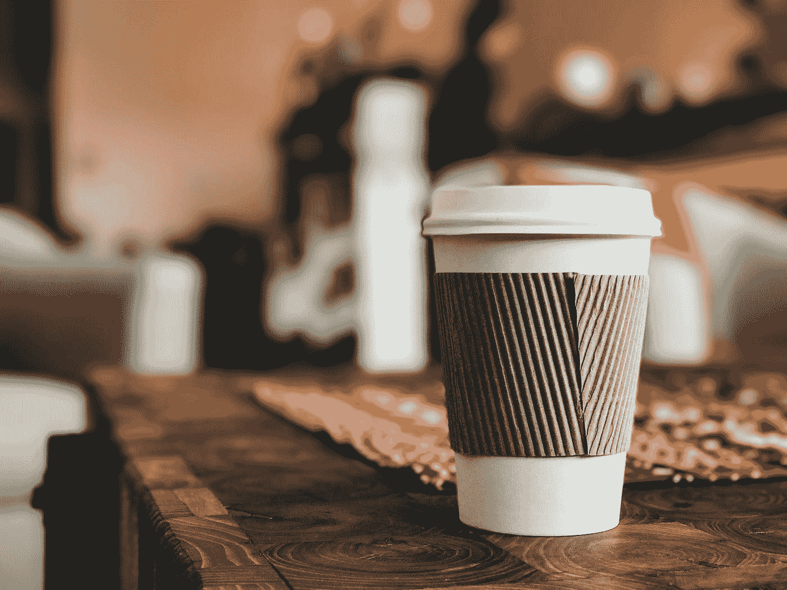

# 一次性营销——不利于销售环境

> 原文：<https://medium.com/swlh/disposable-marketing-not-good-for-the-sales-environment-1f6dcd5bbac6>

Photo by [Ross Varrette](https://unsplash.com/@rossvarrette?utm_source=medium&utm_medium=referral) on [Unsplash](https://unsplash.com?utm_source=medium&utm_medium=referral)

我们营销人员喜欢一个好的类比。我经常在这个博客上给自己讲述电子邮件营销如何非常 [**像钓鱼**](https://blog.icontact.com/what-kind-of-fisherman-are-you) ，或者内容营销如何有点像 [**自行车车轮**](https://blog.icontact.com/why-content-marketing-is-like-a-bicycle-wheel) 的故事。但并不是所有的比较都能从好的方面反映营销。今天，我想让你们考虑一下，你们的营销是否像一个一次性咖啡杯——也就是说，设计成只能使用的东西…