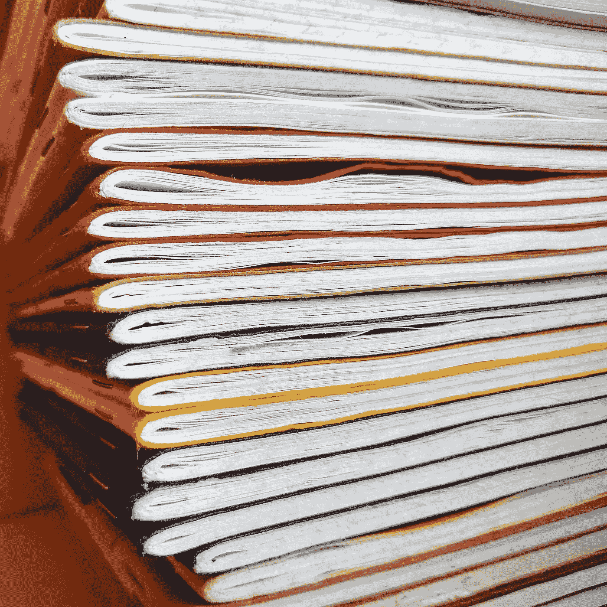

# 提炼和归档

> 原文：<https://medium.com/swlh/distillation-and-archiving-d1c31129d998>

在过去的几年里，我保存了很多袖珍笔记本，从我的第一个野外笔记笔记本开始。在此之前，我主要使用 Moleskine 笔记本，通常是精装的袖珍版。一旦写满了，就可以很方便地坐下来细读，记住我对项目的想法，诗歌片段，大大小小的冒险经历，以及我认为可能不会留给自己的哲学段落。之前…