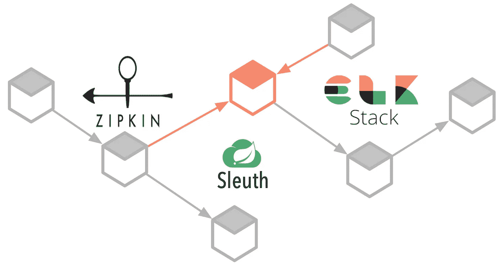

# 使用 Zipkin、Sleuth 和 ELK Stack 在 Micoservices 中进行分布式跟踪。

> 原文：<https://medium.com/swlh/distributed-tracing-in-micoservices-using-spring-zipkin-sleuth-and-elk-stack-5665c5fbecf>

# 什么是分布式跟踪？

微服务的主要挑战之一是调试和监控问题的能力。一个简单的动作可以触发一连串的微服务调用，而在被调用的微服务中跟踪这些动作是很乏味的。这是因为每个微服务都运行在一个环境中…