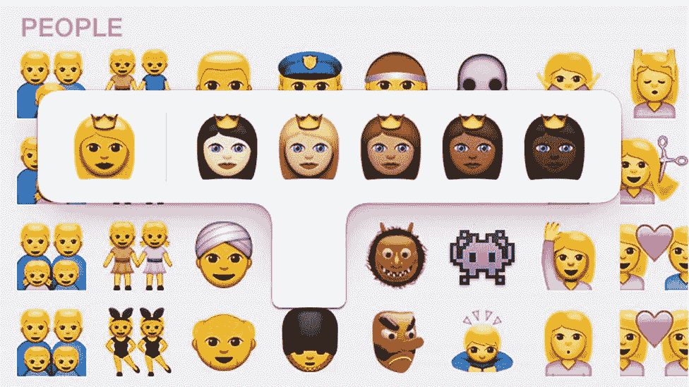

# 远程工作的多样性——走向更具包容性的团队和组织

> 原文：<https://medium.com/swlh/diversity-in-remote-work-moving-towards-more-inclusive-teams-and-organisations-88a213b51c5d>

“多元化”是许多企业使命文件和政策声明中的价值观，包括世界许多地方法律规定的平等机会，以及在许多情况下远远超出法律义务的包容性行为承诺。除了有时华丽和公式化的组织语言…