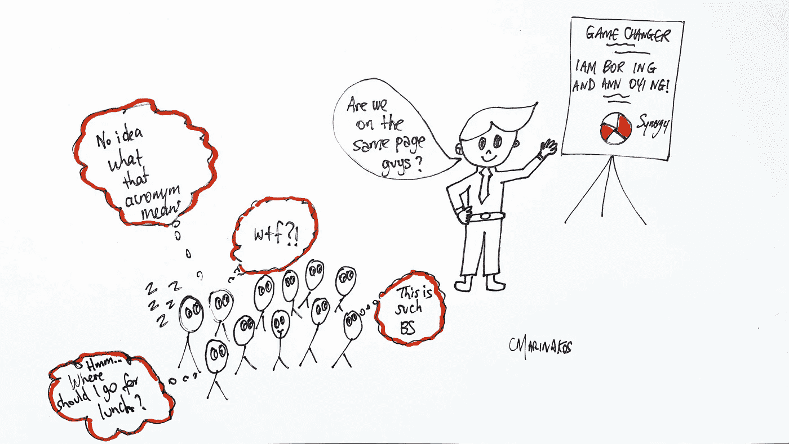

# 流行语、行话和首字母缩略词会让聪明人听起来愚蠢吗？

> 原文：<https://medium.com/swlh/do-buzzwords-jargon-and-acronyms-make-smart-people-sound-stupid-d60bd375a6c2>

## 为什么我们需要清晰地写作和说话

Illustration by Cynthia Marinakos.

我的一个读者 Jean 分享了这个观察结果:

*“…我们都知道，随着公司规模的扩大，流行语也会增加；)我不得不努力赶上进度……*