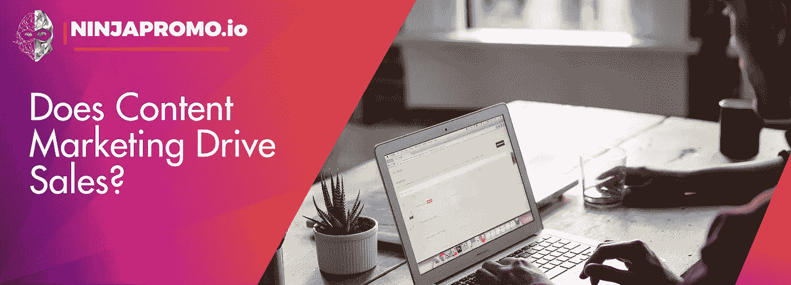

# 内容营销推动销售吗？

> 原文：<https://medium.com/swlh/do-content-marketing-drive-sales-dfa1a9beb2b3>

**内容营销**如何降低一个线索的成本，提高搜索结果，带来高投资回报？ [NinjaPromo](http://ninjapromo.io/?utm_source=medium&utm_medium=organic&utm_campaign=promo) 分享其观点。

内容营销(CM)通过为客户介绍有用的信息来吸引和留住客户。它已经成为在网络市场推广产品和品牌的工具 **#1** 。它取代了恼人的、无处不在的直接广告，后者的效果已经下降。

大多数广告工具只能瞄准两组价值中的一组:软价值(为客户创造额外价值，建立忠诚度，建立长期关系)或硬价值(获得流量，增加交易量和投资回报率)。这种营销的主要好处是它面向解决所有的商业问题。

这就是原因。

# 没有到期日期

考虑到在线信息的特点，它主要具有实时价值，看起来你的内容营销策略的结果也是短暂的。请记住，一旦发布的信息材料没有截止日期，它将永久在线。即使你关闭了材料，它也很可能已经被某人分发或上传了。

与其他营销模式(假设你必须为与 TA 的每次互动付费)相比，内容是一种长期的资金投入，而**将一次又一次地为自己买单**。

**证明:**

其中一名研究人员调查发现，CM 的内部效率是付费搜索的三倍，尽管后者被认为是非常强大的广告方法(但这只是一项短期投资)。

在付费搜索的帮助下，只获得了 9 个线索，而 CM 允许超过 30 个线索。

付费搜索的领先成本约为 110 美元，CM 约为 32 美元。

此外，根据 HubSpot 的研究，每天在博客上发帖的营销人员中，有 82%声称在集客营销框架中的整套运营获得了积极的投资回报。

**读数:**

不要在很快失去价值的结果上浪费金钱。发布信息材料会给你带来数月甚至数年的收益。**创作展示最高投资回报率的文章、视频和“白皮书”。**

Photo by [Glenn Carstens-Peters](https://unsplash.com/photos/npxXWgQ33ZQ?utm_source=unsplash&utm_medium=referral&utm_content=creditCopyText) on [Unsplash](https://unsplash.com/search/photos/publish?utm_source=unsplash&utm_medium=referral&utm_content=creditCopyText)

# 与客户和搜索引擎合作

您分发的资料不仅对您的读者有益，还能提高查询结果的性能。在几年前发布新的搜索结果算法 Google Panda 之后，内容已经成为成功的搜索引擎优化的关键部分。制作高质量的材料向搜索系统发出了你在某一特定领域的专业知识的信号，你发表的文章越多，这个信号就越强。你生成的专业材料越多，潜在客户通过有机结果找到你的机会就越多。换句话说，你不仅操纵了已经和你在一起的用户的忠诚度，还吸引了越来越多的新线索。

**证明:**

HubSpot 的一份报告显示，消费者从 organic results 购买的平均比例为 14.6%，从 ads 购买的平均比例为 1.7%。最重要的是，在“搜索线索”中的交易百分比比直接邮寄高出八倍。

尼尔森的研究证明，67%的人更倾向于购买通过搜索系统找到的新产品。

**读出:**

通过创建高质量的报道，可以充分利用有机搜索结果，这将增加传入流量，并让您获得更多的线索、客户和交易。

# 内容成就信任，信任成就销售

亚马逊、苹果和 GoPro 是公司认识到信任对于赢得客户忠诚度有多重要的好例子。

内容是建立信任的重要工具。如果你将购买漏斗每个阶段的材料生产联系起来，你的客户将获得更多关于你公司活动领域、产品或服务的信息，这反过来将帮助他们快速做出购买决定。预测用户问题和需求的信息内容是展示你的品牌真正关心消费者的最佳实践。

**证明:**

如果相信 TMG 定制媒体，78%的购买者认为提供定制材料的公司希望与他们建立真正的联系。

Edelman 的研究表明，64%的潜在买家下意识地希望从公司那里听到同样的信息 3-5 次，才会相信。

另一份报告称，53%的消费者更愿意购买之前在网上找到的商品。

**读数:**

想想有多少消费者仅仅因为没有找到他们想看的信息而路过你的公司。使用有用的营销内容来获得认可，打破僵局，获得信任，并最终增加你的销售额。

Photo by [Headway](https://unsplash.com/photos/5QgIuuBxKwM?utm_source=unsplash&utm_medium=referral&utm_content=creditCopyText) on [Unsplash](https://unsplash.com/search/photos/publish?utm_source=unsplash&utm_medium=referral&utm_content=creditCopyText)

# 内容“知道”Y 世代的途径

很快，千禧一代——7900 万出生于 80 年代，结束于 21 世纪初的人——将成为主要的消费群体。预计仅在美国，他们每年的购买量就将达到约 1700 亿美元。

如果你想被这一大群人听到，你必须意识到这一代人的一个显著特征:“Y 一代不信任传统广告——他们只是没有注意到它”——正如波士顿学院的一位营销学教授所说。

传统的广告不知道如何说这一代人的语言，但文字报道知道——通常出现在这一代人花费大部分时间的地方。只有通过制定内容政策，人们才能在新的法律下进入利润如此丰厚的市场。

**证明:**

Edelman 8095 Insights 发现，94%的新一代买家在购买之前至少会使用一个额外的公司信息来源。

布莱恩·索利斯声称，66%的新一代代表会查看商店的信息，从朋友那里登记某人。他还指出，他们订阅/关注品牌更新的意愿是其亲属的 3 倍。

美国商会宣称，80%的千禧一代睡觉时都抱着手机。

总的来说，所有这些不仅影响到年轻一代。CrowdTap 进行的一项研究涉及数千名男性和女性，证明他们中的大多数人甚至不太相信广告，因为他们尊重这些建议:

*   70%的人在朋友或家人的建议下决定购买某样东西，或者是因为他们在网上看到了关于该公司的帖子；
*   55%的人在看了网上的文章后决定购买；
*   此外，Content Plus 发现，70%的买家更喜欢通过文章而不是广告来了解公司。

**读数:**

为了吸引 Y 一代和今天的其他顾客，你的品牌需要成为你的观众花费最多时间的地方。制作引人入胜的高质量材料，及时提供给这些受众(他们经常使用自己的设备)，但**从不强行推销**。

Photo by [John Schnobrich](https://unsplash.com/photos/2FPjlAyMQTA?utm_source=unsplash&utm_medium=referral&utm_content=creditCopyText) on [Unsplash](https://unsplash.com/search/photos/publish?utm_source=unsplash&utm_medium=referral&utm_content=creditCopyText)

# 平台会改变，内容会保留

还有一个使用 CM 的理由。

在网络上，一切都在迅速变化。某些平台和社交网络的受欢迎程度有增无减(这有点像过山车)。你的客户，今天专注于 Pinterest，明天就可以转向 Path。

归根结底，信息材料的真正价值在于其从一个平台到另一个平台的可移植性。一旦创造了高质量的报道，在你的购买者从一个平台转向另一个平台或下载一个新的社交应用程序后，你会感受到这种投资的效果。

[**NinjaPromo**](http://ninjapromo.io/?utm_source=medium&utm_medium=organic&utm_campaign=promo) **建议**:为你的 TA 制作出真正有价值的优质素材，无论这些内容出现在哪里，你都会保证收到你的分红。

*感谢您阅读本文！如果你喜欢它，请分享它，并告诉我们你对内容营销的看法。另外，你可能会喜欢我们的其他故事:*

> — [如何衡量一个移动应用的有效性？](/swlh/how-to-measure-the-effectiveness-of-a-mobile-application-23c29c6722cd?utm_source=medium&utm_medium=organic&utm_campaign=promo)
> 
> — [你想知道的关于社区管理的一切](https://hackernoon.com/how-to-move-crowds-or-all-about-community-management-27e56cceb7dc)
> 
> — [电子邮件营销已死吗？](http://blog.markgrowth.com/is-e-mail-marketing-dead-72f5eebce2fc?utm_source=medium&utm_medium=organic&utm_campaign=promo)
> 
> — T [年度趋势:Stablecoins 代替 ICO](/@NinjaPromoAgency/trend-of-the-year-stablecoins-instead-of-ico-688d28844a7a)

## 这篇文章发表在 [The Startup](https://medium.com/swlh) 上，这是 Medium 最大的创业刊物，拥有+436，678 名读者。

## 在这里订阅接收[我们的头条新闻](https://growthsupply.com/the-startup-newsletter/)。

