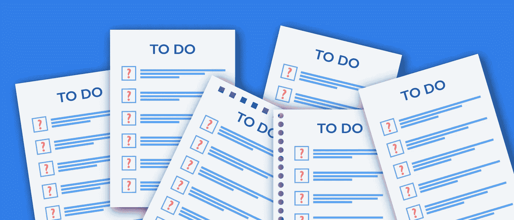

# 我在乎我的待办事项清单吗？

> 原文：<https://medium.com/swlh/do-i-care-about-my-to-do-list-68a7eaade0a3>

## 这些年来，我慢慢不再认真对待我的待办事项清单。现在我需要做点什么。

从我记事起，我就一直使用待办事项清单。即使是学校的项目，我也记得在我的记事本上划任务。这是一种对我一直有效的方法，它让我感到有条理，当然也富有成效。每当我处于巨大的压力下时，我知道我总是可以看看我的清单，我会立刻感到平静。那张小小的纸可以给我继续下去所需的动力和信心。在这个过程中的某个地方，我对列表天真无邪的热爱进化到了一个更加成熟和不同的层次。

现在，作为一个成年人，我从我的黄色小记事本转到了复杂的组织系统，有分类和标记的任务。我用子弹日记和应用程序来记录我所有不同的项目。不用说，我的生活中几乎每个方面都有待办事项清单。尽管我为自己创建的系统感到非常自豪，但我怀疑自己是否还在正确地使用它。

# "忙忙"

我属于喜欢过度工作的一代，这一代人在这个喧嚣的文化和创业世界中茁壮成长。就我而言，我承认在前进的道路上，我沉迷于这种匆忙，这种我需要一直做重要事情的感觉。我需要让一些事情发生。现实是，我的待办事项清单只是我试图描绘的“忙碌形象”的纯粹反映。

> **每天，我的清单上都写满了任务，很多任务，也许太多了。**这就是问题的开始。

在我生命中的某个时刻，我说服自己，我只是有太多的任务和项目。但在那个时候，不管我对我的组织系统和清单做了什么改变，我总是发现自己在某个时候有 40 多项过期的任务。这让我一直在想，是什么原因让我大部分时间都无法完成我的待办事项清单上的事情。

我确信我为自己设定了一个很高的期望水平，没有一个正常人能够达到——包括我自己！也许这种超水平发挥的心态让我*在空中有太多的球来玩杂耍*，就像他们说的。因此，在很长一段时间里，当我遇到“生产力危机”时，我的解决办法是改变几项任务的截止日期，希望能解决问题。然而，过了一段时间后，循环最终会重复:新列表、太多任务、过期任务、新日期、新列表…

# 又来了？

这是一个需要停止的恶性循环。我受够了，我想以某种方式改变。重要的是要试着理解为什么我不能每天都遵循我的待办事项清单。最终，我有了这个想法来测试自己，看看我的列表是否真的有太多的任务。

我决定连续 25 天跟踪我的工作效率，每天我都会努力完成每一项任务，即使这意味着只睡几个小时(这种情况发生过几次)。在一天开始的时候，我会记录我为那天计划了多少任务，以及我是否有任何过期的任务(从过去的日子里)；到最后，我会看到我完成了多少任务。我的目标是试图理解对我来说什么是“有成效的”一天。

# 25 个生产日

在体验期间，我计算了一下，我的平均一天将由 16 项任务和 5 项过期任务组成(总共 21 项)，在一天结束时，我将设法完成大约 19 项任务。这就给我留下了接下来几天 3 个过期的任务。这最后一个数字对我来说非常有趣，它帮助我理解了我的任务积累问题。我确实感受到了这三项任务的重量，因为在这段经历中的某个时刻，我有将近 20 项任务逾期未完成。所以我们可以得出结论，这些结果并不完美，当然也没有反映出我最初的目标。然而，值得一提的是，它仍然比我以前做的要好。在这段经历中，我从未觉得有必要为了达到“零任务”的目标而改变最后期限或删除所有任务。我可以很容易地说，毫无疑问，这是我多年来最有成效的一次。顺便说一句，正是在这段时间里，我做了一件我从未想过自己能够做到的事情:[我发表了我的第一篇博文](/@filipaamado/push-notifications-delete-all-79d2ff0f242b)。

现在的问题是试图理解为什么我现在更有效率了。挑战当然给了我动力，但我相信有一个更简单的解释:我在拖延。我意识到我所有的待办事项都与忙碌的生活方式无关。事实上，我现在可以看到我在做某种“忙碌”的表演，更担心我的任务量，而不是实际去做。我甚至重新安排了最基本的家务，只是因为我知道我可以在以后的日子里完成它，而不会受到它的影响。不断地列出新奇的任务清单，然后改变它们是我自己拖延的方式。过去总是让我觉得有所作为的事情，对我不再有影响。我看着我的清单，它不再有力量和价值。我基本上就不把它当回事了。

# 做一只聪明的蜜蜂

对我来说，这是一次非常私人的、大开眼界的经历。也许这个结论有点显而易见，几乎是陈词滥调，但它给了我一个机会来思考我认为富有成效意味着什么。我创造了一个有效的组织系统，我只是停止了携带它和不正确地使用它。但在此之后，我学到了一些东西，我希望它能激励你从忙碌走向聪明:

1.  专注于你的日常任务——避免做那些你已经安排在以后几天的任务，因为它们更容易做，专注于你当前的任务。
2.  **关注障碍**——记住未来可能会扰乱你工作效率的事件(会议、婚礼、旅行……)，试着安排当天最少的任务，或者想办法在事件发生前完成这些任务。
3.  **没有死气沉沉的时刻**——找到创造性的方法在任何“死气沉沉的时刻”保持高效，我开始在公交车上带上我的平板电脑来写作。
4.  打破效率链——我在某处读到打破习惯链是可以的，只是不要连续两天重复。
5.  反思——在一天结束时，分析你做了什么，还有什么需要做，以及你是否应该对你的计划做任何(明智的)改变。
6.  **重新安排**就好——时不时想重新安排任务是完全正常的，但如果你需要这么做，真的要想想背后的原因——对自己诚实。

这些只是帮助我变得更有效率和生产力的几个建议。我肯定会继续把这些应用到我的每一天，并记录我的进步(但我可能不会再做那些紧张的 25 天)。我对我的待办事项清单有了新的认识，现在我有信心无所畏惧地一个任务接一个任务地面对它。所有这一切都是因为我能够对自己诚实，不再有外界的借口。因为在一天结束的时候，你不能真的责怪你的待办事项。