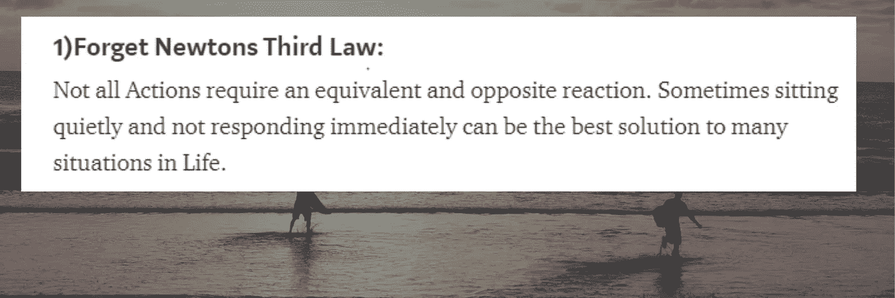
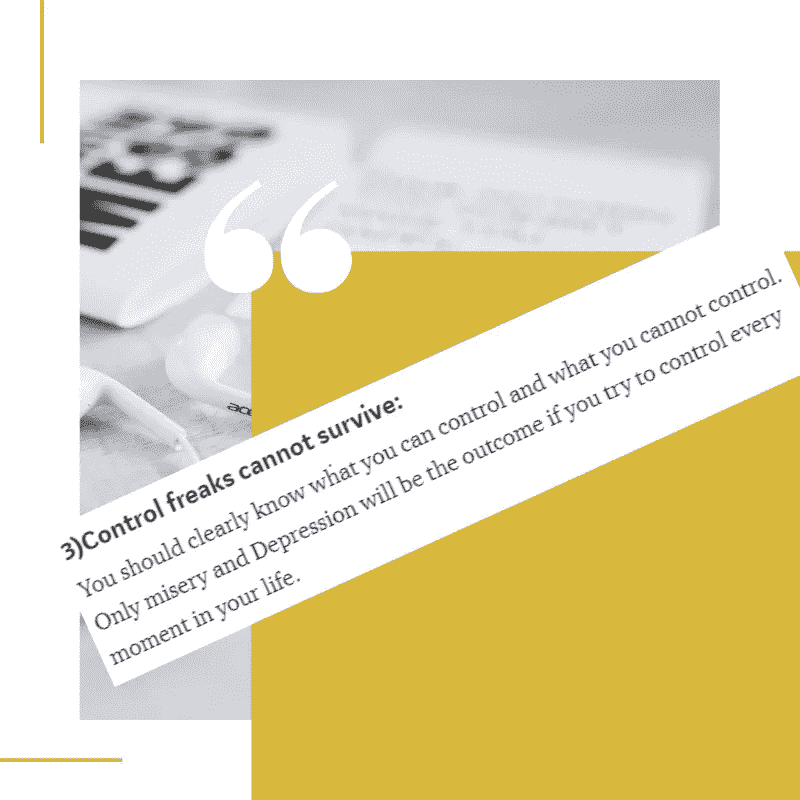
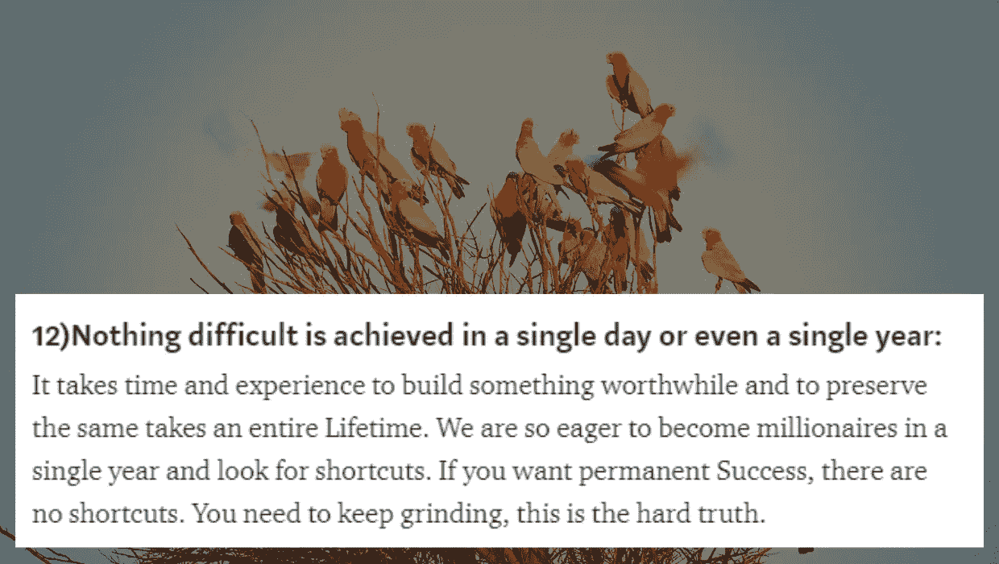
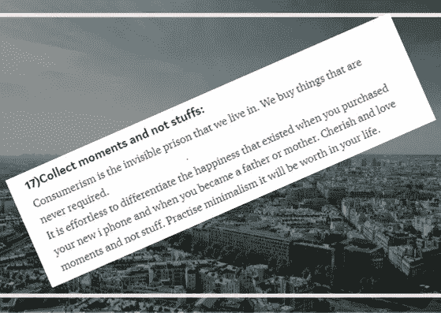
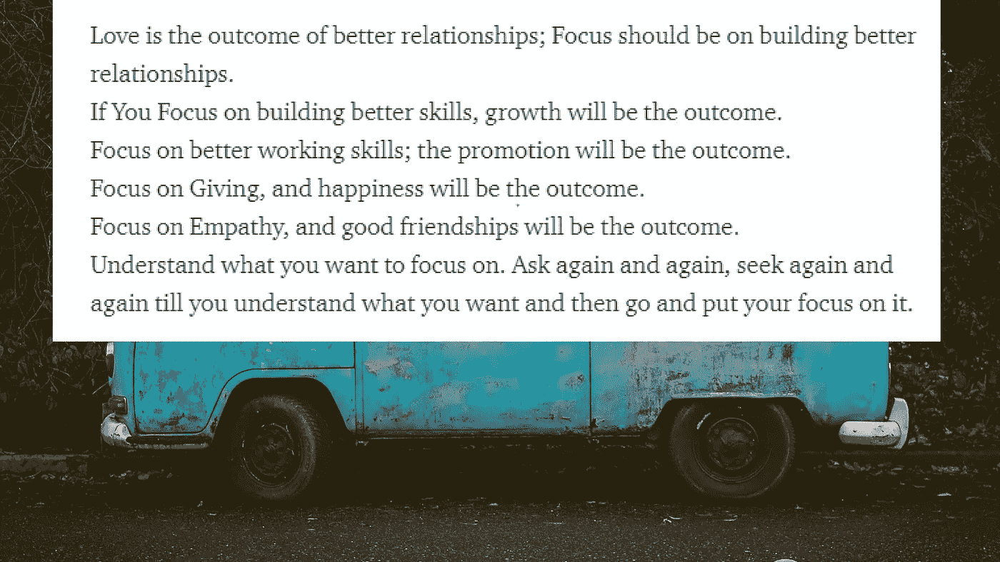

# 我遵循我自己的作品吗？

> 原文：<https://medium.com/swlh/do-i-follow-my-own-writings-32fe0e3a79ad>

写作总是容易的，但要做到这一点却很难？我会说这是最困难的事情！

Photo by [Debby Hudson](https://unsplash.com/@dhudson_creative?utm_source=medium&utm_medium=referral) on [Unsplash](https://unsplash.com?utm_source=medium&utm_medium=referral)

我认为自己是一个非常博学的人，一年至少读 30 本书，我在一家大机构工作。我在 medium 写作，在 Udemy 教书。尽管如此，我的生活经历表明我的大脑有问题。

我写的和我做的有相当大的差别。

不管我妻子提出了什么简单的抱怨，为什么我需要立即做出反应？。
我有丰富的自我储备，我总是试图向别人证明我不是。当有人对我指指点点时，我的自我就会充满能量和活力。我什么时候才能学会？

## 我写了这个，但它适用于我吗？？

走到哪里都想控制别人。

我看着别人，我总是希望别人能认可我，理解我说的话，并对我的意思点头。

我怎么能相信操纵和控制我周围的人是可能的呢？我对简单的日常活动感到厌烦。我总是告诉我的三个孩子听我的。我对他说，我是你爸爸，你必须永远依靠我。

> 可怜的我，我的操控不起作用，我把我的操控命名为养育。我应该知道我写的是什么。

这是最具挑战性的练习。我总是期待即时的满足。当我只发布了几个在线课程时，我肯定想成为一个有钱人。我想用我投资的很少的钱成为股票市场的百万富翁。

当我只能看到 00 美元时，我梦想着每个月从我的在线课程中至少看到 1000 美元。我写了些东西，却期望媒体报以 1000 次掌声——可怜的我。

不知道什么时候才能改变，给时间让每一次努力都有成果。我只想事情马上发生。

当我不能带我的家人去度假的时候，我该怎么说呢？我妻子总是问我要去哪里。她喜欢旅游，享受美好时光。

我总是说让她等着！当我作为三星品牌大使忙于购买三星 Note 系列手机、三星标志性耳塞、三星 VR 和三星智能手表时，我会遇到一些财务问题。

> 我很自豪地说，我是一个只关心炫耀我所拥有的一切的小玩意极客，我不能忘记我也写过关于极简主义的文章。现在我更能理解自己了，我有毛病！

> 每当有人问我任何建议，我都是第一个给的。这个世界上最容易的事就是给别人提建议，最难的是听从我们的建议。

当我真的无法接受我无法改变的事情时，我会说宁静祈祷和其他东西。这些话有更深的含义，读这些台词总是很容易，但练习我太远了。

当谈到专注时，我想要成长，我想要加薪，当我从不专注于建立更好的关系、提高我的有用技能时，我想要幸福。所有的钱都花在了购买电子产品上，我没有钱用于慈善事业。

> 写起来总是比较轻松，多读起来也毫不费力。从一个演员到一个真实的人的转变是一项艰巨的任务。

## 最后，我想说:

我想通过向世界展示我的面具来显得聪明和引人注目。是的，每个人都有自己的封面。

我们生来就没有面具和面具，但无论我们去哪里，我们都带着它们，这成了我们的生活方式。

> 这一刻我明白了，我不是我想的那样。
> 
> 只有通过觉知，我才能改变。
> 
> 即使我知道我是什么，我可能会也可能不会改变，因为我知道建造大山和改变别人是容易的，但改变自己是更需要的。再多的教育也改变不了想成为这样的人的头脑，因为有很多人。

我期待你的批评和意见，因为我真的很喜欢它们，让我们看看我能改变多少！

## 这篇文章发表在 [The Startup](https://medium.com/swlh) 上，这是 Medium 最大的创业刊物，拥有+440，678 读者。

## 在这里订阅接收[我们的头条新闻](https://growthsupply.com/the-startup-newsletter/)。

