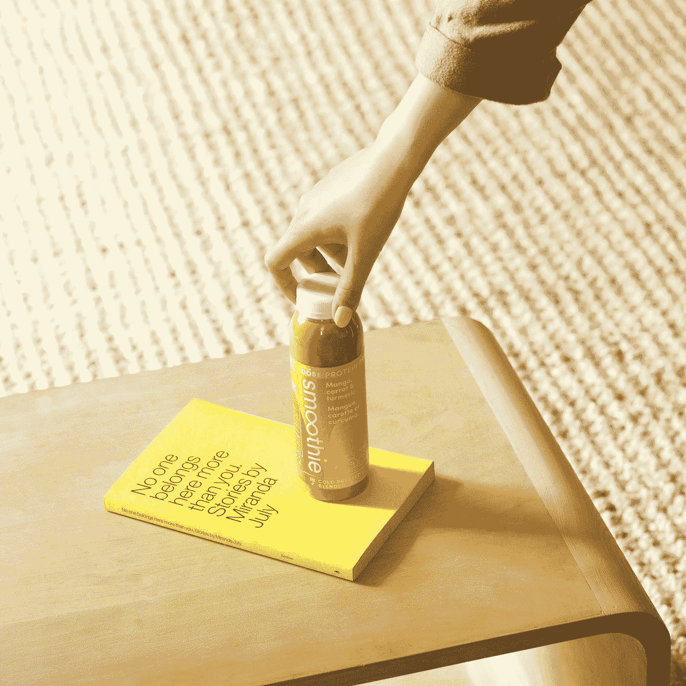

# 我需要有一个“品牌”吗？

> 原文：<https://medium.com/swlh/do-i-need-to-have-a-brand-96f792a594d7>

Photo by [Dose Juice](https://unsplash.com/@dosejuice?utm_source=medium&utm_medium=referral) on [Unsplash](https://unsplash.com?utm_source=medium&utm_medium=referral)

残酷的说实话，我开始写作不是为了做一个“品牌”。我从未注册过 Medium，也从未质疑过我所写的体裁或我分享的话题是否会被关注或认可。

我只是…我。我想这是我的品牌。

到目前为止，在过去的一年里，我最成功的故事是我写的那些作为虐待受害者的回忆的故事。我纠结于…