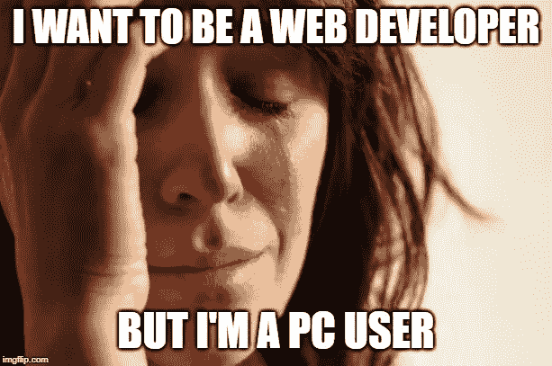

# 我真的需要 Mac 吗？

> 原文：<https://medium.com/swlh/do-i-really-need-a-mac-120d3b856f60>

## 面向 Linux 的 Windows 子系统初学者编码指南

在我第一天参加编码训练营的前几周，我和我未来的一位导师进行了一次视频聊天。在准备工作中有一节是关于 BASH 的，这对于一个 PC 用户来说很难，我问他为什么这一节假设我使用的是 mac。