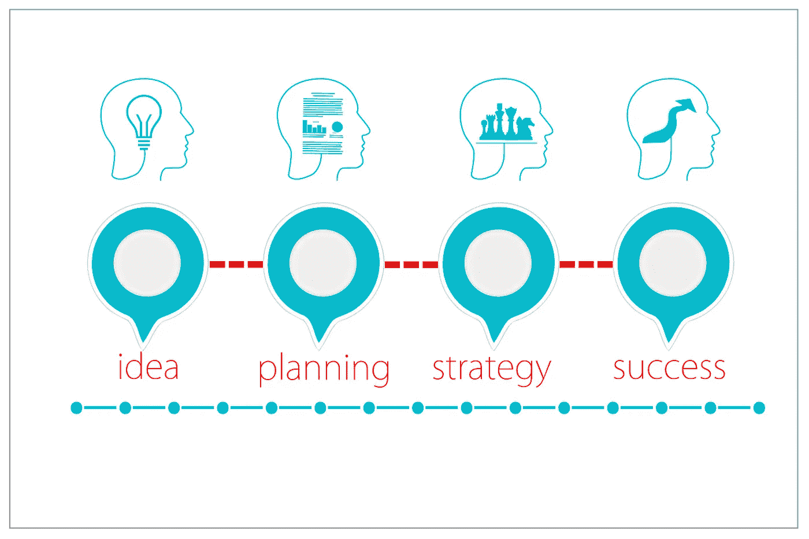

# 我真的需要写一个规范吗？

> 原文：<https://medium.com/swlh/do-i-really-need-to-write-a-specification-15312bdf6357>

## 为什么在实现之前记录一个特性会让你开心

Image by [Gerd Altmann](https://pixabay.com/users/geralt-9301/?utm_source=link-attribution&utm_medium=referral&utm_campaign=image&utm_content=3189797) from [Pixabay](https://pixabay.com/?utm_source=link-attribution&utm_medium=referral&utm_campaign=image&utm_content=3189797)

# 有计划

本杰明·富兰克林曾经说过，

> “如果你**失败**到**计划**，你就是**计划失败**。”

当处理任何任务时，如果你知道你想要实现什么，这是一个被证明的事实…