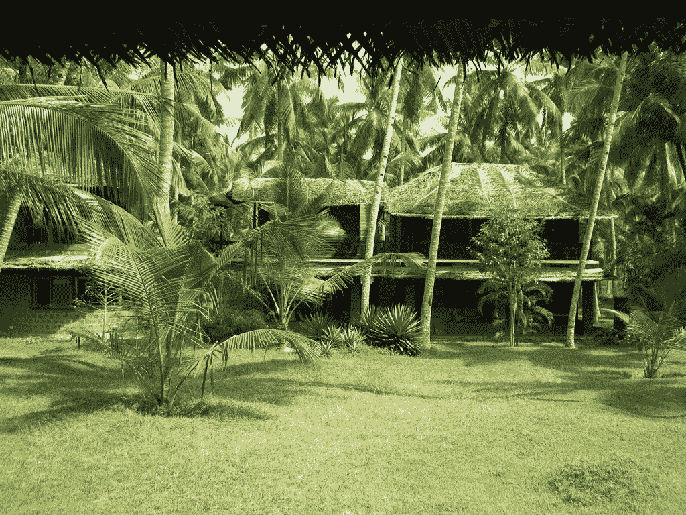

# 坚持做下去，你会成功的，就这样。

> 原文：<https://medium.com/swlh/do-it-for-long-enough-and-you-will-succeed-period-4715898ba681>

Photo by [Usman Omar](https://unsplash.com/@usmanomar?utm_source=medium&utm_medium=referral) on [Unsplash](https://unsplash.com?utm_source=medium&utm_medium=referral)

因为攀登高峰需要时间。练习成为更好的运动员需要时间。成功需要时间。一致性是关键；这是权力。

我给你讲个故事吧。我父亲和叔叔的两个故事，和我的存在一样真实。

我父亲现在 52 岁了。他比自己想象的老得更快，我想他还没有取得任何进展。当他 27 岁时，他用银行批准给他的贷款建造了自己的大房子。贷款和利息加起来是一笔巨款，所以他开始计划还款。30 岁时，他开了自己的珠宝店。这是整个城市的骄傲时刻，因为他是第一个建立这样一个商店的人。事情进展得很顺利，他的生意越做越大，并扩展到第二个分支机构，直到有一天发生了不好的事情。

一个人在我父亲的店里卖了一些金子。一周后，警察来了，告诉他们珠宝被偷了。最终，我父亲成了嫌疑犯，他们把他带走审问。他花了整整一周的时间，进进出出警察局，所以商店暂时关闭。记住他还没有还清银行债务。他一直在跑，直到他不得不在法庭上纠正错误。一切在一个月内结束，他为法院和警察花了几美元。正当他准备重新开张他的贵重商店时，他的家人阻止了他。令人惊讶的是，消极会扼杀我们的决心！他们让他相信经营珠宝店是不明智的，这样糟糕的事情可能会一次又一次地发生。商店被永远关闭了。

他花了两年时间决定下一步该做什么，银行通知来了。这是一份警告通知，上面写着债务必须尽快偿还。破产后，他和朋友合伙开始建造一个巨大的腰果工厂。工厂成功建成时，他 35 岁。头两年并不顺利。但是第三年是个大奖。这就像一个长期的推动，我的父亲收集了很多美元！6 年过去了，他还清了债务，有一天，一场暴风雨袭击了工厂。它摧毁了工厂的一部分、机器和货物。这给我父亲造成了重大损失，但它本来是可以挽回的，只要他保持专注和决心。他说，当商业全是为了收集它们的时候，在恢复上花钱不是正确的事情。他 41 岁了，就这样，他放弃了工厂。

他又休息了两年。这个人想要舒适，讨厌为生活做任何事情。当他 44 岁的时候，我妈妈强迫他做一些事情。所以他联系了他在印度铁路部门的一个朋友，他很快被接受并被认可为铁路承包商。这是一份相当体面的工作。他所要做的就是以最低的预算从拍卖中赢得建筑工程。印度政府提供预算，我爸爸只需要任命工人并完成它。他的目标是从预算中拿出最少的资金投入工作。剩下的都是承包商的收入。我爸从中赚了足够的钱，过得很好。他做了 3 年，并说这是一项艰巨的工作。最终，他也退出了。

他 47 岁时成为大蒜批发商。他进口大蒜，然后卖给零售商。他把生意经营得很好，赚了很多钱。在市场下跌之前，他是全州最好的大蒜批发商之一。他订购了 150 吨大蒜，很快就进口了。一天天地过去，他的订单越来越少，市场最终跌到了谷底。它留下了大约 120 吨大蒜，它们都被毁了，他损失了一大笔钱。你可能已经猜到了，他也退出了。

我爸爸现在呆在家里，他 52 岁了，毫无头绪。他是那种喜欢呆在舒适区，或者在努力工作之前在海滩上喝马丁尼酒的人。另一方面，我的叔叔恰恰相反。他努力工作，他相信一致性。

当这个家伙 27 岁时，他和一个外国人合伙，在[瓦卡拉的海滩边建了一个](https://www.google.co.in/url?sa=t&rct=j&q=&esrc=s&source=web&cd=1&cad=rja&uact=8&ved=2ahUKEwittZGLw4nhAhVSinAKHT4sDXIQFjAAegQIDhAB&url=https%3A%2F%2Fen.wikipedia.org%2Fwiki%2FVarkala&usg=AOvVaw2YUrd8-BtdfUJb8TFNlsw9)[度假村](https://www.booking.com/hotel/in/mektoub-resort.en-gb.html?label=gen173nr-1FCAEoggI46AdIM1gEaGyIAQGYAQm4AQbIARXYAQHoAQH4AQuIAgGoAgO4ApzXueQFwAIB&sid=6e62b7200ac02fb2e0b15757016a83de&srpvid=34666ef8b09102be&ucfs=1&srpvid=34666ef8b09102be&srepoch=1552837616&hpos=1&hapos=1&checkin=2019-04-15&checkout=2019-04-18&dest_id=-2114230&dest_type=city&sr_order=popularity&all_sr_blocks=148701501_142126730_2_1_0&highlighted_blocks=148701501_142126730_2_1_0&from=searchresults;highlight_room=#hotelTmpl)。几个月后，和他合伙的那个家伙走了，整个生意交给了我叔叔。那时候，他的[度假村](https://www.booking.com/hotel/in/mektoub-resort.en-gb.html?label=gen173nr-1FCAEoggI46AdIM1gEaGyIAQGYAQm4AQbIARXYAQHoAQH4AQuIAgGoAgO4ApzXueQFwAIB&sid=6e62b7200ac02fb2e0b15757016a83de&srpvid=34666ef8b09102be&ucfs=1&srpvid=34666ef8b09102be&srepoch=1552837616&hpos=1&hapos=1&checkin=2019-04-15&checkout=2019-04-18&dest_id=-2114230&dest_type=city&sr_order=popularity&all_sr_blocks=148701501_142126730_2_1_0&highlighted_blocks=148701501_142126730_2_1_0&from=searchresults;highlight_room=#hotelTmpl)甚至一点都不为任何人所知。他奉献了他的生命和时间来使它成功。他总是说好客和质量比奢华更重要。那是一块泥土地，建筑就建在正中间。他相信自然的力量，总是对机器说不。17 年前，这个人看到了这个行业未来的蓝图。在最初阶段，[度假村](https://www.booking.com/hotel/in/mektoub-resort.en-gb.html?label=gen173nr-1FCAEoggI46AdIM1gEaGyIAQGYAQm4AQbIARXYAQHoAQH4AQuIAgGoAgO4ApzXueQFwAIB&sid=6e62b7200ac02fb2e0b15757016a83de&srpvid=34666ef8b09102be&ucfs=1&srpvid=34666ef8b09102be&srepoch=1552837616&hpos=1&hapos=1&checkin=2019-04-15&checkout=2019-04-18&dest_id=-2114230&dest_type=city&sr_order=popularity&all_sr_blocks=148701501_142126730_2_1_0&highlighted_blocks=148701501_142126730_2_1_0&from=searchresults;highlight_room=#hotelTmpl)几乎没有一两个房间可以预订。这个人开始做出改变。他开始种树，今天，整个建筑置身于美丽的大自然之中。周围都是树和草，你会说这个地方是大地母亲的祝福！今天，[Mektoub](https://www.booking.com/hotel/in/mektoub-resort.en-gb.html?label=gen173nr-1FCAEoggI46AdIM1gEaGyIAQGYAQm4AQbIARXYAQHoAQH4AQuIAgGoAgO4ApzXueQFwAIB&sid=6e62b7200ac02fb2e0b15757016a83de&srpvid=34666ef8b09102be&ucfs=1&srpvid=34666ef8b09102be&srepoch=1552837616&hpos=1&hapos=1&checkin=2019-04-15&checkout=2019-04-18&dest_id=-2114230&dest_type=city&sr_order=popularity&all_sr_blocks=148701501_142126730_2_1_0&highlighted_blocks=148701501_142126730_2_1_0&from=searchresults;highlight_room=#hotelTmpl)——隐藏的天堂，为 20 多个国家的人们所知，它是在整个 [Varkala 度过几个夜晚的最受欢迎的度假胜地之一！到现在已经 17 年了，每天都有游客涌入。哦，那他经历的事情呢？银行要查封他的所有财产，镇上其他度假村的业主差点把他打死，附近度假村的人在他的财产里藏了毒品，而他对此一无所知，因此被捕。经历了这一切，他继续前进。他日夜奋斗。他跌倒了，但从未放弃。最重要的是，他一直在前进，甚至懒得停下来。](https://www.google.co.in/url?sa=t&rct=j&q=&esrc=s&source=web&cd=1&cad=rja&uact=8&ved=2ahUKEwittZGLw4nhAhVSinAKHT4sDXIQFjAAegQIDhAB&url=https%3A%2F%2Fen.wikipedia.org%2Fwiki%2FVarkala&usg=AOvVaw2YUrd8-BtdfUJb8TFNlsw9)

[Mektoub beach resort — the hidden paradise by the sea.](https://www.booking.com/hotel/in/mektoub-resort.en-gb.html?label=gen173nr-1FCAEoggI46AdIM1gEaGyIAQGYAQm4AQbIARXYAQHoAQH4AQuIAgGoAgO4ApzXueQFwAIB&sid=6e62b7200ac02fb2e0b15757016a83de&srpvid=34666ef8b09102be&ucfs=1&srpvid=34666ef8b09102be&srepoch=1552837616&hpos=1&hapos=1&checkin=2019-04-15&checkout=2019-04-18&dest_id=-2114230&dest_type=city&sr_order=popularity&all_sr_blocks=148701501_142126730_2_1_0&highlighted_blocks=148701501_142126730_2_1_0&from=searchresults;highlight_room=#hotelTmpl)

努力工作、晚睡、早起、练习、打猎或做任何你想做的事情，你都不会成功。你必须始终如一。你需要时间。做事要尽善尽美。慢慢来。因为你不能强迫婴儿成长。你不能强迫一棵树活着。凡事都有它的方式和规律。需要。时间。

成功是激情，由努力工作、熬夜、早起、练习、汗水和坚持来支撑！我父亲一生都很努力，但他缺乏连贯性。这就是为什么他现在觉得生活毫无意义，厌倦了。他一无所知而且破产了。但是我叔叔做到了。他正处于成功的巅峰，生活无忧无虑！但这是一夜之间发生在他身上的吗？不，当然不是。他一点一点地，一天一天地做着。这是他 14 年来的辛勤工作。我相信这解释了为什么努力+坚持=成功。
嗯，成功从来都不是运气。你努力，你就能得到。
你流汗，你得到它。就在你想放弃的时候，站直，抬起头，一路奋斗到底！因为**一致性是关键；这是权力。**

> **强迫自己，受伤，奋斗，挣扎，经历一切必须经历的；即使这意味着被活活烧死！因为好时光可能真的在火后等着你。”**

****

## **这篇文章发表在 [The Startup](https://medium.com/swlh) 上，这是 Medium 最大的创业刊物，拥有+436，678 读者。**

## **在此订阅接收[我们的头条新闻](https://growthsupply.com/the-startup-newsletter/)。**

****