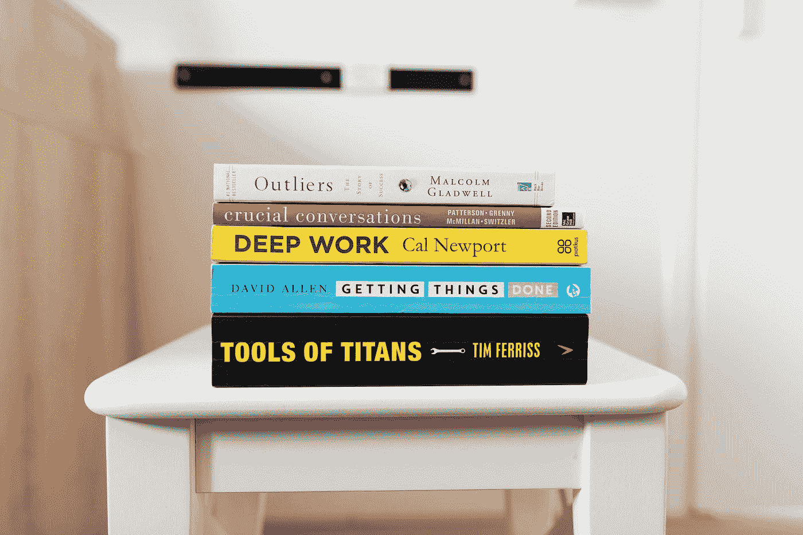

# 做得更少，更好

> 原文：<https://medium.com/swlh/do-less-better-ade1e3815e83>

Photo by [Jeroen den Otter](https://unsplash.com/@jeroendenotter?utm_source=medium&utm_medium=referral) on [Unsplash](https://unsplash.com?utm_source=medium&utm_medium=referral)

最近，我在工作中的责任大大增加了。除了需要快速学习一套新技能，我每天要完成的任务比以往任何时候都多。这个新的挑战驱使我虔诚地搜寻关于生产力的研究，目的是找到对我有用的东西。**我对理论不感兴趣——我需要结果。**