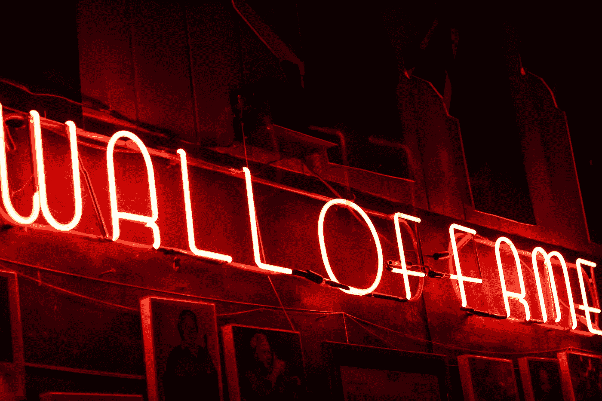

# 不要为你的工作要求回报

> 原文：<https://medium.com/swlh/do-not-ask-for-rewards-for-your-work-5d9ff07be49f>

## 学会如何对抗自我

Photo by [Kevin Grieve](https://unsplash.com/@kevin_1658?utm_source=medium&utm_medium=referral) on [Unsplash](https://unsplash.com?utm_source=medium&utm_medium=referral)

> 做好事的回报就是做了这件事—塞内卡

坚忍意味着掌握谦逊的艺术。

知道没有什么比为我们的工作寻求名誉和回报更卑微的了。

斯多葛派的工作是因为这是正确的事情，奖励只是额外的。别人的看法无关紧要，我们也不能控制名声。这两件事都增加了我们的自我，这不是禁欲主义。

小我让我们不去做我们应该做的事。

名气和报酬的问题很有诱惑力。我们都想出名。上报纸，签名，拥有数百万 Instagram 粉丝。

这些奖励是我们必须争取的。

# 为什么我们不应该寻找奖励呢？

# 奖励只是额外的。

如果好运因为我们的工作而奖励我们，那太好了。但是如果它没有发生，我们也不应该担心。

回报是我们无法控制的。

正如爱比克泰德所说，我们必须专注于那些我们可以控制的事情，而对其他事情漠不关心。

我们尽了最大努力。我们做一件工作后会有什么结果，是我们无法控制的。

*   也许作为一名政治家，你花了几个小时在一个涉及许多公民福利的项目上，却没有人感谢你。
*   也许作为一名员工，你加班完成了一份老板不感谢你的工作。
*   也许作为学生，你做了一件没有同学感谢你的事。

习惯于做事情接受孙的感谢会给我们带来不快。

总有一天，我们会停止工作，除非你感谢我们的工作或者称赞我们有多好。

这种奖励只会改变我们对现实的认知。我们停止为正确的东西而工作，我们将开始为流行的东西而工作。

别人的意见将成为我们成功的衡量标准。

# 我们按照我们的自我行事

做工作来寻求表扬只会满足我们的自我。

《自我是敌人》的作者 Ryan holiday 将自我定义为我们对自己的疯狂信念。自我改变了我们对事物的感知。创造了一个扭曲的现实，让我们按照它应该的方式行动。

每次我们按照自我行事，我们就失去了真正的潜力。我们将失去对自己情绪的控制，我们的生活将只是满足自我。

# 别人的意见不重要

重要的是你要理解这种不同。

征求他人的意见是一回事，寻求社会认可是另一回事。

第一个帮助我们作为人来提高。第二是仅仅膨胀我们的自我。

*   如果你是一个政治家，其他人的意见是非常重要的。它会让你知道你应该把注意力集中在哪里。你会发现公民的真正问题是什么。
*   如果你正在设计一个产品，其他人的意见会让你知道你的产品哪里有错误。

然而，当你依赖别人的意见时，它就会变得有害。你开始根据别人的意见行事。

当你所做的一切都是为了寻求回报。

为了获得某种回报而做事会让我们依赖他人的看法。是别人定义了我们对成功的概念。

我们将再次犯爱比克泰德警告我们的同样的错误:“不要专注于你无法控制的事情。”

我们将不再为自己而行动。我们将会像一个只追求名声和人气的木偶。

# 我们应该如何进行？

你做得好的不会感谢你。尽管如此，你的职责是把事情做好。

斯多葛派采取行动是因为他们有对社会做出贡献的强烈愿望。成功和工作把它看作是个人的实现。而不是作为别人赋予的限定语。

这种做好事的强烈愿望导致斯多葛派采取行动，为他赢得了嘲笑和侮辱。

# **这三个角色给了我们一个如何行动的好例子**

# **苏格拉底:**

这位著名的哲学家的思维方式判了他死刑。他当时很激动。即便如此，苏格拉底从未不履行自己的职责。他从未停止以他特有的方式进行哲学思考，甚至在他去世之前。

他从不在乎名声，也从不滥用自己的能力。

像爱比克泰德这样的人物后来会说:“我们必须像苏格拉底一样。”

# **小卡托:**

他是罗马共和国最伟大的捍卫者，历史将他视为凯撒大帝最大的敌人。卡托一生的特点是正直的价值观和履行自己的职责。他所做的一切都是为了罗马共和国的利益。每次他们给他奖励，卡托都拒绝了。他光着脚，穿着丑陋的衣服在罗马的街道上走来走去，取笑他，因此不担心他的名声。

像塞内卡这样的人后来会说，卡托代表了理想的斯多葛派的价值观。

# **弗拉维斯·贝利撒留**

最伟大的军事战略家之一，同时也是最不为人知的一位。他的功绩被比作朱利叶斯·凯撒或亚历山大大帝的功绩。尽管如此，没人认识他。

贝利撒留是拜占庭帝国查士丁尼统治时期罗马军队的将军。他取得了许多成就:

他有足够的力量控制罗马。但是，我没有。贝利萨里奥从不追求名利，尽管他可以做到。他宁愿保持谦逊，继续履行自己的职责。

Photo by [Artem Maltsev](https://unsplash.com/@art_maltsev?utm_source=medium&utm_medium=referral) on [Unsplash](https://unsplash.com?utm_source=medium&utm_medium=referral)

# **练习不为我们的工作寻求奖励**

# 1)不要期待任何人的感谢

你的职责永远是做正确的事。如果只有一个人感谢你，如果没有人感谢你，或者如果他们批评你做的事情，这都没有关系。你的职责是采取行动，因为这是正确的。

此外，我们会使用消极的视觉化。如果你做的时候从来不期待表扬，你会更加感激。

# 2)思考世界的浩瀚

保持我们谦逊的最好方法是思考世界的浩瀚。

这是一种坚忍的练习，你将自己与整个世界进行比较。这是马可·奥勒留做的练习。

> 想一想很久以前别人的生活，想一想在你之后别人的生活，想一想现在在异国他乡的生活。有多少人甚至不知道你的名字。有多少人会很快忘记它。有多少人现在赞美你，明天也许会鄙视你。被记住是没有价值的。比如名气。喜欢一切。”— 30，马可·奥勒留第九卷

马库斯·奥勒留是对的。我们可以很成功，但最终，我们永远只是一个人。

我们可以成为有影响力的人，拥有 1000 万追随者。但是全世界是 70 亿人。这还不到总人口的 1%。

我们可以成为伟大的作家，但在许多语言中，他们不会阅读我们。

我们可以在奥运会上获得金牌，但许多人也有金牌。

# 3)不要担心你的名声

> *一个人不应该努力获得名声，而应该努力克服对名声的渴望吗？—讲座 7.2，棕尾蝠的讲座和片段*

名气搜索让我们无法做各种相关的工作。我们的工作沦为他人的意见。

此外，追求名声决定了我们的幸福。我们将永远依赖他人。

忽视名声的斯多葛派是马可·奥勒留。他说:

> *忘掉其他一切。只抓住这一点并记住它:我们每个人只活在现在，这短暂的一瞬间。其余的已经被生活，或者是不可能看到的。我们生活的时间很短——就像我们生活的地球的一角一样短。即使是最大的名气也很小，由短命的简笔画从一张嘴巴传到另一张嘴巴，对自己和那些早已死去的人都一无所知。— 10，马可·奥勒留第三册*
> 
> 还是你的名声在困扰你？但是看看我们这么快就被遗忘了。— 3，马可·奥勒留的第四册
> 
> 让我惊讶不已的是:我们都比别人更爱自己，但更在意别人的看法。— 4，马可·奥勒留的第十二卷

皇帝总是得出同样的结论。我们无法控制自己的名声。

# 你的工作没什么大不了的

明白自己做的事情没什么大不了的。总会有人比你做得更好。

如果你把你的工作与其他重要的工作相比，你就会明白你的工作没什么了不起。

*   也许你是维兹·卡利法，你在音乐界很受欢迎。即便如此，如果和披头士的经典作品相比，你的作品也不算什么。
*   也许你是一个相当好的学生，但总会有人比你成绩更好
*   也许你是百万富翁，但总会有人比你更有钱。

最终，我们所做的工作总是化为乌有。

在相信我们之前，最好接受现实。

我们越谦虚，将来就能做得越好。

我更愿意把我的工作看作一件小事。这迫使我更加雄心勃勃，开发更精细的工作。

反过来，如果我认为我的工作毫无价值，我也不认为自己值得表扬。我将继续专注于工作，而不是名声。

目前，很难进行这项工作。我们总是读到这样的短语:“你的工作是值得的”，我们总是为我们所做的事情寻求尽可能高的报酬。

即便如此，我们做更多更好工作的潜力还是被浪费了。

# 5)明白自我是你最大的敌人

没有什么比我们的自我更能改变我们对事物的看法。斯多葛派日复一日地与之斗争。

自我太有害了。对现实有一个扭曲的看法，我们唯一会得到的是不快乐。我们会做出错误的决定，等待现实中永远不会发生的事情。

自我存在于我们做的每一件事情中。无论我们渴望什么，或者如果我们在什么事情上失败了，或者如果我们在什么事情上成功了，自我都会在那里，是我们必须学会与之斗争的东西。

对抗自我的第一步是理解它的存在。我们必须考虑到，我们总是会被那些疯狂的信念所滋养。这只有通过不断的自我分析才能实现。

马库斯·奥勒留总是想知道:

> 我在用我的灵魂做什么？审问你自己，去发现你所谓的头脑中居住着什么，你现在拥有什么样的灵魂。— 11 马可·奥勒留第五册

Photo by [Dayne Topkin](https://unsplash.com/@dtopkin1?utm_source=medium&utm_medium=referral) on [Unsplash](https://unsplash.com?utm_source=medium&utm_medium=referral)

# 结论

这篇文章，我问的是大家说的反面。我做的和别人说的相反。

如今，我们总是希望拍摄照片，并发布我们所做的每一件事。我们根据认识我们的人的数量和喜欢我们的人的数量来衡量我们的幸福和成功。

这条道路可以是相当好的，但同时也是相当有害的。我们可以成就好事，但同时也会坏事。

我给他们的每一个策略都是开始把我们的工作看作是一个为他人做贡献的机会，而不是增加我们的名气。

不要把我们的成功建立在别人的看法上，如果不是建立在我们情绪的克服上。

我希望这篇文章能帮助你在工作中保持谦逊和创造性。

让名声成为对优秀工作的奖励，而不是你想要的东西。

# **提到的书籍:**

1.  自我是敌人
2.  爱比克泰德的话语和文选
3.  马可·奥勒留的沉思

## 这篇文章发表在[《创业](https://medium.com/swlh)》上，这是 Medium 最大的创业刊物，有+435，678 人关注。

## 在这里订阅接收[我们的头条新闻](https://growthsupply.com/the-startup-newsletter/)。

