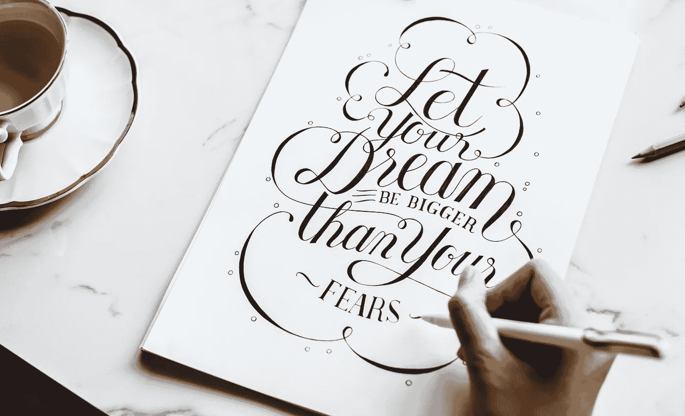

# 不要害怕拒绝，拥抱它

> 原文：<https://medium.com/swlh/do-not-fear-rejection-embrace-it-b551f5c8ca24>

即使不是所有的作家，也有很多人在职业生涯的某个阶段被拒绝，这种后果是如此重要，以至于我们有时可能看不到。即使我们表现出来或不表现出来，我们都有一种最初难以处理的惆怅感，但随着时间的推移，我们会设法理解我们最初被拒绝的原因。

# 为什么我被拒绝了？