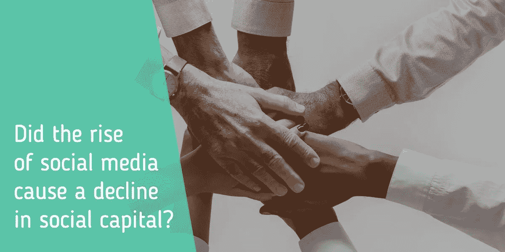

# 虚拟社交网络会破坏社会结构吗？

> 原文：<https://medium.com/swlh/do-virtual-social-networks-destroy-the-social-fabric-b1e96de514db>

关于虚拟社交网络对社会到底是有益还是有害，还存在一些争议。[1]而且必须承认，这个问题很难回答。例如，受到社交网络威胁的社会结构是什么？对社会资本的研究可以提供一个答案。

# 社会资本对社会很重要