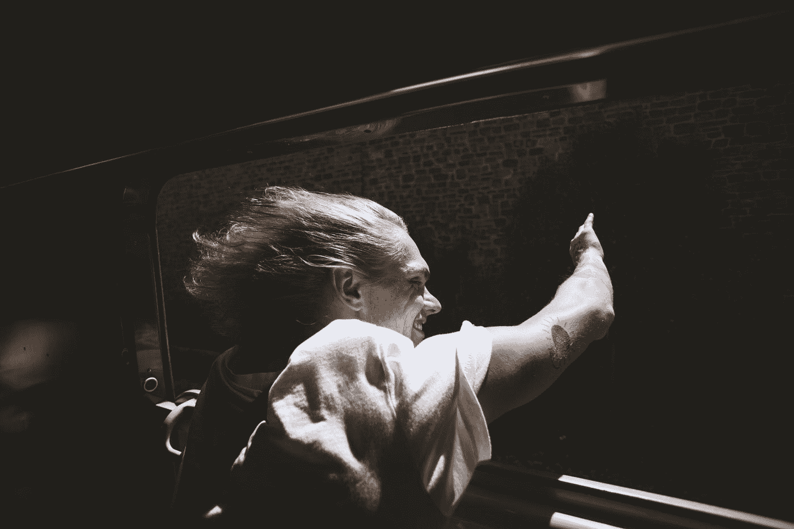

# 通缉:“不骑就死”的人

> 原文：<https://medium.com/swlh/do-we-need-a-ride-or-die-person-a51d3a86589c>

Photo by [Daniel van den Berg](https://unsplash.com/@danielvandenberg?utm_source=medium&utm_medium=referral) on [Unsplash](https://unsplash.com?utm_source=medium&utm_medium=referral)

我有一个，但她可能不总是最好的选择

你们中有多少人有一个“不成功便成仁”的人？“不成功便成仁”是一个无论你在什么时候、什么情况、什么困境或在什么地方都能找到的人。你的生死之交会在那里，在你身边，无论发生什么都会帮助你。